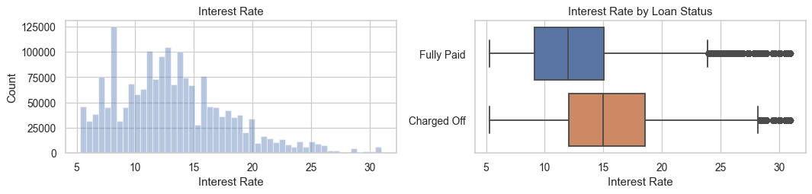
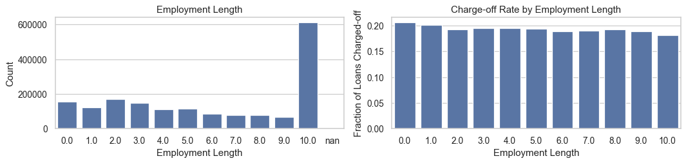

## Context

LendingClub is an American peer-to-peer lending company, headquartered in San Francisco, California. It was the first peer-to-peer lender to register its offerings as securities with the Securities and Exchange Commission (SEC), and to offer loan trading on a secondary market. LendingClub is the world's largest peer-to-peer lending platform. The company claims that $15.98 billion in loans had been originated through its platform up to December 31, 2015.

## Inspiration

This is great dataset to measure the credit risk of P2P lending loans from the Year 2015 to 2020.

<hr/>

# P2P Credit Risk Lending Prediction

<hr/>

Given historical data on loans given out with information on whether or not the borrower defaulted (charge-off), can we build a model that can predict wether or nor a borrower will pay back their loan? This way in the future when **we get a new potential customer we can assess whether or not they are likely to pay back the loan.**

## Table of Contents

* [1. Import Dataset](#1)
* [2. Limit the Feature Space](#2)
 * [2.1 Drop features missing more than 30% data](#2.1)
 * [2.2 Only keep loan features known to potential investors](#2.2)
* [3. Data Analysis and Pre-processing](#3)
 * [3.1 Overlook on Data](#3.1)
 * [3.2  Pre-processing on each Variable](#3.2)
* [4. More Pre-processing](#4)
 * [4.1 Convert loan status to 0/1 charge-off indicator](#4.1)
 * [4.2 Create dummy variables](#4.2)
 * [4.3 Train/test split](#4.3)
* [5. Linear Dependence of Charge-off on the Predictors](#5)
 * [5.1 Pearson correlation](#5.1)
* [6. Model Training and Testing](#6)
 * [6.1 Logistic regression with SGD training](#6.1)
 * [6.2 Random forest classifier](#6.2)
 * [6.3 Tune hyperparameters on the chosen model more finely](#6.3)
 * [6.4 Test set evaluation](#6.4)
* [7. Conclusion](#7)

Link to the dataset: https://www.kaggle.com/ethon0426/lending-club-20072020q1


<a id="1"></a>
# 1. Setup and Import
<hr>


```python
path ='data/Loan_status_2007-2020Q3.csv'
```


```python
# # Files in dataset
# import os
# for dirname, _, filenames in os.walk('/kaggle/input'):
#     for filename in filenames:
#         print(os.path.join(dirname, filename))
```


```python
# data analysis and wrangling
import pandas as pd
import numpy as np
import random as rnd
import scipy as sp

# visualization
import seaborn as sns
import plotly.express as px
import matplotlib.pyplot as plt
import matplotlib as mpl
%matplotlib inline
mpl.style.use('ggplot')
sns.set(style='whitegrid')

# scaling and train test split
from sklearn.model_selection import train_test_split
from sklearn.preprocessing import MinMaxScaler

# pandas options
pd.set_option('display.max_colwidth', 1000, 'display.max_rows', None, 'display.max_columns', None)
pd.set_option("display.precision", 4) # Show numbers only with 2 decimal places

# machine learning algorithm
from sklearn.pipeline import Pipeline
from sklearn.preprocessing import StandardScaler
from sklearn.impute import SimpleImputer
from sklearn.discriminant_analysis import LinearDiscriminantAnalysis
from sklearn.model_selection import GridSearchCV
from sklearn.linear_model import SGDClassifier
from sklearn.ensemble import RandomForestClassifier
from sklearn.neighbors import KNeighborsClassifier
from sklearn.metrics import roc_auc_score


# creating a model
# import tensorflow as tf
# from tensorflow.keras.models import Sequential
# from tensorflow.keras.layers import Dense, Dropout, Activation
# from tensorflow.keras.constraints import max_norm
# from tensorflow.keras.optimizers import Adam
# from tensorflow.keras.callbacks import EarlyStopping
# from tensorflow.keras.models import load_model

# evaluation on test data
from sklearn.metrics import classification_report,confusion_matrix
import shap

```


```python
# Create dataframe from dataset file
loans = pd.read_csv(path, low_memory = False, index_col=0, )
loans.head()
```


<div>
<style scoped>
    .dataframe tbody tr th:only-of-type {
        vertical-align: middle;
    }

    .dataframe tbody tr th {
        vertical-align: top;
    }

    .dataframe thead th {
        text-align: right;
    }
</style>
<table border="1" class="dataframe">
  <thead>
    <tr style="text-align: right;">
      <th></th>
      <th>id</th>
      <th>loan_amnt</th>
      <th>funded_amnt</th>
      <th>funded_amnt_inv</th>
      <th>term</th>
      <th>int_rate</th>
      <th>installment</th>
      <th>grade</th>
      <th>sub_grade</th>
      <th>emp_title</th>
      <th>emp_length</th>
      <th>home_ownership</th>
      <th>annual_inc</th>
      <th>verification_status</th>
      <th>issue_d</th>
      <th>loan_status</th>
      <th>pymnt_plan</th>
      <th>url</th>
      <th>purpose</th>
      <th>title</th>
      <th>zip_code</th>
      <th>addr_state</th>
      <th>dti</th>
      <th>delinq_2yrs</th>
      <th>earliest_cr_line</th>
      <th>fico_range_low</th>
      <th>fico_range_high</th>
      <th>inq_last_6mths</th>
      <th>mths_since_last_delinq</th>
      <th>mths_since_last_record</th>
      <th>open_acc</th>
      <th>pub_rec</th>
      <th>revol_bal</th>
      <th>revol_util</th>
      <th>total_acc</th>
      <th>initial_list_status</th>
      <th>out_prncp</th>
      <th>out_prncp_inv</th>
      <th>total_pymnt</th>
      <th>total_pymnt_inv</th>
      <th>total_rec_prncp</th>
      <th>total_rec_int</th>
      <th>total_rec_late_fee</th>
      <th>recoveries</th>
      <th>collection_recovery_fee</th>
      <th>last_pymnt_d</th>
      <th>last_pymnt_amnt</th>
      <th>next_pymnt_d</th>
      <th>last_credit_pull_d</th>
      <th>last_fico_range_high</th>
      <th>last_fico_range_low</th>
      <th>collections_12_mths_ex_med</th>
      <th>mths_since_last_major_derog</th>
      <th>policy_code</th>
      <th>application_type</th>
      <th>annual_inc_joint</th>
      <th>dti_joint</th>
      <th>verification_status_joint</th>
      <th>acc_now_delinq</th>
      <th>tot_coll_amt</th>
      <th>tot_cur_bal</th>
      <th>open_acc_6m</th>
      <th>open_act_il</th>
      <th>open_il_12m</th>
      <th>open_il_24m</th>
      <th>mths_since_rcnt_il</th>
      <th>total_bal_il</th>
      <th>il_util</th>
      <th>open_rv_12m</th>
      <th>open_rv_24m</th>
      <th>max_bal_bc</th>
      <th>all_util</th>
      <th>total_rev_hi_lim</th>
      <th>inq_fi</th>
      <th>total_cu_tl</th>
      <th>inq_last_12m</th>
      <th>acc_open_past_24mths</th>
      <th>avg_cur_bal</th>
      <th>bc_open_to_buy</th>
      <th>bc_util</th>
      <th>chargeoff_within_12_mths</th>
      <th>delinq_amnt</th>
      <th>mo_sin_old_il_acct</th>
      <th>mo_sin_old_rev_tl_op</th>
      <th>mo_sin_rcnt_rev_tl_op</th>
      <th>mo_sin_rcnt_tl</th>
      <th>mort_acc</th>
      <th>mths_since_recent_bc</th>
      <th>mths_since_recent_bc_dlq</th>
      <th>mths_since_recent_inq</th>
      <th>mths_since_recent_revol_delinq</th>
      <th>num_accts_ever_120_pd</th>
      <th>num_actv_bc_tl</th>
      <th>num_actv_rev_tl</th>
      <th>num_bc_sats</th>
      <th>num_bc_tl</th>
      <th>num_il_tl</th>
      <th>num_op_rev_tl</th>
      <th>num_rev_accts</th>
      <th>num_rev_tl_bal_gt_0</th>
      <th>num_sats</th>
      <th>num_tl_120dpd_2m</th>
      <th>num_tl_30dpd</th>
      <th>num_tl_90g_dpd_24m</th>
      <th>num_tl_op_past_12m</th>
      <th>pct_tl_nvr_dlq</th>
      <th>percent_bc_gt_75</th>
      <th>pub_rec_bankruptcies</th>
      <th>tax_liens</th>
      <th>tot_hi_cred_lim</th>
      <th>total_bal_ex_mort</th>
      <th>total_bc_limit</th>
      <th>total_il_high_credit_limit</th>
      <th>revol_bal_joint</th>
      <th>sec_app_fico_range_low</th>
      <th>sec_app_fico_range_high</th>
      <th>sec_app_earliest_cr_line</th>
      <th>sec_app_inq_last_6mths</th>
      <th>sec_app_mort_acc</th>
      <th>sec_app_open_acc</th>
      <th>sec_app_revol_util</th>
      <th>sec_app_open_act_il</th>
      <th>sec_app_num_rev_accts</th>
      <th>sec_app_chargeoff_within_12_mths</th>
      <th>sec_app_collections_12_mths_ex_med</th>
      <th>hardship_flag</th>
      <th>hardship_type</th>
      <th>hardship_reason</th>
      <th>hardship_status</th>
      <th>deferral_term</th>
      <th>hardship_amount</th>
      <th>hardship_start_date</th>
      <th>hardship_end_date</th>
      <th>payment_plan_start_date</th>
      <th>hardship_length</th>
      <th>hardship_dpd</th>
      <th>hardship_loan_status</th>
      <th>orig_projected_additional_accrued_interest</th>
      <th>hardship_payoff_balance_amount</th>
      <th>hardship_last_payment_amount</th>
      <th>debt_settlement_flag</th>
    </tr>
  </thead>
  <tbody>
    <tr>
      <th>0</th>
      <td>1077501</td>
      <td>5000.0</td>
      <td>5000.0</td>
      <td>4975.0</td>
      <td>36 months</td>
      <td>10.65%</td>
      <td>162.87</td>
      <td>B</td>
      <td>B2</td>
      <td>NaN</td>
      <td>10+ years</td>
      <td>RENT</td>
      <td>24000.0</td>
      <td>Verified</td>
      <td>Dec-2011</td>
      <td>Fully Paid</td>
      <td>n</td>
      <td>https://lendingclub.com/browse/loanDetail.action?loan_id=1077501</td>
      <td>credit_card</td>
      <td>Computer</td>
      <td>860xx</td>
      <td>AZ</td>
      <td>27.65</td>
      <td>0.0</td>
      <td>Jan-1985</td>
      <td>735.0</td>
      <td>739.0</td>
      <td>1.0</td>
      <td>NaN</td>
      <td>NaN</td>
      <td>3.0</td>
      <td>0.0</td>
      <td>13648.0</td>
      <td>83.7%</td>
      <td>9.0</td>
      <td>f</td>
      <td>0.0</td>
      <td>0.0</td>
      <td>5863.1552</td>
      <td>5833.84</td>
      <td>5000.00</td>
      <td>863.16</td>
      <td>0.00</td>
      <td>0.0</td>
      <td>0.00</td>
      <td>Jan-2015</td>
      <td>171.62</td>
      <td>NaN</td>
      <td>May-2020</td>
      <td>704.0</td>
      <td>700.0</td>
      <td>0.0</td>
      <td>NaN</td>
      <td>1.0</td>
      <td>Individual</td>
      <td>NaN</td>
      <td>NaN</td>
      <td>NaN</td>
      <td>0.0</td>
      <td>NaN</td>
      <td>NaN</td>
      <td>NaN</td>
      <td>NaN</td>
      <td>NaN</td>
      <td>NaN</td>
      <td>NaN</td>
      <td>NaN</td>
      <td>NaN</td>
      <td>NaN</td>
      <td>NaN</td>
      <td>NaN</td>
      <td>NaN</td>
      <td>NaN</td>
      <td>NaN</td>
      <td>NaN</td>
      <td>NaN</td>
      <td>NaN</td>
      <td>NaN</td>
      <td>NaN</td>
      <td>NaN</td>
      <td>0.0</td>
      <td>0.0</td>
      <td>NaN</td>
      <td>NaN</td>
      <td>NaN</td>
      <td>NaN</td>
      <td>NaN</td>
      <td>NaN</td>
      <td>NaN</td>
      <td>NaN</td>
      <td>NaN</td>
      <td>NaN</td>
      <td>NaN</td>
      <td>NaN</td>
      <td>NaN</td>
      <td>NaN</td>
      <td>NaN</td>
      <td>NaN</td>
      <td>NaN</td>
      <td>NaN</td>
      <td>NaN</td>
      <td>NaN</td>
      <td>NaN</td>
      <td>NaN</td>
      <td>NaN</td>
      <td>NaN</td>
      <td>NaN</td>
      <td>0.0</td>
      <td>0.0</td>
      <td>NaN</td>
      <td>NaN</td>
      <td>NaN</td>
      <td>NaN</td>
      <td>NaN</td>
      <td>NaN</td>
      <td>NaN</td>
      <td>NaN</td>
      <td>NaN</td>
      <td>NaN</td>
      <td>NaN</td>
      <td>NaN</td>
      <td>NaN</td>
      <td>NaN</td>
      <td>NaN</td>
      <td>NaN</td>
      <td>N</td>
      <td>NaN</td>
      <td>NaN</td>
      <td>NaN</td>
      <td>NaN</td>
      <td>NaN</td>
      <td>NaN</td>
      <td>NaN</td>
      <td>NaN</td>
      <td>NaN</td>
      <td>NaN</td>
      <td>NaN</td>
      <td>NaN</td>
      <td>NaN</td>
      <td>NaN</td>
      <td>N</td>
    </tr>
    <tr>
      <th>1</th>
      <td>1077430</td>
      <td>2500.0</td>
      <td>2500.0</td>
      <td>2500.0</td>
      <td>60 months</td>
      <td>15.27%</td>
      <td>59.83</td>
      <td>C</td>
      <td>C4</td>
      <td>Ryder</td>
      <td>&lt; 1 year</td>
      <td>RENT</td>
      <td>30000.0</td>
      <td>Source Verified</td>
      <td>Dec-2011</td>
      <td>Charged Off</td>
      <td>n</td>
      <td>https://lendingclub.com/browse/loanDetail.action?loan_id=1077430</td>
      <td>car</td>
      <td>bike</td>
      <td>309xx</td>
      <td>GA</td>
      <td>1.00</td>
      <td>0.0</td>
      <td>Apr-1999</td>
      <td>740.0</td>
      <td>744.0</td>
      <td>5.0</td>
      <td>NaN</td>
      <td>NaN</td>
      <td>3.0</td>
      <td>0.0</td>
      <td>1687.0</td>
      <td>9.4%</td>
      <td>4.0</td>
      <td>f</td>
      <td>0.0</td>
      <td>0.0</td>
      <td>1014.5300</td>
      <td>1014.53</td>
      <td>456.46</td>
      <td>435.17</td>
      <td>0.00</td>
      <td>122.9</td>
      <td>1.11</td>
      <td>Apr-2013</td>
      <td>119.66</td>
      <td>NaN</td>
      <td>Oct-2016</td>
      <td>499.0</td>
      <td>0.0</td>
      <td>0.0</td>
      <td>NaN</td>
      <td>1.0</td>
      <td>Individual</td>
      <td>NaN</td>
      <td>NaN</td>
      <td>NaN</td>
      <td>0.0</td>
      <td>NaN</td>
      <td>NaN</td>
      <td>NaN</td>
      <td>NaN</td>
      <td>NaN</td>
      <td>NaN</td>
      <td>NaN</td>
      <td>NaN</td>
      <td>NaN</td>
      <td>NaN</td>
      <td>NaN</td>
      <td>NaN</td>
      <td>NaN</td>
      <td>NaN</td>
      <td>NaN</td>
      <td>NaN</td>
      <td>NaN</td>
      <td>NaN</td>
      <td>NaN</td>
      <td>NaN</td>
      <td>NaN</td>
      <td>0.0</td>
      <td>0.0</td>
      <td>NaN</td>
      <td>NaN</td>
      <td>NaN</td>
      <td>NaN</td>
      <td>NaN</td>
      <td>NaN</td>
      <td>NaN</td>
      <td>NaN</td>
      <td>NaN</td>
      <td>NaN</td>
      <td>NaN</td>
      <td>NaN</td>
      <td>NaN</td>
      <td>NaN</td>
      <td>NaN</td>
      <td>NaN</td>
      <td>NaN</td>
      <td>NaN</td>
      <td>NaN</td>
      <td>NaN</td>
      <td>NaN</td>
      <td>NaN</td>
      <td>NaN</td>
      <td>NaN</td>
      <td>NaN</td>
      <td>0.0</td>
      <td>0.0</td>
      <td>NaN</td>
      <td>NaN</td>
      <td>NaN</td>
      <td>NaN</td>
      <td>NaN</td>
      <td>NaN</td>
      <td>NaN</td>
      <td>NaN</td>
      <td>NaN</td>
      <td>NaN</td>
      <td>NaN</td>
      <td>NaN</td>
      <td>NaN</td>
      <td>NaN</td>
      <td>NaN</td>
      <td>NaN</td>
      <td>N</td>
      <td>NaN</td>
      <td>NaN</td>
      <td>NaN</td>
      <td>NaN</td>
      <td>NaN</td>
      <td>NaN</td>
      <td>NaN</td>
      <td>NaN</td>
      <td>NaN</td>
      <td>NaN</td>
      <td>NaN</td>
      <td>NaN</td>
      <td>NaN</td>
      <td>NaN</td>
      <td>N</td>
    </tr>
    <tr>
      <th>2</th>
      <td>1077175</td>
      <td>2400.0</td>
      <td>2400.0</td>
      <td>2400.0</td>
      <td>36 months</td>
      <td>15.96%</td>
      <td>84.33</td>
      <td>C</td>
      <td>C5</td>
      <td>NaN</td>
      <td>10+ years</td>
      <td>RENT</td>
      <td>12252.0</td>
      <td>Not Verified</td>
      <td>Dec-2011</td>
      <td>Fully Paid</td>
      <td>n</td>
      <td>https://lendingclub.com/browse/loanDetail.action?loan_id=1077175</td>
      <td>small_business</td>
      <td>real estate business</td>
      <td>606xx</td>
      <td>IL</td>
      <td>8.72</td>
      <td>0.0</td>
      <td>Nov-2001</td>
      <td>735.0</td>
      <td>739.0</td>
      <td>2.0</td>
      <td>NaN</td>
      <td>NaN</td>
      <td>2.0</td>
      <td>0.0</td>
      <td>2956.0</td>
      <td>98.5%</td>
      <td>10.0</td>
      <td>f</td>
      <td>0.0</td>
      <td>0.0</td>
      <td>3005.6668</td>
      <td>3005.67</td>
      <td>2400.00</td>
      <td>605.67</td>
      <td>0.00</td>
      <td>0.0</td>
      <td>0.00</td>
      <td>Jun-2014</td>
      <td>649.91</td>
      <td>NaN</td>
      <td>Jun-2017</td>
      <td>739.0</td>
      <td>735.0</td>
      <td>0.0</td>
      <td>NaN</td>
      <td>1.0</td>
      <td>Individual</td>
      <td>NaN</td>
      <td>NaN</td>
      <td>NaN</td>
      <td>0.0</td>
      <td>NaN</td>
      <td>NaN</td>
      <td>NaN</td>
      <td>NaN</td>
      <td>NaN</td>
      <td>NaN</td>
      <td>NaN</td>
      <td>NaN</td>
      <td>NaN</td>
      <td>NaN</td>
      <td>NaN</td>
      <td>NaN</td>
      <td>NaN</td>
      <td>NaN</td>
      <td>NaN</td>
      <td>NaN</td>
      <td>NaN</td>
      <td>NaN</td>
      <td>NaN</td>
      <td>NaN</td>
      <td>NaN</td>
      <td>0.0</td>
      <td>0.0</td>
      <td>NaN</td>
      <td>NaN</td>
      <td>NaN</td>
      <td>NaN</td>
      <td>NaN</td>
      <td>NaN</td>
      <td>NaN</td>
      <td>NaN</td>
      <td>NaN</td>
      <td>NaN</td>
      <td>NaN</td>
      <td>NaN</td>
      <td>NaN</td>
      <td>NaN</td>
      <td>NaN</td>
      <td>NaN</td>
      <td>NaN</td>
      <td>NaN</td>
      <td>NaN</td>
      <td>NaN</td>
      <td>NaN</td>
      <td>NaN</td>
      <td>NaN</td>
      <td>NaN</td>
      <td>NaN</td>
      <td>0.0</td>
      <td>0.0</td>
      <td>NaN</td>
      <td>NaN</td>
      <td>NaN</td>
      <td>NaN</td>
      <td>NaN</td>
      <td>NaN</td>
      <td>NaN</td>
      <td>NaN</td>
      <td>NaN</td>
      <td>NaN</td>
      <td>NaN</td>
      <td>NaN</td>
      <td>NaN</td>
      <td>NaN</td>
      <td>NaN</td>
      <td>NaN</td>
      <td>N</td>
      <td>NaN</td>
      <td>NaN</td>
      <td>NaN</td>
      <td>NaN</td>
      <td>NaN</td>
      <td>NaN</td>
      <td>NaN</td>
      <td>NaN</td>
      <td>NaN</td>
      <td>NaN</td>
      <td>NaN</td>
      <td>NaN</td>
      <td>NaN</td>
      <td>NaN</td>
      <td>N</td>
    </tr>
    <tr>
      <th>3</th>
      <td>1076863</td>
      <td>10000.0</td>
      <td>10000.0</td>
      <td>10000.0</td>
      <td>36 months</td>
      <td>13.49%</td>
      <td>339.31</td>
      <td>C</td>
      <td>C1</td>
      <td>AIR RESOURCES BOARD</td>
      <td>10+ years</td>
      <td>RENT</td>
      <td>49200.0</td>
      <td>Source Verified</td>
      <td>Dec-2011</td>
      <td>Fully Paid</td>
      <td>n</td>
      <td>https://lendingclub.com/browse/loanDetail.action?loan_id=1076863</td>
      <td>other</td>
      <td>personel</td>
      <td>917xx</td>
      <td>CA</td>
      <td>20.00</td>
      <td>0.0</td>
      <td>Feb-1996</td>
      <td>690.0</td>
      <td>694.0</td>
      <td>1.0</td>
      <td>35.0</td>
      <td>NaN</td>
      <td>10.0</td>
      <td>0.0</td>
      <td>5598.0</td>
      <td>21%</td>
      <td>37.0</td>
      <td>f</td>
      <td>0.0</td>
      <td>0.0</td>
      <td>12231.8900</td>
      <td>12231.89</td>
      <td>10000.00</td>
      <td>2214.92</td>
      <td>16.97</td>
      <td>0.0</td>
      <td>0.00</td>
      <td>Jan-2015</td>
      <td>357.48</td>
      <td>NaN</td>
      <td>Apr-2016</td>
      <td>604.0</td>
      <td>600.0</td>
      <td>0.0</td>
      <td>NaN</td>
      <td>1.0</td>
      <td>Individual</td>
      <td>NaN</td>
      <td>NaN</td>
      <td>NaN</td>
      <td>0.0</td>
      <td>NaN</td>
      <td>NaN</td>
      <td>NaN</td>
      <td>NaN</td>
      <td>NaN</td>
      <td>NaN</td>
      <td>NaN</td>
      <td>NaN</td>
      <td>NaN</td>
      <td>NaN</td>
      <td>NaN</td>
      <td>NaN</td>
      <td>NaN</td>
      <td>NaN</td>
      <td>NaN</td>
      <td>NaN</td>
      <td>NaN</td>
      <td>NaN</td>
      <td>NaN</td>
      <td>NaN</td>
      <td>NaN</td>
      <td>0.0</td>
      <td>0.0</td>
      <td>NaN</td>
      <td>NaN</td>
      <td>NaN</td>
      <td>NaN</td>
      <td>NaN</td>
      <td>NaN</td>
      <td>NaN</td>
      <td>NaN</td>
      <td>NaN</td>
      <td>NaN</td>
      <td>NaN</td>
      <td>NaN</td>
      <td>NaN</td>
      <td>NaN</td>
      <td>NaN</td>
      <td>NaN</td>
      <td>NaN</td>
      <td>NaN</td>
      <td>NaN</td>
      <td>NaN</td>
      <td>NaN</td>
      <td>NaN</td>
      <td>NaN</td>
      <td>NaN</td>
      <td>NaN</td>
      <td>0.0</td>
      <td>0.0</td>
      <td>NaN</td>
      <td>NaN</td>
      <td>NaN</td>
      <td>NaN</td>
      <td>NaN</td>
      <td>NaN</td>
      <td>NaN</td>
      <td>NaN</td>
      <td>NaN</td>
      <td>NaN</td>
      <td>NaN</td>
      <td>NaN</td>
      <td>NaN</td>
      <td>NaN</td>
      <td>NaN</td>
      <td>NaN</td>
      <td>N</td>
      <td>NaN</td>
      <td>NaN</td>
      <td>NaN</td>
      <td>NaN</td>
      <td>NaN</td>
      <td>NaN</td>
      <td>NaN</td>
      <td>NaN</td>
      <td>NaN</td>
      <td>NaN</td>
      <td>NaN</td>
      <td>NaN</td>
      <td>NaN</td>
      <td>NaN</td>
      <td>N</td>
    </tr>
    <tr>
      <th>4</th>
      <td>1075358</td>
      <td>3000.0</td>
      <td>3000.0</td>
      <td>3000.0</td>
      <td>60 months</td>
      <td>12.69%</td>
      <td>67.79</td>
      <td>B</td>
      <td>B5</td>
      <td>University Medical Group</td>
      <td>1 year</td>
      <td>RENT</td>
      <td>80000.0</td>
      <td>Source Verified</td>
      <td>Dec-2011</td>
      <td>Fully Paid</td>
      <td>n</td>
      <td>https://lendingclub.com/browse/loanDetail.action?loan_id=1075358</td>
      <td>other</td>
      <td>Personal</td>
      <td>972xx</td>
      <td>OR</td>
      <td>17.94</td>
      <td>0.0</td>
      <td>Jan-1996</td>
      <td>695.0</td>
      <td>699.0</td>
      <td>0.0</td>
      <td>38.0</td>
      <td>NaN</td>
      <td>15.0</td>
      <td>0.0</td>
      <td>27783.0</td>
      <td>53.9%</td>
      <td>38.0</td>
      <td>f</td>
      <td>0.0</td>
      <td>0.0</td>
      <td>4066.9082</td>
      <td>4066.91</td>
      <td>3000.00</td>
      <td>1066.91</td>
      <td>0.00</td>
      <td>0.0</td>
      <td>0.00</td>
      <td>Jan-2017</td>
      <td>67.30</td>
      <td>NaN</td>
      <td>Apr-2018</td>
      <td>684.0</td>
      <td>680.0</td>
      <td>0.0</td>
      <td>NaN</td>
      <td>1.0</td>
      <td>Individual</td>
      <td>NaN</td>
      <td>NaN</td>
      <td>NaN</td>
      <td>0.0</td>
      <td>NaN</td>
      <td>NaN</td>
      <td>NaN</td>
      <td>NaN</td>
      <td>NaN</td>
      <td>NaN</td>
      <td>NaN</td>
      <td>NaN</td>
      <td>NaN</td>
      <td>NaN</td>
      <td>NaN</td>
      <td>NaN</td>
      <td>NaN</td>
      <td>NaN</td>
      <td>NaN</td>
      <td>NaN</td>
      <td>NaN</td>
      <td>NaN</td>
      <td>NaN</td>
      <td>NaN</td>
      <td>NaN</td>
      <td>0.0</td>
      <td>0.0</td>
      <td>NaN</td>
      <td>NaN</td>
      <td>NaN</td>
      <td>NaN</td>
      <td>NaN</td>
      <td>NaN</td>
      <td>NaN</td>
      <td>NaN</td>
      <td>NaN</td>
      <td>NaN</td>
      <td>NaN</td>
      <td>NaN</td>
      <td>NaN</td>
      <td>NaN</td>
      <td>NaN</td>
      <td>NaN</td>
      <td>NaN</td>
      <td>NaN</td>
      <td>NaN</td>
      <td>NaN</td>
      <td>NaN</td>
      <td>NaN</td>
      <td>NaN</td>
      <td>NaN</td>
      <td>NaN</td>
      <td>0.0</td>
      <td>0.0</td>
      <td>NaN</td>
      <td>NaN</td>
      <td>NaN</td>
      <td>NaN</td>
      <td>NaN</td>
      <td>NaN</td>
      <td>NaN</td>
      <td>NaN</td>
      <td>NaN</td>
      <td>NaN</td>
      <td>NaN</td>
      <td>NaN</td>
      <td>NaN</td>
      <td>NaN</td>
      <td>NaN</td>
      <td>NaN</td>
      <td>N</td>
      <td>NaN</td>
      <td>NaN</td>
      <td>NaN</td>
      <td>NaN</td>
      <td>NaN</td>
      <td>NaN</td>
      <td>NaN</td>
      <td>NaN</td>
      <td>NaN</td>
      <td>NaN</td>
      <td>NaN</td>
      <td>NaN</td>
      <td>NaN</td>
      <td>NaN</td>
      <td>N</td>
    </tr>
  </tbody>
</table>
</div>


```python
loans.shape
```


    (2925493, 141)


<a id="2"></a>
# 2. Limit the Feature Space

The full dataset has 150 features for each loan. We'll select features in two steps:

1. Drop features with more than 30% of their data missing.
2. Of the remaining features, choose only those that would be available to an investor before deciding to fund the loan.

<a id="2.1"></a>
## 2.1 Drop features missing more than 30% data


```python
missing_fractions = loans.isnull().mean().sort_values(ascending=False)
missing_fractions = missing_fractions.to_frame(name = 'percent_missing').reset_index()
missing_fractions.columns = ['col_name' , 'percent_missing']
missing_fractions.head()
```


<div>
<style scoped>
    .dataframe tbody tr th:only-of-type {
        vertical-align: middle;
    }

    .dataframe tbody tr th {
        vertical-align: top;
    }

    .dataframe thead th {
        text-align: right;
    }
</style>
<table border="1" class="dataframe">
  <thead>
    <tr style="text-align: right;">
      <th></th>
      <th>col_name</th>
      <th>percent_missing</th>
    </tr>
  </thead>
  <tbody>
    <tr>
      <th>0</th>
      <td>hardship_loan_status</td>
      <td>0.9510</td>
    </tr>
    <tr>
      <th>1</th>
      <td>hardship_reason</td>
      <td>0.9509</td>
    </tr>
    <tr>
      <th>2</th>
      <td>hardship_status</td>
      <td>0.9509</td>
    </tr>
    <tr>
      <th>3</th>
      <td>hardship_dpd</td>
      <td>0.9509</td>
    </tr>
    <tr>
      <th>4</th>
      <td>hardship_type</td>
      <td>0.9509</td>
    </tr>
  </tbody>
</table>
</div>


```python
hist = px.histogram(missing_fractions, x = "percent_missing")
hist.layout.yaxis.title.text = 'Count of Features'
hist.show()
```


```python
```

From the above histogram, we see there's a large gap between features missing "some" data (&lt;20%) and those missing "lots" of data (&gt;40%). Because it's generally very difficult to accurately impute data with more than 30% missing values, we drop such columns. First store all variables missing more than 30% data in an alphabetical list:


```python
loans.head()
```


<div>
<style scoped>
    .dataframe tbody tr th:only-of-type {
        vertical-align: middle;
    }

    .dataframe tbody tr th {
        vertical-align: top;
    }

    .dataframe thead th {
        text-align: right;
    }
</style>
<table border="1" class="dataframe">
  <thead>
    <tr style="text-align: right;">
      <th></th>
      <th>id</th>
      <th>loan_amnt</th>
      <th>funded_amnt</th>
      <th>funded_amnt_inv</th>
      <th>term</th>
      <th>int_rate</th>
      <th>installment</th>
      <th>grade</th>
      <th>sub_grade</th>
      <th>emp_title</th>
      <th>emp_length</th>
      <th>home_ownership</th>
      <th>annual_inc</th>
      <th>verification_status</th>
      <th>issue_d</th>
      <th>loan_status</th>
      <th>pymnt_plan</th>
      <th>url</th>
      <th>purpose</th>
      <th>title</th>
      <th>zip_code</th>
      <th>addr_state</th>
      <th>dti</th>
      <th>delinq_2yrs</th>
      <th>earliest_cr_line</th>
      <th>fico_range_low</th>
      <th>fico_range_high</th>
      <th>inq_last_6mths</th>
      <th>mths_since_last_delinq</th>
      <th>mths_since_last_record</th>
      <th>open_acc</th>
      <th>pub_rec</th>
      <th>revol_bal</th>
      <th>revol_util</th>
      <th>total_acc</th>
      <th>initial_list_status</th>
      <th>out_prncp</th>
      <th>out_prncp_inv</th>
      <th>total_pymnt</th>
      <th>total_pymnt_inv</th>
      <th>total_rec_prncp</th>
      <th>total_rec_int</th>
      <th>total_rec_late_fee</th>
      <th>recoveries</th>
      <th>collection_recovery_fee</th>
      <th>last_pymnt_d</th>
      <th>last_pymnt_amnt</th>
      <th>next_pymnt_d</th>
      <th>last_credit_pull_d</th>
      <th>last_fico_range_high</th>
      <th>last_fico_range_low</th>
      <th>collections_12_mths_ex_med</th>
      <th>mths_since_last_major_derog</th>
      <th>policy_code</th>
      <th>application_type</th>
      <th>annual_inc_joint</th>
      <th>dti_joint</th>
      <th>verification_status_joint</th>
      <th>acc_now_delinq</th>
      <th>tot_coll_amt</th>
      <th>tot_cur_bal</th>
      <th>open_acc_6m</th>
      <th>open_act_il</th>
      <th>open_il_12m</th>
      <th>open_il_24m</th>
      <th>mths_since_rcnt_il</th>
      <th>total_bal_il</th>
      <th>il_util</th>
      <th>open_rv_12m</th>
      <th>open_rv_24m</th>
      <th>max_bal_bc</th>
      <th>all_util</th>
      <th>total_rev_hi_lim</th>
      <th>inq_fi</th>
      <th>total_cu_tl</th>
      <th>inq_last_12m</th>
      <th>acc_open_past_24mths</th>
      <th>avg_cur_bal</th>
      <th>bc_open_to_buy</th>
      <th>bc_util</th>
      <th>chargeoff_within_12_mths</th>
      <th>delinq_amnt</th>
      <th>mo_sin_old_il_acct</th>
      <th>mo_sin_old_rev_tl_op</th>
      <th>mo_sin_rcnt_rev_tl_op</th>
      <th>mo_sin_rcnt_tl</th>
      <th>mort_acc</th>
      <th>mths_since_recent_bc</th>
      <th>mths_since_recent_bc_dlq</th>
      <th>mths_since_recent_inq</th>
      <th>mths_since_recent_revol_delinq</th>
      <th>num_accts_ever_120_pd</th>
      <th>num_actv_bc_tl</th>
      <th>num_actv_rev_tl</th>
      <th>num_bc_sats</th>
      <th>num_bc_tl</th>
      <th>num_il_tl</th>
      <th>num_op_rev_tl</th>
      <th>num_rev_accts</th>
      <th>num_rev_tl_bal_gt_0</th>
      <th>num_sats</th>
      <th>num_tl_120dpd_2m</th>
      <th>num_tl_30dpd</th>
      <th>num_tl_90g_dpd_24m</th>
      <th>num_tl_op_past_12m</th>
      <th>pct_tl_nvr_dlq</th>
      <th>percent_bc_gt_75</th>
      <th>pub_rec_bankruptcies</th>
      <th>tax_liens</th>
      <th>tot_hi_cred_lim</th>
      <th>total_bal_ex_mort</th>
      <th>total_bc_limit</th>
      <th>total_il_high_credit_limit</th>
      <th>revol_bal_joint</th>
      <th>sec_app_fico_range_low</th>
      <th>sec_app_fico_range_high</th>
      <th>sec_app_earliest_cr_line</th>
      <th>sec_app_inq_last_6mths</th>
      <th>sec_app_mort_acc</th>
      <th>sec_app_open_acc</th>
      <th>sec_app_revol_util</th>
      <th>sec_app_open_act_il</th>
      <th>sec_app_num_rev_accts</th>
      <th>sec_app_chargeoff_within_12_mths</th>
      <th>sec_app_collections_12_mths_ex_med</th>
      <th>hardship_flag</th>
      <th>hardship_type</th>
      <th>hardship_reason</th>
      <th>hardship_status</th>
      <th>deferral_term</th>
      <th>hardship_amount</th>
      <th>hardship_start_date</th>
      <th>hardship_end_date</th>
      <th>payment_plan_start_date</th>
      <th>hardship_length</th>
      <th>hardship_dpd</th>
      <th>hardship_loan_status</th>
      <th>orig_projected_additional_accrued_interest</th>
      <th>hardship_payoff_balance_amount</th>
      <th>hardship_last_payment_amount</th>
      <th>debt_settlement_flag</th>
    </tr>
  </thead>
  <tbody>
    <tr>
      <th>0</th>
      <td>1077501</td>
      <td>5000.0</td>
      <td>5000.0</td>
      <td>4975.0</td>
      <td>36 months</td>
      <td>10.65%</td>
      <td>162.87</td>
      <td>B</td>
      <td>B2</td>
      <td>NaN</td>
      <td>10+ years</td>
      <td>RENT</td>
      <td>24000.0</td>
      <td>Verified</td>
      <td>Dec-2011</td>
      <td>Fully Paid</td>
      <td>n</td>
      <td>https://lendingclub.com/browse/loanDetail.action?loan_id=1077501</td>
      <td>credit_card</td>
      <td>Computer</td>
      <td>860xx</td>
      <td>AZ</td>
      <td>27.65</td>
      <td>0.0</td>
      <td>Jan-1985</td>
      <td>735.0</td>
      <td>739.0</td>
      <td>1.0</td>
      <td>NaN</td>
      <td>NaN</td>
      <td>3.0</td>
      <td>0.0</td>
      <td>13648.0</td>
      <td>83.7%</td>
      <td>9.0</td>
      <td>f</td>
      <td>0.0</td>
      <td>0.0</td>
      <td>5863.1552</td>
      <td>5833.84</td>
      <td>5000.00</td>
      <td>863.16</td>
      <td>0.00</td>
      <td>0.0</td>
      <td>0.00</td>
      <td>Jan-2015</td>
      <td>171.62</td>
      <td>NaN</td>
      <td>May-2020</td>
      <td>704.0</td>
      <td>700.0</td>
      <td>0.0</td>
      <td>NaN</td>
      <td>1.0</td>
      <td>Individual</td>
      <td>NaN</td>
      <td>NaN</td>
      <td>NaN</td>
      <td>0.0</td>
      <td>NaN</td>
      <td>NaN</td>
      <td>NaN</td>
      <td>NaN</td>
      <td>NaN</td>
      <td>NaN</td>
      <td>NaN</td>
      <td>NaN</td>
      <td>NaN</td>
      <td>NaN</td>
      <td>NaN</td>
      <td>NaN</td>
      <td>NaN</td>
      <td>NaN</td>
      <td>NaN</td>
      <td>NaN</td>
      <td>NaN</td>
      <td>NaN</td>
      <td>NaN</td>
      <td>NaN</td>
      <td>NaN</td>
      <td>0.0</td>
      <td>0.0</td>
      <td>NaN</td>
      <td>NaN</td>
      <td>NaN</td>
      <td>NaN</td>
      <td>NaN</td>
      <td>NaN</td>
      <td>NaN</td>
      <td>NaN</td>
      <td>NaN</td>
      <td>NaN</td>
      <td>NaN</td>
      <td>NaN</td>
      <td>NaN</td>
      <td>NaN</td>
      <td>NaN</td>
      <td>NaN</td>
      <td>NaN</td>
      <td>NaN</td>
      <td>NaN</td>
      <td>NaN</td>
      <td>NaN</td>
      <td>NaN</td>
      <td>NaN</td>
      <td>NaN</td>
      <td>NaN</td>
      <td>0.0</td>
      <td>0.0</td>
      <td>NaN</td>
      <td>NaN</td>
      <td>NaN</td>
      <td>NaN</td>
      <td>NaN</td>
      <td>NaN</td>
      <td>NaN</td>
      <td>NaN</td>
      <td>NaN</td>
      <td>NaN</td>
      <td>NaN</td>
      <td>NaN</td>
      <td>NaN</td>
      <td>NaN</td>
      <td>NaN</td>
      <td>NaN</td>
      <td>N</td>
      <td>NaN</td>
      <td>NaN</td>
      <td>NaN</td>
      <td>NaN</td>
      <td>NaN</td>
      <td>NaN</td>
      <td>NaN</td>
      <td>NaN</td>
      <td>NaN</td>
      <td>NaN</td>
      <td>NaN</td>
      <td>NaN</td>
      <td>NaN</td>
      <td>NaN</td>
      <td>N</td>
    </tr>
    <tr>
      <th>1</th>
      <td>1077430</td>
      <td>2500.0</td>
      <td>2500.0</td>
      <td>2500.0</td>
      <td>60 months</td>
      <td>15.27%</td>
      <td>59.83</td>
      <td>C</td>
      <td>C4</td>
      <td>Ryder</td>
      <td>&lt; 1 year</td>
      <td>RENT</td>
      <td>30000.0</td>
      <td>Source Verified</td>
      <td>Dec-2011</td>
      <td>Charged Off</td>
      <td>n</td>
      <td>https://lendingclub.com/browse/loanDetail.action?loan_id=1077430</td>
      <td>car</td>
      <td>bike</td>
      <td>309xx</td>
      <td>GA</td>
      <td>1.00</td>
      <td>0.0</td>
      <td>Apr-1999</td>
      <td>740.0</td>
      <td>744.0</td>
      <td>5.0</td>
      <td>NaN</td>
      <td>NaN</td>
      <td>3.0</td>
      <td>0.0</td>
      <td>1687.0</td>
      <td>9.4%</td>
      <td>4.0</td>
      <td>f</td>
      <td>0.0</td>
      <td>0.0</td>
      <td>1014.5300</td>
      <td>1014.53</td>
      <td>456.46</td>
      <td>435.17</td>
      <td>0.00</td>
      <td>122.9</td>
      <td>1.11</td>
      <td>Apr-2013</td>
      <td>119.66</td>
      <td>NaN</td>
      <td>Oct-2016</td>
      <td>499.0</td>
      <td>0.0</td>
      <td>0.0</td>
      <td>NaN</td>
      <td>1.0</td>
      <td>Individual</td>
      <td>NaN</td>
      <td>NaN</td>
      <td>NaN</td>
      <td>0.0</td>
      <td>NaN</td>
      <td>NaN</td>
      <td>NaN</td>
      <td>NaN</td>
      <td>NaN</td>
      <td>NaN</td>
      <td>NaN</td>
      <td>NaN</td>
      <td>NaN</td>
      <td>NaN</td>
      <td>NaN</td>
      <td>NaN</td>
      <td>NaN</td>
      <td>NaN</td>
      <td>NaN</td>
      <td>NaN</td>
      <td>NaN</td>
      <td>NaN</td>
      <td>NaN</td>
      <td>NaN</td>
      <td>NaN</td>
      <td>0.0</td>
      <td>0.0</td>
      <td>NaN</td>
      <td>NaN</td>
      <td>NaN</td>
      <td>NaN</td>
      <td>NaN</td>
      <td>NaN</td>
      <td>NaN</td>
      <td>NaN</td>
      <td>NaN</td>
      <td>NaN</td>
      <td>NaN</td>
      <td>NaN</td>
      <td>NaN</td>
      <td>NaN</td>
      <td>NaN</td>
      <td>NaN</td>
      <td>NaN</td>
      <td>NaN</td>
      <td>NaN</td>
      <td>NaN</td>
      <td>NaN</td>
      <td>NaN</td>
      <td>NaN</td>
      <td>NaN</td>
      <td>NaN</td>
      <td>0.0</td>
      <td>0.0</td>
      <td>NaN</td>
      <td>NaN</td>
      <td>NaN</td>
      <td>NaN</td>
      <td>NaN</td>
      <td>NaN</td>
      <td>NaN</td>
      <td>NaN</td>
      <td>NaN</td>
      <td>NaN</td>
      <td>NaN</td>
      <td>NaN</td>
      <td>NaN</td>
      <td>NaN</td>
      <td>NaN</td>
      <td>NaN</td>
      <td>N</td>
      <td>NaN</td>
      <td>NaN</td>
      <td>NaN</td>
      <td>NaN</td>
      <td>NaN</td>
      <td>NaN</td>
      <td>NaN</td>
      <td>NaN</td>
      <td>NaN</td>
      <td>NaN</td>
      <td>NaN</td>
      <td>NaN</td>
      <td>NaN</td>
      <td>NaN</td>
      <td>N</td>
    </tr>
    <tr>
      <th>2</th>
      <td>1077175</td>
      <td>2400.0</td>
      <td>2400.0</td>
      <td>2400.0</td>
      <td>36 months</td>
      <td>15.96%</td>
      <td>84.33</td>
      <td>C</td>
      <td>C5</td>
      <td>NaN</td>
      <td>10+ years</td>
      <td>RENT</td>
      <td>12252.0</td>
      <td>Not Verified</td>
      <td>Dec-2011</td>
      <td>Fully Paid</td>
      <td>n</td>
      <td>https://lendingclub.com/browse/loanDetail.action?loan_id=1077175</td>
      <td>small_business</td>
      <td>real estate business</td>
      <td>606xx</td>
      <td>IL</td>
      <td>8.72</td>
      <td>0.0</td>
      <td>Nov-2001</td>
      <td>735.0</td>
      <td>739.0</td>
      <td>2.0</td>
      <td>NaN</td>
      <td>NaN</td>
      <td>2.0</td>
      <td>0.0</td>
      <td>2956.0</td>
      <td>98.5%</td>
      <td>10.0</td>
      <td>f</td>
      <td>0.0</td>
      <td>0.0</td>
      <td>3005.6668</td>
      <td>3005.67</td>
      <td>2400.00</td>
      <td>605.67</td>
      <td>0.00</td>
      <td>0.0</td>
      <td>0.00</td>
      <td>Jun-2014</td>
      <td>649.91</td>
      <td>NaN</td>
      <td>Jun-2017</td>
      <td>739.0</td>
      <td>735.0</td>
      <td>0.0</td>
      <td>NaN</td>
      <td>1.0</td>
      <td>Individual</td>
      <td>NaN</td>
      <td>NaN</td>
      <td>NaN</td>
      <td>0.0</td>
      <td>NaN</td>
      <td>NaN</td>
      <td>NaN</td>
      <td>NaN</td>
      <td>NaN</td>
      <td>NaN</td>
      <td>NaN</td>
      <td>NaN</td>
      <td>NaN</td>
      <td>NaN</td>
      <td>NaN</td>
      <td>NaN</td>
      <td>NaN</td>
      <td>NaN</td>
      <td>NaN</td>
      <td>NaN</td>
      <td>NaN</td>
      <td>NaN</td>
      <td>NaN</td>
      <td>NaN</td>
      <td>NaN</td>
      <td>0.0</td>
      <td>0.0</td>
      <td>NaN</td>
      <td>NaN</td>
      <td>NaN</td>
      <td>NaN</td>
      <td>NaN</td>
      <td>NaN</td>
      <td>NaN</td>
      <td>NaN</td>
      <td>NaN</td>
      <td>NaN</td>
      <td>NaN</td>
      <td>NaN</td>
      <td>NaN</td>
      <td>NaN</td>
      <td>NaN</td>
      <td>NaN</td>
      <td>NaN</td>
      <td>NaN</td>
      <td>NaN</td>
      <td>NaN</td>
      <td>NaN</td>
      <td>NaN</td>
      <td>NaN</td>
      <td>NaN</td>
      <td>NaN</td>
      <td>0.0</td>
      <td>0.0</td>
      <td>NaN</td>
      <td>NaN</td>
      <td>NaN</td>
      <td>NaN</td>
      <td>NaN</td>
      <td>NaN</td>
      <td>NaN</td>
      <td>NaN</td>
      <td>NaN</td>
      <td>NaN</td>
      <td>NaN</td>
      <td>NaN</td>
      <td>NaN</td>
      <td>NaN</td>
      <td>NaN</td>
      <td>NaN</td>
      <td>N</td>
      <td>NaN</td>
      <td>NaN</td>
      <td>NaN</td>
      <td>NaN</td>
      <td>NaN</td>
      <td>NaN</td>
      <td>NaN</td>
      <td>NaN</td>
      <td>NaN</td>
      <td>NaN</td>
      <td>NaN</td>
      <td>NaN</td>
      <td>NaN</td>
      <td>NaN</td>
      <td>N</td>
    </tr>
    <tr>
      <th>3</th>
      <td>1076863</td>
      <td>10000.0</td>
      <td>10000.0</td>
      <td>10000.0</td>
      <td>36 months</td>
      <td>13.49%</td>
      <td>339.31</td>
      <td>C</td>
      <td>C1</td>
      <td>AIR RESOURCES BOARD</td>
      <td>10+ years</td>
      <td>RENT</td>
      <td>49200.0</td>
      <td>Source Verified</td>
      <td>Dec-2011</td>
      <td>Fully Paid</td>
      <td>n</td>
      <td>https://lendingclub.com/browse/loanDetail.action?loan_id=1076863</td>
      <td>other</td>
      <td>personel</td>
      <td>917xx</td>
      <td>CA</td>
      <td>20.00</td>
      <td>0.0</td>
      <td>Feb-1996</td>
      <td>690.0</td>
      <td>694.0</td>
      <td>1.0</td>
      <td>35.0</td>
      <td>NaN</td>
      <td>10.0</td>
      <td>0.0</td>
      <td>5598.0</td>
      <td>21%</td>
      <td>37.0</td>
      <td>f</td>
      <td>0.0</td>
      <td>0.0</td>
      <td>12231.8900</td>
      <td>12231.89</td>
      <td>10000.00</td>
      <td>2214.92</td>
      <td>16.97</td>
      <td>0.0</td>
      <td>0.00</td>
      <td>Jan-2015</td>
      <td>357.48</td>
      <td>NaN</td>
      <td>Apr-2016</td>
      <td>604.0</td>
      <td>600.0</td>
      <td>0.0</td>
      <td>NaN</td>
      <td>1.0</td>
      <td>Individual</td>
      <td>NaN</td>
      <td>NaN</td>
      <td>NaN</td>
      <td>0.0</td>
      <td>NaN</td>
      <td>NaN</td>
      <td>NaN</td>
      <td>NaN</td>
      <td>NaN</td>
      <td>NaN</td>
      <td>NaN</td>
      <td>NaN</td>
      <td>NaN</td>
      <td>NaN</td>
      <td>NaN</td>
      <td>NaN</td>
      <td>NaN</td>
      <td>NaN</td>
      <td>NaN</td>
      <td>NaN</td>
      <td>NaN</td>
      <td>NaN</td>
      <td>NaN</td>
      <td>NaN</td>
      <td>NaN</td>
      <td>0.0</td>
      <td>0.0</td>
      <td>NaN</td>
      <td>NaN</td>
      <td>NaN</td>
      <td>NaN</td>
      <td>NaN</td>
      <td>NaN</td>
      <td>NaN</td>
      <td>NaN</td>
      <td>NaN</td>
      <td>NaN</td>
      <td>NaN</td>
      <td>NaN</td>
      <td>NaN</td>
      <td>NaN</td>
      <td>NaN</td>
      <td>NaN</td>
      <td>NaN</td>
      <td>NaN</td>
      <td>NaN</td>
      <td>NaN</td>
      <td>NaN</td>
      <td>NaN</td>
      <td>NaN</td>
      <td>NaN</td>
      <td>NaN</td>
      <td>0.0</td>
      <td>0.0</td>
      <td>NaN</td>
      <td>NaN</td>
      <td>NaN</td>
      <td>NaN</td>
      <td>NaN</td>
      <td>NaN</td>
      <td>NaN</td>
      <td>NaN</td>
      <td>NaN</td>
      <td>NaN</td>
      <td>NaN</td>
      <td>NaN</td>
      <td>NaN</td>
      <td>NaN</td>
      <td>NaN</td>
      <td>NaN</td>
      <td>N</td>
      <td>NaN</td>
      <td>NaN</td>
      <td>NaN</td>
      <td>NaN</td>
      <td>NaN</td>
      <td>NaN</td>
      <td>NaN</td>
      <td>NaN</td>
      <td>NaN</td>
      <td>NaN</td>
      <td>NaN</td>
      <td>NaN</td>
      <td>NaN</td>
      <td>NaN</td>
      <td>N</td>
    </tr>
    <tr>
      <th>4</th>
      <td>1075358</td>
      <td>3000.0</td>
      <td>3000.0</td>
      <td>3000.0</td>
      <td>60 months</td>
      <td>12.69%</td>
      <td>67.79</td>
      <td>B</td>
      <td>B5</td>
      <td>University Medical Group</td>
      <td>1 year</td>
      <td>RENT</td>
      <td>80000.0</td>
      <td>Source Verified</td>
      <td>Dec-2011</td>
      <td>Fully Paid</td>
      <td>n</td>
      <td>https://lendingclub.com/browse/loanDetail.action?loan_id=1075358</td>
      <td>other</td>
      <td>Personal</td>
      <td>972xx</td>
      <td>OR</td>
      <td>17.94</td>
      <td>0.0</td>
      <td>Jan-1996</td>
      <td>695.0</td>
      <td>699.0</td>
      <td>0.0</td>
      <td>38.0</td>
      <td>NaN</td>
      <td>15.0</td>
      <td>0.0</td>
      <td>27783.0</td>
      <td>53.9%</td>
      <td>38.0</td>
      <td>f</td>
      <td>0.0</td>
      <td>0.0</td>
      <td>4066.9082</td>
      <td>4066.91</td>
      <td>3000.00</td>
      <td>1066.91</td>
      <td>0.00</td>
      <td>0.0</td>
      <td>0.00</td>
      <td>Jan-2017</td>
      <td>67.30</td>
      <td>NaN</td>
      <td>Apr-2018</td>
      <td>684.0</td>
      <td>680.0</td>
      <td>0.0</td>
      <td>NaN</td>
      <td>1.0</td>
      <td>Individual</td>
      <td>NaN</td>
      <td>NaN</td>
      <td>NaN</td>
      <td>0.0</td>
      <td>NaN</td>
      <td>NaN</td>
      <td>NaN</td>
      <td>NaN</td>
      <td>NaN</td>
      <td>NaN</td>
      <td>NaN</td>
      <td>NaN</td>
      <td>NaN</td>
      <td>NaN</td>
      <td>NaN</td>
      <td>NaN</td>
      <td>NaN</td>
      <td>NaN</td>
      <td>NaN</td>
      <td>NaN</td>
      <td>NaN</td>
      <td>NaN</td>
      <td>NaN</td>
      <td>NaN</td>
      <td>NaN</td>
      <td>0.0</td>
      <td>0.0</td>
      <td>NaN</td>
      <td>NaN</td>
      <td>NaN</td>
      <td>NaN</td>
      <td>NaN</td>
      <td>NaN</td>
      <td>NaN</td>
      <td>NaN</td>
      <td>NaN</td>
      <td>NaN</td>
      <td>NaN</td>
      <td>NaN</td>
      <td>NaN</td>
      <td>NaN</td>
      <td>NaN</td>
      <td>NaN</td>
      <td>NaN</td>
      <td>NaN</td>
      <td>NaN</td>
      <td>NaN</td>
      <td>NaN</td>
      <td>NaN</td>
      <td>NaN</td>
      <td>NaN</td>
      <td>NaN</td>
      <td>0.0</td>
      <td>0.0</td>
      <td>NaN</td>
      <td>NaN</td>
      <td>NaN</td>
      <td>NaN</td>
      <td>NaN</td>
      <td>NaN</td>
      <td>NaN</td>
      <td>NaN</td>
      <td>NaN</td>
      <td>NaN</td>
      <td>NaN</td>
      <td>NaN</td>
      <td>NaN</td>
      <td>NaN</td>
      <td>NaN</td>
      <td>NaN</td>
      <td>N</td>
      <td>NaN</td>
      <td>NaN</td>
      <td>NaN</td>
      <td>NaN</td>
      <td>NaN</td>
      <td>NaN</td>
      <td>NaN</td>
      <td>NaN</td>
      <td>NaN</td>
      <td>NaN</td>
      <td>NaN</td>
      <td>NaN</td>
      <td>NaN</td>
      <td>NaN</td>
      <td>N</td>
    </tr>
  </tbody>
</table>
</div>


```python
drop_list = sorted(list(missing_fractions[missing_fractions.percent_missing > 0.3].col_name))
print(drop_list)
print("\n\n Drop Features: ", len(drop_list))
```

    ['annual_inc_joint', 'deferral_term', 'dti_joint', 'hardship_amount', 'hardship_dpd', 'hardship_end_date', 'hardship_last_payment_amount', 'hardship_length', 'hardship_loan_status', 'hardship_payoff_balance_amount', 'hardship_reason', 'hardship_start_date', 'hardship_status', 'hardship_type', 'il_util', 'mths_since_last_delinq', 'mths_since_last_major_derog', 'mths_since_last_record', 'mths_since_rcnt_il', 'mths_since_recent_bc_dlq', 'mths_since_recent_revol_delinq', 'next_pymnt_d', 'orig_projected_additional_accrued_interest', 'payment_plan_start_date', 'revol_bal_joint', 'sec_app_chargeoff_within_12_mths', 'sec_app_collections_12_mths_ex_med', 'sec_app_earliest_cr_line', 'sec_app_fico_range_high', 'sec_app_fico_range_low', 'sec_app_inq_last_6mths', 'sec_app_mort_acc', 'sec_app_num_rev_accts', 'sec_app_open_acc', 'sec_app_open_act_il', 'sec_app_revol_util', 'verification_status_joint']
    
    
     Drop Features:  37
    


```python
# Drop these features
loans.drop(labels=drop_list, axis=1, inplace=True)
```


```python
loans.shape
```


    (2925493, 104)


<a id="2.2"></a>
## 2.2 Only keep loan features known to potential investors


```python
print(sorted(loans.columns))
```

    ['acc_now_delinq', 'acc_open_past_24mths', 'addr_state', 'all_util', 'annual_inc', 'application_type', 'avg_cur_bal', 'bc_open_to_buy', 'bc_util', 'chargeoff_within_12_mths', 'collection_recovery_fee', 'collections_12_mths_ex_med', 'debt_settlement_flag', 'delinq_2yrs', 'delinq_amnt', 'dti', 'earliest_cr_line', 'emp_length', 'emp_title', 'fico_range_high', 'fico_range_low', 'funded_amnt', 'funded_amnt_inv', 'grade', 'hardship_flag', 'home_ownership', 'id', 'initial_list_status', 'inq_fi', 'inq_last_12m', 'inq_last_6mths', 'installment', 'int_rate', 'issue_d', 'last_credit_pull_d', 'last_fico_range_high', 'last_fico_range_low', 'last_pymnt_amnt', 'last_pymnt_d', 'loan_amnt', 'loan_status', 'max_bal_bc', 'mo_sin_old_il_acct', 'mo_sin_old_rev_tl_op', 'mo_sin_rcnt_rev_tl_op', 'mo_sin_rcnt_tl', 'mort_acc', 'mths_since_recent_bc', 'mths_since_recent_inq', 'num_accts_ever_120_pd', 'num_actv_bc_tl', 'num_actv_rev_tl', 'num_bc_sats', 'num_bc_tl', 'num_il_tl', 'num_op_rev_tl', 'num_rev_accts', 'num_rev_tl_bal_gt_0', 'num_sats', 'num_tl_120dpd_2m', 'num_tl_30dpd', 'num_tl_90g_dpd_24m', 'num_tl_op_past_12m', 'open_acc', 'open_acc_6m', 'open_act_il', 'open_il_12m', 'open_il_24m', 'open_rv_12m', 'open_rv_24m', 'out_prncp', 'out_prncp_inv', 'pct_tl_nvr_dlq', 'percent_bc_gt_75', 'policy_code', 'pub_rec', 'pub_rec_bankruptcies', 'purpose', 'pymnt_plan', 'recoveries', 'revol_bal', 'revol_util', 'sub_grade', 'tax_liens', 'term', 'title', 'tot_coll_amt', 'tot_cur_bal', 'tot_hi_cred_lim', 'total_acc', 'total_bal_ex_mort', 'total_bal_il', 'total_bc_limit', 'total_cu_tl', 'total_il_high_credit_limit', 'total_pymnt', 'total_pymnt_inv', 'total_rec_int', 'total_rec_late_fee', 'total_rec_prncp', 'total_rev_hi_lim', 'url', 'verification_status', 'zip_code']
    

For each of these features, we check the description in the Data Dictionary and only keep the features that would have been available to investors considering an investment in the loan. These include features in the loan application, and any features added by LendingClub when the loan listing was accepted, such as the loan grade and interest rate.

I'm using my best available knowledge to determine which loan features are known to potential investors. I am not an investor on LendingClub, so my knowledge of the LendingClub investment process is not exact. When in doubt, I err on the side of dropping the feature.


```python
keep_list = ['addr_state', 'annual_inc', 'application_type', 'dti', 'earliest_cr_line', 'emp_length', 'emp_title', 'fico_range_high', 'fico_range_low', 'grade', 'home_ownership', 'id', 'initial_list_status', 'installment', 'int_rate', 'issue_d', 'loan_amnt', 'loan_status', 'mort_acc', 'open_acc', 'pub_rec', 'pub_rec_bankruptcies', 'purpose', 'revol_bal', 'revol_util', 'sub_grade', 'term', 'title', 'total_acc', 'verification_status', 'zip_code']
print("Keep features: ", len(keep_list))
```

    Keep features:  31
    


```python
drop_list = [col for col in loans.columns if col not in keep_list]
print(drop_list)

print("\n\nNumber of features needed to be dropped: ",len(drop_list))
```

    ['funded_amnt', 'funded_amnt_inv', 'pymnt_plan', 'url', 'delinq_2yrs', 'inq_last_6mths', 'out_prncp', 'out_prncp_inv', 'total_pymnt', 'total_pymnt_inv', 'total_rec_prncp', 'total_rec_int', 'total_rec_late_fee', 'recoveries', 'collection_recovery_fee', 'last_pymnt_d', 'last_pymnt_amnt', 'last_credit_pull_d', 'last_fico_range_high', 'last_fico_range_low', 'collections_12_mths_ex_med', 'policy_code', 'acc_now_delinq', 'tot_coll_amt', 'tot_cur_bal', 'open_acc_6m', 'open_act_il', 'open_il_12m', 'open_il_24m', 'total_bal_il', 'open_rv_12m', 'open_rv_24m', 'max_bal_bc', 'all_util', 'total_rev_hi_lim', 'inq_fi', 'total_cu_tl', 'inq_last_12m', 'acc_open_past_24mths', 'avg_cur_bal', 'bc_open_to_buy', 'bc_util', 'chargeoff_within_12_mths', 'delinq_amnt', 'mo_sin_old_il_acct', 'mo_sin_old_rev_tl_op', 'mo_sin_rcnt_rev_tl_op', 'mo_sin_rcnt_tl', 'mths_since_recent_bc', 'mths_since_recent_inq', 'num_accts_ever_120_pd', 'num_actv_bc_tl', 'num_actv_rev_tl', 'num_bc_sats', 'num_bc_tl', 'num_il_tl', 'num_op_rev_tl', 'num_rev_accts', 'num_rev_tl_bal_gt_0', 'num_sats', 'num_tl_120dpd_2m', 'num_tl_30dpd', 'num_tl_90g_dpd_24m', 'num_tl_op_past_12m', 'pct_tl_nvr_dlq', 'percent_bc_gt_75', 'tax_liens', 'tot_hi_cred_lim', 'total_bal_ex_mort', 'total_bc_limit', 'total_il_high_credit_limit', 'hardship_flag', 'debt_settlement_flag']
    
    
    Number of features needed to be dropped:  73
    


```python
loans.drop(labels=drop_list, axis=1, inplace=True)
loans.shape
```


    (2925493, 31)


<a id="3"></a>
# 3. Data Analysis and Pre-processing

* Overlook on Data
* Pre-processing on each Variable

<a id="3.1"></a>
## 3.1 Overlook on Data


```python
print("Records: ", loans.shape[0], "\nFeatures: ", loans.shape[1])
print("\nInformation of Dataset\n-------")
loans.info()
```

    Records:  2925493 
    Features:  31
    
    Information of Dataset
    -------
    <class 'pandas.core.frame.DataFrame'>
    Int64Index: 2925493 entries, 0 to 105450
    Data columns (total 31 columns):
     #   Column                Dtype  
    ---  ------                -----  
     0   id                    object 
     1   loan_amnt             float64
     2   term                  object 
     3   int_rate              object 
     4   installment           float64
     5   grade                 object 
     6   sub_grade             object 
     7   emp_title             object 
     8   emp_length            object 
     9   home_ownership        object 
     10  annual_inc            float64
     11  verification_status   object 
     12  issue_d               object 
     13  loan_status           object 
     14  purpose               object 
     15  title                 object 
     16  zip_code              object 
     17  addr_state            object 
     18  dti                   float64
     19  earliest_cr_line      object 
     20  fico_range_low        float64
     21  fico_range_high       float64
     22  open_acc              float64
     23  pub_rec               float64
     24  revol_bal             float64
     25  revol_util            object 
     26  total_acc             float64
     27  initial_list_status   object 
     28  application_type      object 
     29  mort_acc              float64
     30  pub_rec_bankruptcies  float64
    dtypes: float64(12), object(19)
    memory usage: 714.2+ MB
    


```python
loans.head(50)
```


<div>
<style scoped>
    .dataframe tbody tr th:only-of-type {
        vertical-align: middle;
    }

    .dataframe tbody tr th {
        vertical-align: top;
    }

    .dataframe thead th {
        text-align: right;
    }
</style>
<table border="1" class="dataframe">
  <thead>
    <tr style="text-align: right;">
      <th></th>
      <th>id</th>
      <th>loan_amnt</th>
      <th>term</th>
      <th>int_rate</th>
      <th>installment</th>
      <th>grade</th>
      <th>sub_grade</th>
      <th>emp_title</th>
      <th>emp_length</th>
      <th>home_ownership</th>
      <th>annual_inc</th>
      <th>verification_status</th>
      <th>issue_d</th>
      <th>loan_status</th>
      <th>purpose</th>
      <th>title</th>
      <th>zip_code</th>
      <th>addr_state</th>
      <th>dti</th>
      <th>earliest_cr_line</th>
      <th>fico_range_low</th>
      <th>fico_range_high</th>
      <th>open_acc</th>
      <th>pub_rec</th>
      <th>revol_bal</th>
      <th>revol_util</th>
      <th>total_acc</th>
      <th>initial_list_status</th>
      <th>application_type</th>
      <th>mort_acc</th>
      <th>pub_rec_bankruptcies</th>
    </tr>
  </thead>
  <tbody>
    <tr>
      <th>0</th>
      <td>1077501</td>
      <td>5000.0</td>
      <td>36 months</td>
      <td>10.65%</td>
      <td>162.87</td>
      <td>B</td>
      <td>B2</td>
      <td>NaN</td>
      <td>10+ years</td>
      <td>RENT</td>
      <td>24000.00</td>
      <td>Verified</td>
      <td>Dec-2011</td>
      <td>Fully Paid</td>
      <td>credit_card</td>
      <td>Computer</td>
      <td>860xx</td>
      <td>AZ</td>
      <td>27.65</td>
      <td>Jan-1985</td>
      <td>735.0</td>
      <td>739.0</td>
      <td>3.0</td>
      <td>0.0</td>
      <td>13648.0</td>
      <td>83.7%</td>
      <td>9.0</td>
      <td>f</td>
      <td>Individual</td>
      <td>NaN</td>
      <td>0.0</td>
    </tr>
    <tr>
      <th>1</th>
      <td>1077430</td>
      <td>2500.0</td>
      <td>60 months</td>
      <td>15.27%</td>
      <td>59.83</td>
      <td>C</td>
      <td>C4</td>
      <td>Ryder</td>
      <td>&lt; 1 year</td>
      <td>RENT</td>
      <td>30000.00</td>
      <td>Source Verified</td>
      <td>Dec-2011</td>
      <td>Charged Off</td>
      <td>car</td>
      <td>bike</td>
      <td>309xx</td>
      <td>GA</td>
      <td>1.00</td>
      <td>Apr-1999</td>
      <td>740.0</td>
      <td>744.0</td>
      <td>3.0</td>
      <td>0.0</td>
      <td>1687.0</td>
      <td>9.4%</td>
      <td>4.0</td>
      <td>f</td>
      <td>Individual</td>
      <td>NaN</td>
      <td>0.0</td>
    </tr>
    <tr>
      <th>2</th>
      <td>1077175</td>
      <td>2400.0</td>
      <td>36 months</td>
      <td>15.96%</td>
      <td>84.33</td>
      <td>C</td>
      <td>C5</td>
      <td>NaN</td>
      <td>10+ years</td>
      <td>RENT</td>
      <td>12252.00</td>
      <td>Not Verified</td>
      <td>Dec-2011</td>
      <td>Fully Paid</td>
      <td>small_business</td>
      <td>real estate business</td>
      <td>606xx</td>
      <td>IL</td>
      <td>8.72</td>
      <td>Nov-2001</td>
      <td>735.0</td>
      <td>739.0</td>
      <td>2.0</td>
      <td>0.0</td>
      <td>2956.0</td>
      <td>98.5%</td>
      <td>10.0</td>
      <td>f</td>
      <td>Individual</td>
      <td>NaN</td>
      <td>0.0</td>
    </tr>
    <tr>
      <th>3</th>
      <td>1076863</td>
      <td>10000.0</td>
      <td>36 months</td>
      <td>13.49%</td>
      <td>339.31</td>
      <td>C</td>
      <td>C1</td>
      <td>AIR RESOURCES BOARD</td>
      <td>10+ years</td>
      <td>RENT</td>
      <td>49200.00</td>
      <td>Source Verified</td>
      <td>Dec-2011</td>
      <td>Fully Paid</td>
      <td>other</td>
      <td>personel</td>
      <td>917xx</td>
      <td>CA</td>
      <td>20.00</td>
      <td>Feb-1996</td>
      <td>690.0</td>
      <td>694.0</td>
      <td>10.0</td>
      <td>0.0</td>
      <td>5598.0</td>
      <td>21%</td>
      <td>37.0</td>
      <td>f</td>
      <td>Individual</td>
      <td>NaN</td>
      <td>0.0</td>
    </tr>
    <tr>
      <th>4</th>
      <td>1075358</td>
      <td>3000.0</td>
      <td>60 months</td>
      <td>12.69%</td>
      <td>67.79</td>
      <td>B</td>
      <td>B5</td>
      <td>University Medical Group</td>
      <td>1 year</td>
      <td>RENT</td>
      <td>80000.00</td>
      <td>Source Verified</td>
      <td>Dec-2011</td>
      <td>Fully Paid</td>
      <td>other</td>
      <td>Personal</td>
      <td>972xx</td>
      <td>OR</td>
      <td>17.94</td>
      <td>Jan-1996</td>
      <td>695.0</td>
      <td>699.0</td>
      <td>15.0</td>
      <td>0.0</td>
      <td>27783.0</td>
      <td>53.9%</td>
      <td>38.0</td>
      <td>f</td>
      <td>Individual</td>
      <td>NaN</td>
      <td>0.0</td>
    </tr>
    <tr>
      <th>5</th>
      <td>1075269</td>
      <td>5000.0</td>
      <td>36 months</td>
      <td>7.90%</td>
      <td>156.46</td>
      <td>A</td>
      <td>A4</td>
      <td>Veolia Transportaton</td>
      <td>3 years</td>
      <td>RENT</td>
      <td>36000.00</td>
      <td>Source Verified</td>
      <td>Dec-2011</td>
      <td>Fully Paid</td>
      <td>wedding</td>
      <td>My wedding loan I promise to pay back</td>
      <td>852xx</td>
      <td>AZ</td>
      <td>11.20</td>
      <td>Nov-2004</td>
      <td>730.0</td>
      <td>734.0</td>
      <td>9.0</td>
      <td>0.0</td>
      <td>7963.0</td>
      <td>28.3%</td>
      <td>12.0</td>
      <td>f</td>
      <td>Individual</td>
      <td>NaN</td>
      <td>0.0</td>
    </tr>
    <tr>
      <th>6</th>
      <td>1069639</td>
      <td>7000.0</td>
      <td>60 months</td>
      <td>15.96%</td>
      <td>170.08</td>
      <td>C</td>
      <td>C5</td>
      <td>Southern Star Photography</td>
      <td>8 years</td>
      <td>RENT</td>
      <td>47004.00</td>
      <td>Not Verified</td>
      <td>Dec-2011</td>
      <td>Fully Paid</td>
      <td>debt_consolidation</td>
      <td>Loan</td>
      <td>280xx</td>
      <td>NC</td>
      <td>23.51</td>
      <td>Jul-2005</td>
      <td>690.0</td>
      <td>694.0</td>
      <td>7.0</td>
      <td>0.0</td>
      <td>17726.0</td>
      <td>85.6%</td>
      <td>11.0</td>
      <td>f</td>
      <td>Individual</td>
      <td>NaN</td>
      <td>0.0</td>
    </tr>
    <tr>
      <th>7</th>
      <td>1072053</td>
      <td>3000.0</td>
      <td>36 months</td>
      <td>18.64%</td>
      <td>109.43</td>
      <td>E</td>
      <td>E1</td>
      <td>MKC Accounting</td>
      <td>9 years</td>
      <td>RENT</td>
      <td>48000.00</td>
      <td>Source Verified</td>
      <td>Dec-2011</td>
      <td>Fully Paid</td>
      <td>car</td>
      <td>Car Downpayment</td>
      <td>900xx</td>
      <td>CA</td>
      <td>5.35</td>
      <td>Jan-2007</td>
      <td>660.0</td>
      <td>664.0</td>
      <td>4.0</td>
      <td>0.0</td>
      <td>8221.0</td>
      <td>87.5%</td>
      <td>4.0</td>
      <td>f</td>
      <td>Individual</td>
      <td>NaN</td>
      <td>0.0</td>
    </tr>
    <tr>
      <th>8</th>
      <td>1071795</td>
      <td>5600.0</td>
      <td>60 months</td>
      <td>21.28%</td>
      <td>152.39</td>
      <td>F</td>
      <td>F2</td>
      <td>NaN</td>
      <td>4 years</td>
      <td>OWN</td>
      <td>40000.00</td>
      <td>Source Verified</td>
      <td>Dec-2011</td>
      <td>Charged Off</td>
      <td>small_business</td>
      <td>Expand Business &amp; Buy Debt Portfolio</td>
      <td>958xx</td>
      <td>CA</td>
      <td>5.55</td>
      <td>Apr-2004</td>
      <td>675.0</td>
      <td>679.0</td>
      <td>11.0</td>
      <td>0.0</td>
      <td>5210.0</td>
      <td>32.6%</td>
      <td>13.0</td>
      <td>f</td>
      <td>Individual</td>
      <td>NaN</td>
      <td>0.0</td>
    </tr>
    <tr>
      <th>9</th>
      <td>1071570</td>
      <td>5375.0</td>
      <td>60 months</td>
      <td>12.69%</td>
      <td>121.45</td>
      <td>B</td>
      <td>B5</td>
      <td>Starbucks</td>
      <td>&lt; 1 year</td>
      <td>RENT</td>
      <td>15000.00</td>
      <td>Verified</td>
      <td>Dec-2011</td>
      <td>Charged Off</td>
      <td>other</td>
      <td>Building my credit history.</td>
      <td>774xx</td>
      <td>TX</td>
      <td>18.08</td>
      <td>Sep-2004</td>
      <td>725.0</td>
      <td>729.0</td>
      <td>2.0</td>
      <td>0.0</td>
      <td>9279.0</td>
      <td>36.5%</td>
      <td>3.0</td>
      <td>f</td>
      <td>Individual</td>
      <td>NaN</td>
      <td>0.0</td>
    </tr>
    <tr>
      <th>10</th>
      <td>1070078</td>
      <td>6500.0</td>
      <td>60 months</td>
      <td>14.65%</td>
      <td>153.45</td>
      <td>C</td>
      <td>C3</td>
      <td>Southwest Rural metro</td>
      <td>5 years</td>
      <td>OWN</td>
      <td>72000.00</td>
      <td>Not Verified</td>
      <td>Dec-2011</td>
      <td>Fully Paid</td>
      <td>debt_consolidation</td>
      <td>High intrest Consolidation</td>
      <td>853xx</td>
      <td>AZ</td>
      <td>16.12</td>
      <td>Jan-1998</td>
      <td>695.0</td>
      <td>699.0</td>
      <td>14.0</td>
      <td>0.0</td>
      <td>4032.0</td>
      <td>20.6%</td>
      <td>23.0</td>
      <td>f</td>
      <td>Individual</td>
      <td>NaN</td>
      <td>0.0</td>
    </tr>
    <tr>
      <th>11</th>
      <td>1069908</td>
      <td>12000.0</td>
      <td>36 months</td>
      <td>12.69%</td>
      <td>402.54</td>
      <td>B</td>
      <td>B5</td>
      <td>UCLA</td>
      <td>10+ years</td>
      <td>OWN</td>
      <td>75000.00</td>
      <td>Source Verified</td>
      <td>Dec-2011</td>
      <td>Fully Paid</td>
      <td>debt_consolidation</td>
      <td>Consolidation</td>
      <td>913xx</td>
      <td>CA</td>
      <td>10.78</td>
      <td>Oct-1989</td>
      <td>675.0</td>
      <td>679.0</td>
      <td>12.0</td>
      <td>0.0</td>
      <td>23336.0</td>
      <td>67.1%</td>
      <td>34.0</td>
      <td>f</td>
      <td>Individual</td>
      <td>NaN</td>
      <td>0.0</td>
    </tr>
    <tr>
      <th>12</th>
      <td>1064687</td>
      <td>9000.0</td>
      <td>36 months</td>
      <td>13.49%</td>
      <td>305.38</td>
      <td>C</td>
      <td>C1</td>
      <td>Va. Dept of Conservation/Recreation</td>
      <td>&lt; 1 year</td>
      <td>RENT</td>
      <td>30000.00</td>
      <td>Source Verified</td>
      <td>Dec-2011</td>
      <td>Charged Off</td>
      <td>debt_consolidation</td>
      <td>freedom</td>
      <td>245xx</td>
      <td>VA</td>
      <td>10.08</td>
      <td>Apr-2004</td>
      <td>710.0</td>
      <td>714.0</td>
      <td>4.0</td>
      <td>0.0</td>
      <td>10452.0</td>
      <td>91.7%</td>
      <td>9.0</td>
      <td>f</td>
      <td>Individual</td>
      <td>NaN</td>
      <td>0.0</td>
    </tr>
    <tr>
      <th>13</th>
      <td>1069866</td>
      <td>3000.0</td>
      <td>36 months</td>
      <td>9.91%</td>
      <td>96.68</td>
      <td>B</td>
      <td>B1</td>
      <td>Target</td>
      <td>3 years</td>
      <td>RENT</td>
      <td>15000.00</td>
      <td>Source Verified</td>
      <td>Dec-2011</td>
      <td>Fully Paid</td>
      <td>credit_card</td>
      <td>citicard fund</td>
      <td>606xx</td>
      <td>IL</td>
      <td>12.56</td>
      <td>Jul-2003</td>
      <td>705.0</td>
      <td>709.0</td>
      <td>11.0</td>
      <td>0.0</td>
      <td>7323.0</td>
      <td>43.1%</td>
      <td>11.0</td>
      <td>f</td>
      <td>Individual</td>
      <td>NaN</td>
      <td>0.0</td>
    </tr>
    <tr>
      <th>14</th>
      <td>1069057</td>
      <td>10000.0</td>
      <td>36 months</td>
      <td>10.65%</td>
      <td>325.74</td>
      <td>B</td>
      <td>B2</td>
      <td>SFMTA</td>
      <td>3 years</td>
      <td>RENT</td>
      <td>100000.00</td>
      <td>Source Verified</td>
      <td>Dec-2011</td>
      <td>Charged Off</td>
      <td>other</td>
      <td>Other Loan</td>
      <td>951xx</td>
      <td>CA</td>
      <td>7.06</td>
      <td>May-1991</td>
      <td>720.0</td>
      <td>724.0</td>
      <td>14.0</td>
      <td>0.0</td>
      <td>11997.0</td>
      <td>55.5%</td>
      <td>29.0</td>
      <td>f</td>
      <td>Individual</td>
      <td>NaN</td>
      <td>0.0</td>
    </tr>
    <tr>
      <th>15</th>
      <td>1069759</td>
      <td>1000.0</td>
      <td>36 months</td>
      <td>16.29%</td>
      <td>35.31</td>
      <td>D</td>
      <td>D1</td>
      <td>Internal revenue Service</td>
      <td>&lt; 1 year</td>
      <td>RENT</td>
      <td>28000.00</td>
      <td>Not Verified</td>
      <td>Dec-2011</td>
      <td>Fully Paid</td>
      <td>debt_consolidation</td>
      <td>Debt Consolidation Loan</td>
      <td>641xx</td>
      <td>MO</td>
      <td>20.31</td>
      <td>Sep-2007</td>
      <td>665.0</td>
      <td>669.0</td>
      <td>11.0</td>
      <td>0.0</td>
      <td>6524.0</td>
      <td>81.5%</td>
      <td>23.0</td>
      <td>f</td>
      <td>Individual</td>
      <td>NaN</td>
      <td>0.0</td>
    </tr>
    <tr>
      <th>16</th>
      <td>1065775</td>
      <td>10000.0</td>
      <td>36 months</td>
      <td>15.27%</td>
      <td>347.98</td>
      <td>C</td>
      <td>C4</td>
      <td>Chin's Restaurant</td>
      <td>4 years</td>
      <td>RENT</td>
      <td>42000.00</td>
      <td>Not Verified</td>
      <td>Dec-2011</td>
      <td>Fully Paid</td>
      <td>home_improvement</td>
      <td>Home</td>
      <td>921xx</td>
      <td>CA</td>
      <td>18.60</td>
      <td>Oct-1998</td>
      <td>670.0</td>
      <td>674.0</td>
      <td>14.0</td>
      <td>0.0</td>
      <td>24043.0</td>
      <td>70.2%</td>
      <td>28.0</td>
      <td>f</td>
      <td>Individual</td>
      <td>NaN</td>
      <td>0.0</td>
    </tr>
    <tr>
      <th>17</th>
      <td>1069971</td>
      <td>3600.0</td>
      <td>36 months</td>
      <td>6.03%</td>
      <td>109.57</td>
      <td>A</td>
      <td>A1</td>
      <td>Duracell</td>
      <td>10+ years</td>
      <td>MORTGAGE</td>
      <td>110000.00</td>
      <td>Not Verified</td>
      <td>Dec-2011</td>
      <td>Fully Paid</td>
      <td>major_purchase</td>
      <td>Holiday</td>
      <td>067xx</td>
      <td>CT</td>
      <td>10.52</td>
      <td>Aug-1993</td>
      <td>760.0</td>
      <td>764.0</td>
      <td>20.0</td>
      <td>0.0</td>
      <td>22836.0</td>
      <td>16%</td>
      <td>42.0</td>
      <td>f</td>
      <td>Individual</td>
      <td>NaN</td>
      <td>0.0</td>
    </tr>
    <tr>
      <th>18</th>
      <td>1062474</td>
      <td>6000.0</td>
      <td>36 months</td>
      <td>11.71%</td>
      <td>198.46</td>
      <td>B</td>
      <td>B3</td>
      <td>Connection Inspection</td>
      <td>1 year</td>
      <td>MORTGAGE</td>
      <td>84000.00</td>
      <td>Verified</td>
      <td>Dec-2011</td>
      <td>Fully Paid</td>
      <td>medical</td>
      <td>Medical</td>
      <td>890xx</td>
      <td>UT</td>
      <td>18.44</td>
      <td>Oct-2003</td>
      <td>685.0</td>
      <td>689.0</td>
      <td>4.0</td>
      <td>0.0</td>
      <td>0.0</td>
      <td>37.73%</td>
      <td>14.0</td>
      <td>f</td>
      <td>Individual</td>
      <td>NaN</td>
      <td>0.0</td>
    </tr>
    <tr>
      <th>19</th>
      <td>1069742</td>
      <td>9200.0</td>
      <td>36 months</td>
      <td>6.03%</td>
      <td>280.01</td>
      <td>A</td>
      <td>A1</td>
      <td>Network Interpreting Service</td>
      <td>6 years</td>
      <td>RENT</td>
      <td>77385.19</td>
      <td>Not Verified</td>
      <td>Dec-2011</td>
      <td>Fully Paid</td>
      <td>debt_consolidation</td>
      <td>lowerratemeanseasiertogetoutofdebt!</td>
      <td>921xx</td>
      <td>CA</td>
      <td>9.86</td>
      <td>Jan-2001</td>
      <td>755.0</td>
      <td>759.0</td>
      <td>8.0</td>
      <td>0.0</td>
      <td>7314.0</td>
      <td>23.1%</td>
      <td>28.0</td>
      <td>f</td>
      <td>Individual</td>
      <td>NaN</td>
      <td>0.0</td>
    </tr>
    <tr>
      <th>20</th>
      <td>1069740</td>
      <td>20250.0</td>
      <td>60 months</td>
      <td>15.27%</td>
      <td>484.63</td>
      <td>C</td>
      <td>C4</td>
      <td>Archdiocese of Galveston Houston</td>
      <td>3 years</td>
      <td>RENT</td>
      <td>43370.00</td>
      <td>Verified</td>
      <td>Dec-2011</td>
      <td>Fully Paid</td>
      <td>debt_consolidation</td>
      <td>Freedom From Credit Cards</td>
      <td>770xx</td>
      <td>TX</td>
      <td>26.53</td>
      <td>Nov-1997</td>
      <td>725.0</td>
      <td>729.0</td>
      <td>8.0</td>
      <td>0.0</td>
      <td>17813.0</td>
      <td>85.6%</td>
      <td>22.0</td>
      <td>f</td>
      <td>Individual</td>
      <td>NaN</td>
      <td>0.0</td>
    </tr>
    <tr>
      <th>21</th>
      <td>1039153</td>
      <td>21000.0</td>
      <td>36 months</td>
      <td>12.42%</td>
      <td>701.73</td>
      <td>B</td>
      <td>B4</td>
      <td>Osram Sylvania</td>
      <td>10+ years</td>
      <td>RENT</td>
      <td>105000.00</td>
      <td>Verified</td>
      <td>Dec-2011</td>
      <td>Charged Off</td>
      <td>debt_consolidation</td>
      <td>Debt Cleanup</td>
      <td>335xx</td>
      <td>FL</td>
      <td>13.22</td>
      <td>Feb-1983</td>
      <td>705.0</td>
      <td>709.0</td>
      <td>7.0</td>
      <td>0.0</td>
      <td>32135.0</td>
      <td>90.3%</td>
      <td>38.0</td>
      <td>f</td>
      <td>Individual</td>
      <td>NaN</td>
      <td>0.0</td>
    </tr>
    <tr>
      <th>22</th>
      <td>1069710</td>
      <td>10000.0</td>
      <td>36 months</td>
      <td>11.71%</td>
      <td>330.76</td>
      <td>B</td>
      <td>B3</td>
      <td>Value Air</td>
      <td>10+ years</td>
      <td>OWN</td>
      <td>50000.00</td>
      <td>Source Verified</td>
      <td>Dec-2011</td>
      <td>Fully Paid</td>
      <td>credit_card</td>
      <td>Credit Card Loan</td>
      <td>799xx</td>
      <td>TX</td>
      <td>11.18</td>
      <td>Jul-1985</td>
      <td>690.0</td>
      <td>694.0</td>
      <td>8.0</td>
      <td>0.0</td>
      <td>10056.0</td>
      <td>82.4%</td>
      <td>21.0</td>
      <td>f</td>
      <td>Individual</td>
      <td>NaN</td>
      <td>0.0</td>
    </tr>
    <tr>
      <th>23</th>
      <td>1069700</td>
      <td>10000.0</td>
      <td>36 months</td>
      <td>11.71%</td>
      <td>330.76</td>
      <td>B</td>
      <td>B3</td>
      <td>Wells Fargo Bank</td>
      <td>5 years</td>
      <td>RENT</td>
      <td>50000.00</td>
      <td>Not Verified</td>
      <td>Dec-2011</td>
      <td>Fully Paid</td>
      <td>debt_consolidation</td>
      <td>Debt Consolidation</td>
      <td>917xx</td>
      <td>CA</td>
      <td>16.01</td>
      <td>Apr-2003</td>
      <td>710.0</td>
      <td>714.0</td>
      <td>6.0</td>
      <td>0.0</td>
      <td>17800.0</td>
      <td>91.8%</td>
      <td>17.0</td>
      <td>f</td>
      <td>Individual</td>
      <td>NaN</td>
      <td>0.0</td>
    </tr>
    <tr>
      <th>24</th>
      <td>1069559</td>
      <td>6000.0</td>
      <td>36 months</td>
      <td>11.71%</td>
      <td>198.46</td>
      <td>B</td>
      <td>B3</td>
      <td>bmg-educational</td>
      <td>1 year</td>
      <td>RENT</td>
      <td>76000.00</td>
      <td>Not Verified</td>
      <td>Dec-2011</td>
      <td>Charged Off</td>
      <td>major_purchase</td>
      <td>cash</td>
      <td>900xx</td>
      <td>CA</td>
      <td>2.40</td>
      <td>Jun-2001</td>
      <td>690.0</td>
      <td>694.0</td>
      <td>7.0</td>
      <td>0.0</td>
      <td>5963.0</td>
      <td>29.7%</td>
      <td>7.0</td>
      <td>f</td>
      <td>Individual</td>
      <td>NaN</td>
      <td>0.0</td>
    </tr>
    <tr>
      <th>25</th>
      <td>1069697</td>
      <td>15000.0</td>
      <td>36 months</td>
      <td>9.91%</td>
      <td>483.38</td>
      <td>B</td>
      <td>B1</td>
      <td>Winfield Pathology Consultants</td>
      <td>2 years</td>
      <td>MORTGAGE</td>
      <td>92000.00</td>
      <td>Verified</td>
      <td>Dec-2011</td>
      <td>Fully Paid</td>
      <td>credit_card</td>
      <td>No more credit card debt!</td>
      <td>605xx</td>
      <td>IL</td>
      <td>29.44</td>
      <td>Feb-2002</td>
      <td>730.0</td>
      <td>734.0</td>
      <td>8.0</td>
      <td>0.0</td>
      <td>13707.0</td>
      <td>93.9%</td>
      <td>31.0</td>
      <td>f</td>
      <td>Individual</td>
      <td>NaN</td>
      <td>0.0</td>
    </tr>
    <tr>
      <th>26</th>
      <td>1069800</td>
      <td>15000.0</td>
      <td>36 months</td>
      <td>14.27%</td>
      <td>514.64</td>
      <td>C</td>
      <td>C2</td>
      <td>nyc transit</td>
      <td>9 years</td>
      <td>RENT</td>
      <td>60000.00</td>
      <td>Not Verified</td>
      <td>Dec-2011</td>
      <td>Charged Off</td>
      <td>debt_consolidation</td>
      <td>consolidation</td>
      <td>103xx</td>
      <td>NY</td>
      <td>15.22</td>
      <td>Oct-2003</td>
      <td>695.0</td>
      <td>699.0</td>
      <td>7.0</td>
      <td>0.0</td>
      <td>5872.0</td>
      <td>57.6%</td>
      <td>11.0</td>
      <td>f</td>
      <td>Individual</td>
      <td>NaN</td>
      <td>0.0</td>
    </tr>
    <tr>
      <th>27</th>
      <td>1069657</td>
      <td>5000.0</td>
      <td>60 months</td>
      <td>16.77%</td>
      <td>123.65</td>
      <td>D</td>
      <td>D2</td>
      <td>Frito Lay</td>
      <td>2 years</td>
      <td>RENT</td>
      <td>50004.00</td>
      <td>Not Verified</td>
      <td>Dec-2011</td>
      <td>Charged Off</td>
      <td>other</td>
      <td>Other</td>
      <td>150xx</td>
      <td>PA</td>
      <td>13.97</td>
      <td>Oct-2003</td>
      <td>675.0</td>
      <td>679.0</td>
      <td>14.0</td>
      <td>0.0</td>
      <td>4345.0</td>
      <td>59.5%</td>
      <td>22.0</td>
      <td>f</td>
      <td>Individual</td>
      <td>NaN</td>
      <td>0.0</td>
    </tr>
    <tr>
      <th>28</th>
      <td>1069799</td>
      <td>4000.0</td>
      <td>36 months</td>
      <td>11.71%</td>
      <td>132.31</td>
      <td>B</td>
      <td>B3</td>
      <td>Shands Hospital at the University of Fl</td>
      <td>10+ years</td>
      <td>MORTGAGE</td>
      <td>106000.00</td>
      <td>Not Verified</td>
      <td>Dec-2011</td>
      <td>Fully Paid</td>
      <td>debt_consolidation</td>
      <td>Debt Consolidation</td>
      <td>326xx</td>
      <td>FL</td>
      <td>5.63</td>
      <td>Aug-1984</td>
      <td>680.0</td>
      <td>684.0</td>
      <td>12.0</td>
      <td>0.0</td>
      <td>6110.0</td>
      <td>37.7%</td>
      <td>44.0</td>
      <td>f</td>
      <td>Individual</td>
      <td>NaN</td>
      <td>0.0</td>
    </tr>
    <tr>
      <th>29</th>
      <td>1047704</td>
      <td>8500.0</td>
      <td>36 months</td>
      <td>11.71%</td>
      <td>281.15</td>
      <td>B</td>
      <td>B3</td>
      <td>Oakridge homes</td>
      <td>&lt; 1 year</td>
      <td>RENT</td>
      <td>25000.00</td>
      <td>Source Verified</td>
      <td>Dec-2011</td>
      <td>Fully Paid</td>
      <td>credit_card</td>
      <td>Credit card repayment loan</td>
      <td>564xx</td>
      <td>MN</td>
      <td>12.19</td>
      <td>Nov-2006</td>
      <td>695.0</td>
      <td>699.0</td>
      <td>8.0</td>
      <td>0.0</td>
      <td>6441.0</td>
      <td>59.1%</td>
      <td>12.0</td>
      <td>f</td>
      <td>Individual</td>
      <td>NaN</td>
      <td>0.0</td>
    </tr>
    <tr>
      <th>30</th>
      <td>1032111</td>
      <td>4375.0</td>
      <td>36 months</td>
      <td>7.51%</td>
      <td>136.11</td>
      <td>A</td>
      <td>A3</td>
      <td>NaN</td>
      <td>7 years</td>
      <td>MORTGAGE</td>
      <td>17108.00</td>
      <td>Source Verified</td>
      <td>Dec-2011</td>
      <td>Fully Paid</td>
      <td>debt_consolidation</td>
      <td>Debt Consolidation</td>
      <td>141xx</td>
      <td>NY</td>
      <td>20.34</td>
      <td>Dec-1987</td>
      <td>735.0</td>
      <td>739.0</td>
      <td>6.0</td>
      <td>0.0</td>
      <td>11210.0</td>
      <td>86.9%</td>
      <td>12.0</td>
      <td>f</td>
      <td>Individual</td>
      <td>NaN</td>
      <td>0.0</td>
    </tr>
    <tr>
      <th>31</th>
      <td>1069539</td>
      <td>31825.0</td>
      <td>36 months</td>
      <td>7.90%</td>
      <td>995.82</td>
      <td>A</td>
      <td>A4</td>
      <td>Audubon Mutual Housing Corporation</td>
      <td>5 years</td>
      <td>MORTGAGE</td>
      <td>75000.00</td>
      <td>Verified</td>
      <td>Dec-2011</td>
      <td>Fully Paid</td>
      <td>debt_consolidation</td>
      <td>Debt Consolidation Loan</td>
      <td>080xx</td>
      <td>NJ</td>
      <td>14.03</td>
      <td>Nov-1981</td>
      <td>760.0</td>
      <td>764.0</td>
      <td>12.0</td>
      <td>0.0</td>
      <td>23151.0</td>
      <td>27.4%</td>
      <td>26.0</td>
      <td>f</td>
      <td>Individual</td>
      <td>NaN</td>
      <td>0.0</td>
    </tr>
    <tr>
      <th>32</th>
      <td>1065420</td>
      <td>10000.0</td>
      <td>60 months</td>
      <td>15.96%</td>
      <td>242.97</td>
      <td>C</td>
      <td>C5</td>
      <td>US Legal Support</td>
      <td>2 years</td>
      <td>RENT</td>
      <td>29120.00</td>
      <td>Verified</td>
      <td>Dec-2011</td>
      <td>Fully Paid</td>
      <td>debt_consolidation</td>
      <td>Brown Eyes Loan</td>
      <td>330xx</td>
      <td>FL</td>
      <td>22.83</td>
      <td>Feb-1997</td>
      <td>690.0</td>
      <td>694.0</td>
      <td>11.0</td>
      <td>0.0</td>
      <td>16158.0</td>
      <td>63.6%</td>
      <td>31.0</td>
      <td>f</td>
      <td>Individual</td>
      <td>NaN</td>
      <td>0.0</td>
    </tr>
    <tr>
      <th>33</th>
      <td>1069591</td>
      <td>5000.0</td>
      <td>36 months</td>
      <td>8.90%</td>
      <td>158.77</td>
      <td>A</td>
      <td>A5</td>
      <td>Good Samaritan Society</td>
      <td>2 years</td>
      <td>RENT</td>
      <td>24044.00</td>
      <td>Verified</td>
      <td>Dec-2011</td>
      <td>Fully Paid</td>
      <td>debt_consolidation</td>
      <td>Consolidation</td>
      <td>974xx</td>
      <td>OR</td>
      <td>11.93</td>
      <td>Apr-2005</td>
      <td>700.0</td>
      <td>704.0</td>
      <td>8.0</td>
      <td>0.0</td>
      <td>2224.0</td>
      <td>29.3%</td>
      <td>16.0</td>
      <td>f</td>
      <td>Individual</td>
      <td>NaN</td>
      <td>0.0</td>
    </tr>
    <tr>
      <th>34</th>
      <td>1069530</td>
      <td>7000.0</td>
      <td>36 months</td>
      <td>15.96%</td>
      <td>245.97</td>
      <td>C</td>
      <td>C5</td>
      <td>GREG BARRETT DRYWALL</td>
      <td>7 years</td>
      <td>RENT</td>
      <td>34000.00</td>
      <td>Source Verified</td>
      <td>Dec-2011</td>
      <td>Fully Paid</td>
      <td>credit_card</td>
      <td>Credit Card Loan</td>
      <td>934xx</td>
      <td>CA</td>
      <td>6.35</td>
      <td>Oct-2007</td>
      <td>675.0</td>
      <td>679.0</td>
      <td>6.0</td>
      <td>0.0</td>
      <td>6113.0</td>
      <td>60.5%</td>
      <td>6.0</td>
      <td>f</td>
      <td>Individual</td>
      <td>NaN</td>
      <td>0.0</td>
    </tr>
    <tr>
      <th>35</th>
      <td>1069522</td>
      <td>12400.0</td>
      <td>36 months</td>
      <td>10.65%</td>
      <td>403.91</td>
      <td>B</td>
      <td>B2</td>
      <td>Sharp Lawn Inc.</td>
      <td>10+ years</td>
      <td>RENT</td>
      <td>41000.00</td>
      <td>Not Verified</td>
      <td>Dec-2011</td>
      <td>Fully Paid</td>
      <td>credit_card</td>
      <td>December 2011 Credit Card Loan</td>
      <td>405xx</td>
      <td>KY</td>
      <td>11.80</td>
      <td>Jul-2005</td>
      <td>720.0</td>
      <td>724.0</td>
      <td>9.0</td>
      <td>0.0</td>
      <td>11095.0</td>
      <td>57.2%</td>
      <td>12.0</td>
      <td>f</td>
      <td>Individual</td>
      <td>NaN</td>
      <td>0.0</td>
    </tr>
    <tr>
      <th>36</th>
      <td>1069361</td>
      <td>10800.0</td>
      <td>36 months</td>
      <td>9.91%</td>
      <td>348.03</td>
      <td>B</td>
      <td>B1</td>
      <td>Department of Justice</td>
      <td>2 years</td>
      <td>RENT</td>
      <td>55596.00</td>
      <td>Source Verified</td>
      <td>Dec-2011</td>
      <td>Fully Paid</td>
      <td>moving</td>
      <td>Moving to better job; help a veteran!</td>
      <td>946xx</td>
      <td>CA</td>
      <td>5.50</td>
      <td>Dec-2000</td>
      <td>705.0</td>
      <td>709.0</td>
      <td>7.0</td>
      <td>0.0</td>
      <td>2535.0</td>
      <td>13.3%</td>
      <td>18.0</td>
      <td>f</td>
      <td>Individual</td>
      <td>NaN</td>
      <td>0.0</td>
    </tr>
    <tr>
      <th>37</th>
      <td>1069357</td>
      <td>15000.0</td>
      <td>36 months</td>
      <td>7.90%</td>
      <td>469.36</td>
      <td>A</td>
      <td>A4</td>
      <td>Gateway Hospice</td>
      <td>1 year</td>
      <td>RENT</td>
      <td>45000.00</td>
      <td>Verified</td>
      <td>Dec-2011</td>
      <td>Fully Paid</td>
      <td>debt_consolidation</td>
      <td>Debt Consolidation Loan</td>
      <td>445xx</td>
      <td>OH</td>
      <td>8.48</td>
      <td>Nov-2004</td>
      <td>730.0</td>
      <td>734.0</td>
      <td>7.0</td>
      <td>0.0</td>
      <td>6704.0</td>
      <td>50.4%</td>
      <td>27.0</td>
      <td>f</td>
      <td>Individual</td>
      <td>NaN</td>
      <td>0.0</td>
    </tr>
    <tr>
      <th>38</th>
      <td>1069356</td>
      <td>6000.0</td>
      <td>36 months</td>
      <td>12.42%</td>
      <td>200.50</td>
      <td>B</td>
      <td>B4</td>
      <td>Cox Communications</td>
      <td>1 year</td>
      <td>RENT</td>
      <td>36852.00</td>
      <td>Source Verified</td>
      <td>Dec-2011</td>
      <td>Fully Paid</td>
      <td>debt_consolidation</td>
      <td>Credit Card Consolidation</td>
      <td>850xx</td>
      <td>AZ</td>
      <td>10.62</td>
      <td>Apr-2007</td>
      <td>695.0</td>
      <td>699.0</td>
      <td>7.0</td>
      <td>0.0</td>
      <td>7310.0</td>
      <td>66.5%</td>
      <td>12.0</td>
      <td>f</td>
      <td>Individual</td>
      <td>NaN</td>
      <td>0.0</td>
    </tr>
    <tr>
      <th>39</th>
      <td>1069346</td>
      <td>12500.0</td>
      <td>60 months</td>
      <td>12.69%</td>
      <td>282.44</td>
      <td>B</td>
      <td>B5</td>
      <td>United States Infrastructure Corporation</td>
      <td>1 year</td>
      <td>RENT</td>
      <td>27000.00</td>
      <td>Verified</td>
      <td>Dec-2011</td>
      <td>Fully Paid</td>
      <td>debt_consolidation</td>
      <td>Credit card debt</td>
      <td>604xx</td>
      <td>IL</td>
      <td>16.04</td>
      <td>Dec-2001</td>
      <td>735.0</td>
      <td>739.0</td>
      <td>6.0</td>
      <td>0.0</td>
      <td>10143.0</td>
      <td>50%</td>
      <td>24.0</td>
      <td>f</td>
      <td>Individual</td>
      <td>NaN</td>
      <td>0.0</td>
    </tr>
    <tr>
      <th>40</th>
      <td>1067573</td>
      <td>9600.0</td>
      <td>36 months</td>
      <td>7.51%</td>
      <td>298.67</td>
      <td>A</td>
      <td>A3</td>
      <td>Nucor Building Systems</td>
      <td>4 years</td>
      <td>RENT</td>
      <td>68004.00</td>
      <td>Source Verified</td>
      <td>Dec-2011</td>
      <td>Fully Paid</td>
      <td>other</td>
      <td>Other Loan</td>
      <td>292xx</td>
      <td>SC</td>
      <td>6.63</td>
      <td>Jan-2003</td>
      <td>760.0</td>
      <td>764.0</td>
      <td>6.0</td>
      <td>0.0</td>
      <td>2896.0</td>
      <td>18.1%</td>
      <td>11.0</td>
      <td>f</td>
      <td>Individual</td>
      <td>NaN</td>
      <td>0.0</td>
    </tr>
    <tr>
      <th>41</th>
      <td>1069506</td>
      <td>12000.0</td>
      <td>36 months</td>
      <td>7.90%</td>
      <td>375.49</td>
      <td>A</td>
      <td>A4</td>
      <td>John Wiley Jr.</td>
      <td>10+ years</td>
      <td>RENT</td>
      <td>62300.00</td>
      <td>Not Verified</td>
      <td>Dec-2011</td>
      <td>Fully Paid</td>
      <td>debt_consolidation</td>
      <td>Debt Consolidation</td>
      <td>088xx</td>
      <td>NJ</td>
      <td>16.70</td>
      <td>Mar-1994</td>
      <td>725.0</td>
      <td>729.0</td>
      <td>15.0</td>
      <td>0.0</td>
      <td>8601.0</td>
      <td>21%</td>
      <td>25.0</td>
      <td>f</td>
      <td>Individual</td>
      <td>NaN</td>
      <td>0.0</td>
    </tr>
    <tr>
      <th>42</th>
      <td>1069314</td>
      <td>3000.0</td>
      <td>36 months</td>
      <td>18.25%</td>
      <td>108.84</td>
      <td>D</td>
      <td>D5</td>
      <td>NaN</td>
      <td>9 years</td>
      <td>MORTGAGE</td>
      <td>65000.00</td>
      <td>Not Verified</td>
      <td>Dec-2011</td>
      <td>Fully Paid</td>
      <td>other</td>
      <td>Year End Cleanup</td>
      <td>180xx</td>
      <td>PA</td>
      <td>17.39</td>
      <td>Sep-1998</td>
      <td>670.0</td>
      <td>674.0</td>
      <td>8.0</td>
      <td>0.0</td>
      <td>43936.0</td>
      <td>98.1%</td>
      <td>22.0</td>
      <td>f</td>
      <td>Individual</td>
      <td>NaN</td>
      <td>0.0</td>
    </tr>
    <tr>
      <th>43</th>
      <td>1060578</td>
      <td>4400.0</td>
      <td>36 months</td>
      <td>16.77%</td>
      <td>156.37</td>
      <td>D</td>
      <td>D2</td>
      <td>citizens bank</td>
      <td>10+ years</td>
      <td>RENT</td>
      <td>55000.00</td>
      <td>Not Verified</td>
      <td>Dec-2011</td>
      <td>Fully Paid</td>
      <td>debt_consolidation</td>
      <td>debt</td>
      <td>029xx</td>
      <td>RI</td>
      <td>20.01</td>
      <td>Jun-2004</td>
      <td>690.0</td>
      <td>694.0</td>
      <td>7.0</td>
      <td>0.0</td>
      <td>25237.0</td>
      <td>99%</td>
      <td>11.0</td>
      <td>f</td>
      <td>Individual</td>
      <td>NaN</td>
      <td>0.0</td>
    </tr>
    <tr>
      <th>44</th>
      <td>1069469</td>
      <td>6000.0</td>
      <td>36 months</td>
      <td>6.03%</td>
      <td>182.62</td>
      <td>A</td>
      <td>A1</td>
      <td>Stewart Enterprises, Inc.</td>
      <td>10+ years</td>
      <td>MORTGAGE</td>
      <td>45600.00</td>
      <td>Not Verified</td>
      <td>Dec-2011</td>
      <td>Fully Paid</td>
      <td>debt_consolidation</td>
      <td>Debt-Consolidation</td>
      <td>700xx</td>
      <td>LA</td>
      <td>5.34</td>
      <td>Nov-1995</td>
      <td>790.0</td>
      <td>794.0</td>
      <td>6.0</td>
      <td>0.0</td>
      <td>3378.0</td>
      <td>32.5%</td>
      <td>28.0</td>
      <td>f</td>
      <td>Individual</td>
      <td>NaN</td>
      <td>0.0</td>
    </tr>
    <tr>
      <th>45</th>
      <td>1051117</td>
      <td>14000.0</td>
      <td>36 months</td>
      <td>9.91%</td>
      <td>451.15</td>
      <td>B</td>
      <td>B1</td>
      <td>golfers warehouse</td>
      <td>6 years</td>
      <td>RENT</td>
      <td>80000.00</td>
      <td>Not Verified</td>
      <td>Dec-2011</td>
      <td>Fully Paid</td>
      <td>small_business</td>
      <td>Small Business Loan</td>
      <td>010xx</td>
      <td>MA</td>
      <td>10.00</td>
      <td>Jul-1999</td>
      <td>725.0</td>
      <td>729.0</td>
      <td>7.0</td>
      <td>0.0</td>
      <td>2219.0</td>
      <td>13.4%</td>
      <td>40.0</td>
      <td>f</td>
      <td>Individual</td>
      <td>NaN</td>
      <td>0.0</td>
    </tr>
    <tr>
      <th>46</th>
      <td>1069465</td>
      <td>5000.0</td>
      <td>36 months</td>
      <td>8.90%</td>
      <td>158.77</td>
      <td>A</td>
      <td>A5</td>
      <td>STERIS Corporation</td>
      <td>10+ years</td>
      <td>MORTGAGE</td>
      <td>100000.00</td>
      <td>Source Verified</td>
      <td>Dec-2011</td>
      <td>Charged Off</td>
      <td>debt_consolidation</td>
      <td>Debt Consolidation for a better life</td>
      <td>441xx</td>
      <td>OH</td>
      <td>16.33</td>
      <td>Jun-1995</td>
      <td>705.0</td>
      <td>709.0</td>
      <td>17.0</td>
      <td>0.0</td>
      <td>74351.0</td>
      <td>62.1%</td>
      <td>35.0</td>
      <td>f</td>
      <td>Individual</td>
      <td>NaN</td>
      <td>0.0</td>
    </tr>
    <tr>
      <th>47</th>
      <td>1069283</td>
      <td>10000.0</td>
      <td>36 months</td>
      <td>10.65%</td>
      <td>325.74</td>
      <td>B</td>
      <td>B2</td>
      <td>Costco Wholesale Corp.</td>
      <td>6 years</td>
      <td>RENT</td>
      <td>27000.00</td>
      <td>Verified</td>
      <td>Dec-2011</td>
      <td>Fully Paid</td>
      <td>other</td>
      <td>Other Loan</td>
      <td>104xx</td>
      <td>NY</td>
      <td>11.47</td>
      <td>Nov-2006</td>
      <td>700.0</td>
      <td>704.0</td>
      <td>7.0</td>
      <td>0.0</td>
      <td>7814.0</td>
      <td>52.3%</td>
      <td>10.0</td>
      <td>f</td>
      <td>Individual</td>
      <td>NaN</td>
      <td>0.0</td>
    </tr>
    <tr>
      <th>48</th>
      <td>1069287</td>
      <td>10000.0</td>
      <td>36 months</td>
      <td>6.03%</td>
      <td>304.36</td>
      <td>A</td>
      <td>A1</td>
      <td>Helicoil</td>
      <td>10+ years</td>
      <td>RENT</td>
      <td>60000.00</td>
      <td>Not Verified</td>
      <td>Dec-2011</td>
      <td>Fully Paid</td>
      <td>credit_card</td>
      <td>Credit Card Loan</td>
      <td>067xx</td>
      <td>CT</td>
      <td>12.74</td>
      <td>Sep-1992</td>
      <td>790.0</td>
      <td>794.0</td>
      <td>11.0</td>
      <td>0.0</td>
      <td>14019.0</td>
      <td>19.5%</td>
      <td>18.0</td>
      <td>f</td>
      <td>Individual</td>
      <td>NaN</td>
      <td>0.0</td>
    </tr>
    <tr>
      <th>49</th>
      <td>1069453</td>
      <td>11000.0</td>
      <td>36 months</td>
      <td>6.62%</td>
      <td>337.75</td>
      <td>A</td>
      <td>A2</td>
      <td>cognizant technology solutions</td>
      <td>5 years</td>
      <td>RENT</td>
      <td>70000.00</td>
      <td>Not Verified</td>
      <td>Dec-2011</td>
      <td>Fully Paid</td>
      <td>debt_consolidation</td>
      <td>Debt Consolitation</td>
      <td>061xx</td>
      <td>CT</td>
      <td>10.85</td>
      <td>Jan-2002</td>
      <td>750.0</td>
      <td>754.0</td>
      <td>5.0</td>
      <td>0.0</td>
      <td>11638.0</td>
      <td>36.4%</td>
      <td>7.0</td>
      <td>f</td>
      <td>Individual</td>
      <td>NaN</td>
      <td>0.0</td>
    </tr>
  </tbody>
</table>
</div>


```python
loans.describe()
```


<div>
<style scoped>
    .dataframe tbody tr th:only-of-type {
        vertical-align: middle;
    }

    .dataframe tbody tr th {
        vertical-align: top;
    }

    .dataframe thead th {
        text-align: right;
    }
</style>
<table border="1" class="dataframe">
  <thead>
    <tr style="text-align: right;">
      <th></th>
      <th>loan_amnt</th>
      <th>installment</th>
      <th>annual_inc</th>
      <th>dti</th>
      <th>fico_range_low</th>
      <th>fico_range_high</th>
      <th>open_acc</th>
      <th>pub_rec</th>
      <th>revol_bal</th>
      <th>total_acc</th>
      <th>mort_acc</th>
      <th>pub_rec_bankruptcies</th>
    </tr>
  </thead>
  <tbody>
    <tr>
      <th>count</th>
      <td>2.9255e+06</td>
      <td>2.9255e+06</td>
      <td>2.9255e+06</td>
      <td>2.9224e+06</td>
      <td>2.9255e+06</td>
      <td>2.9255e+06</td>
      <td>2.9255e+06</td>
      <td>2.9255e+06</td>
      <td>2.9255e+06</td>
      <td>2.9255e+06</td>
      <td>2.8755e+06</td>
      <td>2.9241e+06</td>
    </tr>
    <tr>
      <th>mean</th>
      <td>1.5359e+04</td>
      <td>4.5239e+02</td>
      <td>7.9937e+04</td>
      <td>1.9296e+01</td>
      <td>7.0051e+02</td>
      <td>7.0451e+02</td>
      <td>1.1676e+01</td>
      <td>1.7628e-01</td>
      <td>1.6965e+04</td>
      <td>2.4018e+01</td>
      <td>1.5123e+00</td>
      <td>1.2268e-01</td>
    </tr>
    <tr>
      <th>std</th>
      <td>9.4784e+03</td>
      <td>2.7295e+02</td>
      <td>1.1175e+05</td>
      <td>1.5720e+01</td>
      <td>3.3766e+01</td>
      <td>3.3767e+01</td>
      <td>5.7333e+00</td>
      <td>5.2438e-01</td>
      <td>2.2996e+04</td>
      <td>1.2076e+01</td>
      <td>1.8698e+00</td>
      <td>3.5314e-01</td>
    </tr>
    <tr>
      <th>min</th>
      <td>5.0000e+02</td>
      <td>4.9300e+00</td>
      <td>0.0000e+00</td>
      <td>-1.0000e+00</td>
      <td>6.1000e+02</td>
      <td>6.1400e+02</td>
      <td>0.0000e+00</td>
      <td>0.0000e+00</td>
      <td>0.0000e+00</td>
      <td>1.0000e+00</td>
      <td>0.0000e+00</td>
      <td>0.0000e+00</td>
    </tr>
    <tr>
      <th>25%</th>
      <td>8.0000e+03</td>
      <td>2.5350e+02</td>
      <td>4.7000e+04</td>
      <td>1.2080e+01</td>
      <td>6.7500e+02</td>
      <td>6.7900e+02</td>
      <td>8.0000e+00</td>
      <td>0.0000e+00</td>
      <td>5.9930e+03</td>
      <td>1.5000e+01</td>
      <td>0.0000e+00</td>
      <td>0.0000e+00</td>
    </tr>
    <tr>
      <th>50%</th>
      <td>1.3000e+04</td>
      <td>3.8230e+02</td>
      <td>6.6000e+04</td>
      <td>1.8100e+01</td>
      <td>6.9500e+02</td>
      <td>6.9900e+02</td>
      <td>1.1000e+01</td>
      <td>0.0000e+00</td>
      <td>1.1493e+04</td>
      <td>2.2000e+01</td>
      <td>1.0000e+00</td>
      <td>0.0000e+00</td>
    </tr>
    <tr>
      <th>75%</th>
      <td>2.0000e+04</td>
      <td>6.0392e+02</td>
      <td>9.5000e+04</td>
      <td>2.4880e+01</td>
      <td>7.2000e+02</td>
      <td>7.2400e+02</td>
      <td>1.5000e+01</td>
      <td>0.0000e+00</td>
      <td>2.0644e+04</td>
      <td>3.1000e+01</td>
      <td>2.0000e+00</td>
      <td>0.0000e+00</td>
    </tr>
    <tr>
      <th>max</th>
      <td>4.0000e+04</td>
      <td>1.7198e+03</td>
      <td>1.1000e+08</td>
      <td>9.9900e+02</td>
      <td>8.4500e+02</td>
      <td>8.5000e+02</td>
      <td>1.0400e+02</td>
      <td>8.6000e+01</td>
      <td>2.9048e+06</td>
      <td>1.7600e+02</td>
      <td>9.4000e+01</td>
      <td>1.2000e+01</td>
    </tr>
  </tbody>
</table>
</div>


```python
# Target Variable
loans['loan_status'].value_counts(dropna=False)
```


    Fully Paid                                             1497783
    Current                                                1031016
    Charged Off                                             362548
    Late (31-120 days)                                       16154
    In Grace Period                                          10028
    Late (16-30 days)                                         2719
    Issued                                                    2062
    Does not meet the credit policy. Status:Fully Paid        1988
    Does not meet the credit policy. Status:Charged Off        761
    Default                                                    433
    NaN                                                          1
    Name: loan_status, dtype: int64


We're going to try to learn differences in the features between completed loans that have been fully paid or charged off. We won't consider loans that are current, don't meet the credit policy, defaulted, or have a missing status. So we only keep the loans with status "Fully Paid" or "Charged Off."


```python
loans = loans.loc[loans['loan_status'].isin(['Fully Paid', 'Charged Off'])]
```


```python
# Categories in percentage
loans['loan_status'].value_counts(normalize=True, dropna=False)*100
```


    Fully Paid     80.5116
    Charged Off    19.4884
    Name: loan_status, dtype: float64


* This is an imbalance problem, because we have a lot more entries of people that fully paid their loans then people that did not pay back.
* We can expect to probably do very well in terms of accuracy but our precision and recall are going to be the true metrics that we will have to evaluate our model based off of.

* In the loan amount distribution we can see spikes in even ten thousend dollar, so this is indicating that there are certain amounts that are basically standard loans.

<a id="3.2"></a>
## 3.2 Pre-processing on each Variable

We'll inspect each feature individually, and do the following:

1. Drop the feature if it is not useful for predicting the loan status.
2. View summary statistics and visualize the data, plotting against the loan status.
3. Modify the feature to make it useful for modeling, if necessary.

We define a function for plotting a variable and comparing with the loan status:


```python
def plot_var(col_name, full_name, continuous):
    """
    Visualize a variable with and without faceting on the loan status.
    - col_name is the variable name in the dataframe
    - full_name is the full variable name
    - continuous is True if the variable is continuous, False otherwise
    """
    f, (ax1, ax2) = plt.subplots(nrows=1, ncols=2, figsize=(12,3), dpi=90)
    
    # Plot without loan status
    if continuous:
        sns.distplot(loans.loc[loans[col_name].notnull(), col_name], kde=False, ax=ax1)
    else:
        sns.countplot(loans[col_name], order=sorted(loans[col_name].unique()), color='#5975A4', saturation=1, ax=ax1)
    ax1.set_xlabel(full_name)
    ax1.set_ylabel('Count')
    ax1.set_title(full_name)

    # Plot with loan status
    if continuous:
        sns.boxplot(x=col_name, y='loan_status', data=loans, ax=ax2)
        ax2.set_ylabel('')
        ax2.set_title(full_name + ' by Loan Status')
    else:
        charge_off_rates = loans.groupby(col_name)['loan_status'].value_counts(normalize=True).loc[:,'Charged Off']
        sns.barplot(x=charge_off_rates.index, y=charge_off_rates.values, color='#5975A4', saturation=1, ax=ax2)
        ax2.set_ylabel('Fraction of Loans Charged-off')
        ax2.set_title('Charge-off Rate by ' + full_name)
    ax2.set_xlabel(full_name)
    
    plt.tight_layout()
```

Print the remaining features for future reference:


```python
print(list(loans.columns))
```

    ['id', 'loan_amnt', 'term', 'int_rate', 'installment', 'grade', 'sub_grade', 'emp_title', 'emp_length', 'home_ownership', 'annual_inc', 'verification_status', 'issue_d', 'loan_status', 'purpose', 'title', 'zip_code', 'addr_state', 'dti', 'earliest_cr_line', 'fico_range_low', 'fico_range_high', 'open_acc', 'pub_rec', 'revol_bal', 'revol_util', 'total_acc', 'initial_list_status', 'application_type', 'mort_acc', 'pub_rec_bankruptcies']
    

### 3.2.1 id

Data Dictionary: "A unique [LendingClub] assigned ID for the loan listing."

Are all the IDs unique?


```python
loans['id'].describe()
```


    count       1860331
    unique      1860331
    top       113846917
    freq              1
    Name: id, dtype: object


Yes, they are all unique. The ID is not useful for modeling, either as a categorical variable (there are too many distinct values) or as a numerical variable (the IDs vary wildly in magnitude, likely without any significance), so we drop this variable.


```python
loans.drop('id', axis=1, inplace=True)
```

### 3.2.2 loan_amnt

Data Dictionary: "The listed amount of the loan applied for by the borrower. If at some point in time, the credit department reduces the loan amount, then it will be reflected in this value."


```python
loans['loan_amnt'].describe()
```


    count    1.8603e+06
    mean     1.4588e+04
    std      8.9705e+03
    min      5.0000e+02
    25%      7.9500e+03
    50%      1.2000e+04
    75%      2.0000e+04
    max      4.0000e+04
    Name: loan_amnt, dtype: float64


Loan amounts range from \$500 to \$40,000, with a median of \$12,000.


```python
plot_var('loan_amnt', 'Loan Amount', continuous=True)
```

    C:\Users\ykamd\.conda\envs\ve1\lib\site-packages\seaborn\distributions.py:2551: FutureWarning:
    
    `distplot` is a deprecated function and will be removed in a future version. Please adapt your code to use either `displot` (a figure-level function with similar flexibility) or `histplot` (an axes-level function for histograms).
    
    


    

    


Charged-off loans tend to have higher loan amounts. Let's compare the summary statistics by loan status:


```python
loans.groupby('loan_status')['loan_amnt'].describe()
```


<div>
<style scoped>
    .dataframe tbody tr th:only-of-type {
        vertical-align: middle;
    }

    .dataframe tbody tr th {
        vertical-align: top;
    }

    .dataframe thead th {
        text-align: right;
    }
</style>
<table border="1" class="dataframe">
  <thead>
    <tr style="text-align: right;">
      <th></th>
      <th>count</th>
      <th>mean</th>
      <th>std</th>
      <th>min</th>
      <th>25%</th>
      <th>50%</th>
      <th>75%</th>
      <th>max</th>
    </tr>
    <tr>
      <th>loan_status</th>
      <th></th>
      <th></th>
      <th></th>
      <th></th>
      <th></th>
      <th></th>
      <th></th>
      <th></th>
    </tr>
  </thead>
  <tbody>
    <tr>
      <th>Charged Off</th>
      <td>362548.0</td>
      <td>15899.4960</td>
      <td>9083.2622</td>
      <td>900.0</td>
      <td>9250.0</td>
      <td>14700.0</td>
      <td>21000.0</td>
      <td>40000.0</td>
    </tr>
    <tr>
      <th>Fully Paid</th>
      <td>1497783.0</td>
      <td>14270.8825</td>
      <td>8914.0119</td>
      <td>500.0</td>
      <td>7350.0</td>
      <td>12000.0</td>
      <td>20000.0</td>
      <td>40000.0</td>
    </tr>
  </tbody>
</table>
</div>


### 3.2.3 term

Data Dictionary: "The number of payments on the loan. Values are in months and can be either 36 or 60."


```python
loans['term'].value_counts(dropna=False)
```


     36 months    1393299
     60 months     467032
    Name: term, dtype: int64


Convert `term` to integers.


```python
loans['term'] = loans['term'].apply(lambda s: np.int8(s.split()[0]))
loans['term'].value_counts(normalize=True)
```


    36    0.749
    60    0.251
    Name: term, dtype: float64


Compare the charge-off rate by loan period:


```python
loans.groupby('term')['loan_status'].value_counts(normalize=True).loc[:,'Charged Off']
```


    term
    36    0.1562
    60    0.3102
    Name: loan_status, dtype: float64


About 75% of the completed loans have three-year periods, and the rest have five-year periods. Loans with five-year periods are more than twice as likely to charge-off as loans with three-year periods.

### 3.2.4 int_rate

Data Dictionary: "Interest Rate on the loan."


```python
# Let's remove % percent sign from `int_rate` and convert it into `float`
loans.int_rate = loans.int_rate.map(lambda x: x.replace('%','')).astype(np.float64)
```


```python
loans['int_rate'].describe()
```


    count    1.8603e+06
    mean     1.3170e+01
    std      4.8283e+00
    min      5.3100e+00
    25%      9.5600e+00
    50%      1.2690e+01
    75%      1.5990e+01
    max      3.0990e+01
    Name: int_rate, dtype: float64


Interest rates range from 5.32% to 31% (!) with a median of 13.2%.


```python
plot_var('int_rate', 'Interest Rate', continuous=True)
```

    C:\Users\ykamd\.conda\envs\ve1\lib\site-packages\seaborn\distributions.py:2551: FutureWarning:
    
    `distplot` is a deprecated function and will be removed in a future version. Please adapt your code to use either `displot` (a figure-level function with similar flexibility) or `histplot` (an axes-level function for histograms).
    
    


    

    


Charged-off loans tend to have much higher interest rates. Let's compare the summary statistics by loan status:


```python
loans.groupby('loan_status')['int_rate'].describe()
```


<div>
<style scoped>
    .dataframe tbody tr th:only-of-type {
        vertical-align: middle;
    }

    .dataframe tbody tr th {
        vertical-align: top;
    }

    .dataframe thead th {
        text-align: right;
    }
</style>
<table border="1" class="dataframe">
  <thead>
    <tr style="text-align: right;">
      <th></th>
      <th>count</th>
      <th>mean</th>
      <th>std</th>
      <th>min</th>
      <th>25%</th>
      <th>50%</th>
      <th>75%</th>
      <th>max</th>
    </tr>
    <tr>
      <th>loan_status</th>
      <th></th>
      <th></th>
      <th></th>
      <th></th>
      <th></th>
      <th></th>
      <th></th>
      <th></th>
    </tr>
  </thead>
  <tbody>
    <tr>
      <th>Charged Off</th>
      <td>362548.0</td>
      <td>15.6559</td>
      <td>5.0217</td>
      <td>5.31</td>
      <td>12.05</td>
      <td>14.99</td>
      <td>18.55</td>
      <td>30.99</td>
    </tr>
    <tr>
      <th>Fully Paid</th>
      <td>1497783.0</td>
      <td>12.5684</td>
      <td>4.5819</td>
      <td>5.31</td>
      <td>9.16</td>
      <td>11.99</td>
      <td>15.05</td>
      <td>30.99</td>
    </tr>
  </tbody>
</table>
</div>


### 3.2.5 installment
<a id="3.2.5"></a>

Data Dictionary: "The monthly payment owed by the borrower if the loan originates."


```python
loans['installment'].describe()
```


    count    1.8603e+06
    mean     4.4026e+02
    std      2.6691e+02
    min      4.9300e+00
    25%      2.4699e+02
    50%      3.7363e+02
    75%      5.8496e+02
    max      1.7198e+03
    Name: installment, dtype: float64


Installments range from \$4.93 to \$1,714, with a median of \$377.


```python
plot_var('installment', 'Installment', continuous=True)
```

    C:\Users\ykamd\.conda\envs\ve1\lib\site-packages\seaborn\distributions.py:2551: FutureWarning:
    
    `distplot` is a deprecated function and will be removed in a future version. Please adapt your code to use either `displot` (a figure-level function with similar flexibility) or `histplot` (an axes-level function for histograms).
    
    


    

    


Charged-off loans tend to have higher installments. Let's compare the summary statistics by loan status:


```python
loans.groupby('loan_status')['installment'].describe()
```


<div>
<style scoped>
    .dataframe tbody tr th:only-of-type {
        vertical-align: middle;
    }

    .dataframe tbody tr th {
        vertical-align: top;
    }

    .dataframe thead th {
        text-align: right;
    }
</style>
<table border="1" class="dataframe">
  <thead>
    <tr style="text-align: right;">
      <th></th>
      <th>count</th>
      <th>mean</th>
      <th>std</th>
      <th>min</th>
      <th>25%</th>
      <th>50%</th>
      <th>75%</th>
      <th>max</th>
    </tr>
    <tr>
      <th>loan_status</th>
      <th></th>
      <th></th>
      <th></th>
      <th></th>
      <th></th>
      <th></th>
      <th></th>
      <th></th>
    </tr>
  </thead>
  <tbody>
    <tr>
      <th>Charged Off</th>
      <td>362548.0</td>
      <td>472.7604</td>
      <td>268.4462</td>
      <td>21.62</td>
      <td>277.41</td>
      <td>407.26</td>
      <td>620.750</td>
      <td>1717.63</td>
    </tr>
    <tr>
      <th>Fully Paid</th>
      <td>1497783.0</td>
      <td>432.3879</td>
      <td>265.9396</td>
      <td>4.93</td>
      <td>238.17</td>
      <td>366.37</td>
      <td>575.105</td>
      <td>1719.83</td>
    </tr>
  </tbody>
</table>
</div>


Loans that charge off have \$30 higher installments on average.

### 3.2.6 grade, sub_grade

Data Dictionary for `grade`: "LendingClub assigned loan grade."

Data Dictionary for `sub_grade`: "LendingClub assigned loan subgrade."

What are the possible values of `grade` and `sub_grade`?


```python
print(sorted(loans['grade'].unique()))
```

    ['A', 'B', 'C', 'D', 'E', 'F', 'G']
    


```python
print(sorted(loans['sub_grade'].unique()))
```

    ['A1', 'A2', 'A3', 'A4', 'A5', 'B1', 'B2', 'B3', 'B4', 'B5', 'C1', 'C2', 'C3', 'C4', 'C5', 'D1', 'D2', 'D3', 'D4', 'D5', 'E1', 'E2', 'E3', 'E4', 'E5', 'F1', 'F2', 'F3', 'F4', 'F5', 'G1', 'G2', 'G3', 'G4', 'G5']
    

The grade is implied by the subgrade, so let's drop the grade column.


```python
loans.drop('grade', axis=1, inplace=True)
```


```python
plot_var('sub_grade', 'Subgrade', continuous=False)
```

    C:\Users\ykamd\.conda\envs\ve1\lib\site-packages\seaborn\_decorators.py:36: FutureWarning:
    
    Pass the following variable as a keyword arg: x. From version 0.12, the only valid positional argument will be `data`, and passing other arguments without an explicit keyword will result in an error or misinterpretation.
    
    


    

    


There's a clear trend of higher probability of charge-off as the subgrade worsens.

### 3.2.7 emp_title

Data Dictionary: "The job title supplied by the Borrower when applying for the loan."


```python
loans['emp_title'].describe()
```


    count     1728877
    unique     456676
    top       Teacher
    freq        30748
    Name: emp_title, dtype: object


There are too many different job titles for this feature to be useful, so we drop it.


```python
loans.drop(labels='emp_title', axis=1, inplace=True)
```

### 3.2.8 emp_length

Data Dictionary: "Employment length in years. Possible values are between 0 and 10 where 0 means less than one year and 10 means ten or more years." The actual data does not match this description:


```python
loans['emp_length'].value_counts(dropna=False).sort_index()
```


    1 year       122924
    10+ years    611330
    2 years      168516
    3 years      149271
    4 years      112211
    5 years      115872
    6 years       85354
    7 years       78141
    8 years       78646
    9 years       67170
    < 1 year     153700
    NaN          117196
    Name: emp_length, dtype: int64


Note there are 117126 loans without data on the length of employment.

Convert `emp_length` to integers:


```python
loans['emp_length'].replace(to_replace='10+ years', value='10 years', inplace=True)
```


```python
loans['emp_length'].replace('< 1 year', '0 years', inplace=True)
```


```python
def emp_length_to_int(s):
    if pd.isnull(s):
        return s
    else:
        return np.int8(s.split()[0])
```


```python
loans['emp_length'] = loans['emp_length'].apply(emp_length_to_int)
```


```python
loans['emp_length'].value_counts(dropna=False).sort_index()
```


    0.0     153700
    1.0     122924
    2.0     168516
    3.0     149271
    4.0     112211
    5.0     115872
    6.0      85354
    7.0      78141
    8.0      78646
    9.0      67170
    10.0    611330
    NaN     117196
    Name: emp_length, dtype: int64


```python
plot_var('emp_length', 'Employment Length', continuous=False)
```

    C:\Users\ykamd\.conda\envs\ve1\lib\site-packages\seaborn\_decorators.py:36: FutureWarning:
    
    Pass the following variable as a keyword arg: x. From version 0.12, the only valid positional argument will be `data`, and passing other arguments without an explicit keyword will result in an error or misinterpretation.
    
    


    

    


```python
loans.drop('emp_length', axis=1, inplace=True)
```

Loan status does not appear to vary much with employment length on average, except for a small drop in charge-offs for borrowers with over 10 years of employment.

### 3.2.9 home_ownership

Data Dictionary: "The home ownership status provided by the borrower during registrationor obtained from the credit report.Our values are: RENT, OWN, MORTGAGE, OTHER."


```python
loans['home_ownership'].value_counts(dropna=False)
```


    MORTGAGE    918028
    RENT        735358
    OWN         205578
    ANY           1174
    OTHER          144
    NONE            49
    Name: home_ownership, dtype: int64


Replace the values `ANY` and `NONE` with `OTHER`:


```python
loans['home_ownership'].replace(['NONE', 'ANY'], 'OTHER', inplace=True)
```


```python
loans['home_ownership'].value_counts(dropna=False)
```


    MORTGAGE    918028
    RENT        735358
    OWN         205578
    OTHER         1367
    Name: home_ownership, dtype: int64


```python
plot_var('home_ownership', 'Home Ownership', continuous=False)
```

    C:\Users\ykamd\.conda\envs\ve1\lib\site-packages\seaborn\_decorators.py:36: FutureWarning:
    
    Pass the following variable as a keyword arg: x. From version 0.12, the only valid positional argument will be `data`, and passing other arguments without an explicit keyword will result in an error or misinterpretation.
    
    


    

    


There appear to be large differences in charge-off rates by home ownership status. Renters and homeowners have a higher probability of charge-off. Let's compare the charge-off rates:


```python
loans.groupby('home_ownership')['loan_status'].value_counts(normalize=True).loc[:,'Charged Off']
```


    home_ownership
    MORTGAGE    0.1683
    OTHER       0.1997
    OWN         0.2011
    RENT        0.2263
    Name: loan_status, dtype: float64


### 3.2.10 annual_inc

Data Dictionary: "The self-reported annual income provided by the borrower during registration."


```python
loans['annual_inc'].describe()
```


    count    1.8603e+06
    mean     7.7370e+04
    std      1.1782e+05
    min      0.0000e+00
    25%      4.6000e+04
    50%      6.5000e+04
    75%      9.2000e+04
    max      1.1000e+08
    Name: annual_inc, dtype: float64


Annual income ranges from \$0 to \$9,550,000, with a median of \$65,000. Because of the large range of incomes, we should take a log transform of the annual income variable.


```python
loans['log_annual_inc'] = loans['annual_inc'].apply(lambda x: np.log10(x+1))
```


```python
loans.drop('annual_inc', axis=1, inplace=True)
```


```python
loans['log_annual_inc'].describe()
```


    count    1.8603e+06
    mean     4.8147e+00
    std      2.6617e-01
    min      0.0000e+00
    25%      4.6628e+00
    50%      4.8129e+00
    75%      4.9638e+00
    max      8.0414e+00
    Name: log_annual_inc, dtype: float64


```python
plot_var('log_annual_inc', 'Log Annual Income', continuous=True)
```

    C:\Users\ykamd\.conda\envs\ve1\lib\site-packages\seaborn\distributions.py:2551: FutureWarning:
    
    `distplot` is a deprecated function and will be removed in a future version. Please adapt your code to use either `displot` (a figure-level function with similar flexibility) or `histplot` (an axes-level function for histograms).
    
    


    

    


It appears that individuals with higher income are more likely to pay off their loans. Let's compare the summary statistics by loan status:


```python
loans.groupby('loan_status')['log_annual_inc'].describe()
```


<div>
<style scoped>
    .dataframe tbody tr th:only-of-type {
        vertical-align: middle;
    }

    .dataframe tbody tr th {
        vertical-align: top;
    }

    .dataframe thead th {
        text-align: right;
    }
</style>
<table border="1" class="dataframe">
  <thead>
    <tr style="text-align: right;">
      <th></th>
      <th>count</th>
      <th>mean</th>
      <th>std</th>
      <th>min</th>
      <th>25%</th>
      <th>50%</th>
      <th>75%</th>
      <th>max</th>
    </tr>
    <tr>
      <th>loan_status</th>
      <th></th>
      <th></th>
      <th></th>
      <th></th>
      <th></th>
      <th></th>
      <th></th>
      <th></th>
    </tr>
  </thead>
  <tbody>
    <tr>
      <th>Charged Off</th>
      <td>362548.0</td>
      <td>4.7852</td>
      <td>0.2630</td>
      <td>0.0</td>
      <td>4.6435</td>
      <td>4.7782</td>
      <td>4.9294</td>
      <td>8.0414</td>
    </tr>
    <tr>
      <th>Fully Paid</th>
      <td>1497783.0</td>
      <td>4.8219</td>
      <td>0.2664</td>
      <td>0.0</td>
      <td>4.6721</td>
      <td>4.8129</td>
      <td>4.9777</td>
      <td>7.7853</td>
    </tr>
  </tbody>
</table>
</div>


### 3.2.11 verification_status

Data Dictionary: "Indicates if income was verified by [Lending Club], not verified, or if the income source was verified."


```python
plot_var('verification_status', 'Verification Status', continuous=False)
```

    C:\Users\ykamd\.conda\envs\ve1\lib\site-packages\seaborn\_decorators.py:36: FutureWarning:
    
    Pass the following variable as a keyword arg: x. From version 0.12, the only valid positional argument will be `data`, and passing other arguments without an explicit keyword will result in an error or misinterpretation.
    
    


    

    


### 3.2.12 issue_d

Data Dictionary: "The month which the loan was funded."

Because we're only using variables available to investors before the loan was funded, `issue_d` will not be included in the final model. We're keeping it for now just to perform the train/test split later, then we'll drop it.

### 3.2.13 purpose

Data Dictionary: "A category provided by the borrower for the loan request."


```python
loans['purpose'].value_counts()
```


    debt_consolidation    1063459
    credit_card            412844
    home_improvement       123861
    other                  113589
    major_purchase          41750
    medical                 22578
    small_business          20515
    car                     20215
    vacation                13333
    moving                  13203
    house                   11099
    wedding                  2298
    renewable_energy         1260
    educational               327
    Name: purpose, dtype: int64


Calculate the charge-off rates by purpose:


```python
loans.groupby('purpose')['loan_status'].value_counts(normalize=True).loc[:,'Charged Off'].sort_values()
```


    purpose
    wedding               0.1218
    car                   0.1412
    credit_card           0.1685
    educational           0.1713
    home_improvement      0.1722
    vacation              0.1780
    major_purchase        0.1847
    other                 0.2002
    medical               0.2040
    debt_consolidation    0.2064
    renewable_energy      0.2167
    moving                0.2209
    house                 0.2217
    small_business        0.2858
    Name: loan_status, dtype: float64


Notice that only 12% of completed loans for weddings have charged-off, but 30% of completed small business loans have charged-off.

### 3.2.14 title

Data Dictionary: "The loan title provided by the borrower."


```python
loans['title'].describe()
```


    count                1838925
    unique                 61685
    top       Debt consolidation
    freq                  941169
    Name: title, dtype: object


View the top 10 loan titles, and their frequencies:


```python
loans['title'].value_counts().head(10)
```


    Debt consolidation         941169
    Credit card refinancing    366391
    Home improvement           111152
    Other                      102322
    Major purchase              36294
    Medical expenses            20548
    Business                    16806
    Car financing               16802
    Debt Consolidation          15695
    Vacation                    12273
    Name: title, dtype: int64


There are 60,298 different titles in the dataset, and based on the top 10 titles, the `purpose` variable appears to already contain this information. So we drop the `title` variable.


```python
loans.drop('title', axis=1, inplace=True)
```

### 3.2.15 zip_code, addr_state

Data Dictionary for `zip_code`: "The first 3 numbers of the zip code provided by the borrower in the loan application."

Data Dictionary for `addr_state`: "The state provided by the borrower in the loan application."


```python
loans['zip_code'].sample(5)
```


    66567     440xx
    68809     016xx
    110247    088xx
    28360     750xx
    30821     063xx
    Name: zip_code, dtype: object


```python
loans['zip_code'].nunique()
```


    949


```python
loans['addr_state'].sample(5)
```


    229346    TX
    200564    IL
    97998     OK
    132143    WA
    398716    CA
    Name: addr_state, dtype: object


```python
loans['addr_state'].nunique()
```


    51


There are a lot of different zip codes, so let's just keep the state column.


```python
loans.drop(labels='zip_code', axis=1, inplace=True)
```

Calculate the charge-off rates by address state:


```python
loans.groupby('addr_state')['loan_status'].value_counts(normalize=True).loc[:,'Charged Off'].sort_values()
```


    addr_state
    ME    0.1282
    VT    0.1311
    DC    0.1350
    OR    0.1418
    IA    0.1429
    NH    0.1485
    WV    0.1491
    CO    0.1526
    WA    0.1534
    SC    0.1552
    MT    0.1604
    ID    0.1624
    WY    0.1627
    UT    0.1635
    KS    0.1658
    RI    0.1760
    IL    0.1780
    CT    0.1784
    ND    0.1831
    WI    0.1835
    GA    0.1844
    MA    0.1868
    DE    0.1891
    AK    0.1895
    AZ    0.1900
    MN    0.1920
    VA    0.1927
    OH    0.1930
    MI    0.1934
    TX    0.1945
    CA    0.1946
    KY    0.1985
    PA    0.1998
    NC    0.1998
    SD    0.2012
    HI    0.2021
    MO    0.2023
    NJ    0.2031
    TN    0.2034
    IN    0.2037
    NM    0.2059
    MD    0.2093
    FL    0.2141
    NV    0.2147
    NY    0.2160
    LA    0.2216
    NE    0.2248
    OK    0.2267
    AL    0.2271
    AR    0.2360
    MS    0.2489
    Name: loan_status, dtype: float64


The charge-off rate ranges from 13.0% in Washington, DC to 27.6% in Mississippi.

### 3.2.16 dti

Data Dictionary: "A ratio calculated using the borrowers total monthly debt payments on the total debt obligations, excluding mortgage and the requested LC loan, divided by the borrowers self-reported monthly income."


```python
loans['dti'].describe()
```


    count    1.8592e+06
    mean     1.8568e+01
    std      1.3092e+01
    min     -1.0000e+00
    25%      1.1820e+01
    50%      1.7710e+01
    75%      2.4290e+01
    max      9.9900e+02
    Name: dti, dtype: float64


Note sure if the values of -1 and 999 make sense...

There are several outliers that mess up our default plots. Plot a histogram for `dti` less than 60:


```python
plt.figure(figsize=(8,3), dpi=90)
sns.distplot(loans.loc[loans['dti'].notnull() & (loans['dti']<60), 'dti'], kde=False)
plt.xlabel('Debt-to-income Ratio')
plt.ylabel('Count')
plt.title('Debt-to-income Ratio')
```

    C:\Users\ykamd\.conda\envs\ve1\lib\site-packages\seaborn\distributions.py:2551: FutureWarning:
    
    `distplot` is a deprecated function and will be removed in a future version. Please adapt your code to use either `displot` (a figure-level function with similar flexibility) or `histplot` (an axes-level function for histograms).
    
    


    Text(0.5, 1.0, 'Debt-to-income Ratio')


    

    


How many of the `dti` values are "outliers" (above 60)?


```python
(loans['dti']>=60).sum()
```


    4874


Very few. Compare the summary statistics by loan status:


```python
loans.groupby('loan_status')['dti'].describe()
```


<div>
<style scoped>
    .dataframe tbody tr th:only-of-type {
        vertical-align: middle;
    }

    .dataframe tbody tr th {
        vertical-align: top;
    }

    .dataframe thead th {
        text-align: right;
    }
</style>
<table border="1" class="dataframe">
  <thead>
    <tr style="text-align: right;">
      <th></th>
      <th>count</th>
      <th>mean</th>
      <th>std</th>
      <th>min</th>
      <th>25%</th>
      <th>50%</th>
      <th>75%</th>
      <th>max</th>
    </tr>
    <tr>
      <th>loan_status</th>
      <th></th>
      <th></th>
      <th></th>
      <th></th>
      <th></th>
      <th></th>
      <th></th>
      <th></th>
    </tr>
  </thead>
  <tbody>
    <tr>
      <th>Charged Off</th>
      <td>362325.0</td>
      <td>20.2683</td>
      <td>14.2722</td>
      <td>0.0</td>
      <td>13.27</td>
      <td>19.60</td>
      <td>26.31</td>
      <td>999.0</td>
    </tr>
    <tr>
      <th>Fully Paid</th>
      <td>1496898.0</td>
      <td>18.1561</td>
      <td>12.7553</td>
      <td>-1.0</td>
      <td>11.52</td>
      <td>17.29</td>
      <td>23.76</td>
      <td>999.0</td>
    </tr>
  </tbody>
</table>
</div>


Completed loans that are charged off tend to have higher debt-to-income ratios.

### 3.2.17 earliest_cr_line

Data Dictionary: "The month the borrower's earliest reported credit line was opened."


```python
loans['earliest_cr_line'].sample(5)
```


    67113     Apr-2002
    9966      Sep-1988
    143909    Dec-1980
    128824    Sep-2006
    33897     Dec-1994
    Name: earliest_cr_line, dtype: object


```python
loans['earliest_cr_line'].isnull().any()
```


    False


Let's just retain the year for simplicity:


```python
loans['earliest_cr_line'] = loans['earliest_cr_line'].apply(lambda s: int(s[-4:]))
```


```python
loans['earliest_cr_line'].describe()
```


    count    1.8603e+06
    mean     1.9993e+03
    std      7.7717e+00
    min      1.9330e+03
    25%      1.9950e+03
    50%      2.0010e+03
    75%      2.0050e+03
    max      2.0170e+03
    Name: earliest_cr_line, dtype: float64


```python
plot_var('earliest_cr_line', 'Year of Earliest Credit Line', continuous=True)
```

    C:\Users\ykamd\.conda\envs\ve1\lib\site-packages\seaborn\distributions.py:2551: FutureWarning:
    
    `distplot` is a deprecated function and will be removed in a future version. Please adapt your code to use either `displot` (a figure-level function with similar flexibility) or `histplot` (an axes-level function for histograms).
    
    


    

    


Borrowers who are charged-off tend to have shorter lines of credit.

### 3.2.18 fico_range_low, fico_range_high

Data Dictionary for `fico_range_low`: "The lower boundary range the borrowers FICO at loan origination belongs to."

Data Dictionary for `fico_range_high`: "The upper boundary range the borrowers FICO at loan origination belongs to."


```python
loans[['fico_range_low', 'fico_range_high']].describe()
```


<div>
<style scoped>
    .dataframe tbody tr th:only-of-type {
        vertical-align: middle;
    }

    .dataframe tbody tr th {
        vertical-align: top;
    }

    .dataframe thead th {
        text-align: right;
    }
</style>
<table border="1" class="dataframe">
  <thead>
    <tr style="text-align: right;">
      <th></th>
      <th>fico_range_low</th>
      <th>fico_range_high</th>
    </tr>
  </thead>
  <tbody>
    <tr>
      <th>count</th>
      <td>1.8603e+06</td>
      <td>1.8603e+06</td>
    </tr>
    <tr>
      <th>mean</th>
      <td>6.9768e+02</td>
      <td>7.0168e+02</td>
    </tr>
    <tr>
      <th>std</th>
      <td>3.2709e+01</td>
      <td>3.2709e+01</td>
    </tr>
    <tr>
      <th>min</th>
      <td>6.2500e+02</td>
      <td>6.2900e+02</td>
    </tr>
    <tr>
      <th>25%</th>
      <td>6.7000e+02</td>
      <td>6.7400e+02</td>
    </tr>
    <tr>
      <th>50%</th>
      <td>6.9000e+02</td>
      <td>6.9400e+02</td>
    </tr>
    <tr>
      <th>75%</th>
      <td>7.1500e+02</td>
      <td>7.1900e+02</td>
    </tr>
    <tr>
      <th>max</th>
      <td>8.4500e+02</td>
      <td>8.5000e+02</td>
    </tr>
  </tbody>
</table>
</div>


Check the Pearson correlation between these values:


```python
loans[['fico_range_low','fico_range_high']].corr()
```


<div>
<style scoped>
    .dataframe tbody tr th:only-of-type {
        vertical-align: middle;
    }

    .dataframe tbody tr th {
        vertical-align: top;
    }

    .dataframe thead th {
        text-align: right;
    }
</style>
<table border="1" class="dataframe">
  <thead>
    <tr style="text-align: right;">
      <th></th>
      <th>fico_range_low</th>
      <th>fico_range_high</th>
    </tr>
  </thead>
  <tbody>
    <tr>
      <th>fico_range_low</th>
      <td>1.0</td>
      <td>1.0</td>
    </tr>
    <tr>
      <th>fico_range_high</th>
      <td>1.0</td>
      <td>1.0</td>
    </tr>
  </tbody>
</table>
</div>


We only need to keep one of the FICO scores. We'll take the average of the two and call it `fico_score`:


```python
loans['fico_score'] = 0.5*loans['fico_range_low'] + 0.5*loans['fico_range_high']
```


```python
loans.drop(['fico_range_high', 'fico_range_low'], axis=1, inplace=True)
```


```python
plot_var('fico_score', 'FICO Score', continuous=True)
```

    C:\Users\ykamd\.conda\envs\ve1\lib\site-packages\seaborn\distributions.py:2551: FutureWarning:
    
    `distplot` is a deprecated function and will be removed in a future version. Please adapt your code to use either `displot` (a figure-level function with similar flexibility) or `histplot` (an axes-level function for histograms).
    
    


    

    


There is a noticeable difference in FICO scores between fully paid and charged-off loans. Compare the summary statistics:


```python
loans.groupby('loan_status')['fico_score'].describe()
```


<div>
<style scoped>
    .dataframe tbody tr th:only-of-type {
        vertical-align: middle;
    }

    .dataframe tbody tr th {
        vertical-align: top;
    }

    .dataframe thead th {
        text-align: right;
    }
</style>
<table border="1" class="dataframe">
  <thead>
    <tr style="text-align: right;">
      <th></th>
      <th>count</th>
      <th>mean</th>
      <th>std</th>
      <th>min</th>
      <th>25%</th>
      <th>50%</th>
      <th>75%</th>
      <th>max</th>
    </tr>
    <tr>
      <th>loan_status</th>
      <th></th>
      <th></th>
      <th></th>
      <th></th>
      <th></th>
      <th></th>
      <th></th>
      <th></th>
    </tr>
  </thead>
  <tbody>
    <tr>
      <th>Charged Off</th>
      <td>362548.0</td>
      <td>691.6664</td>
      <td>27.3203</td>
      <td>662.0</td>
      <td>672.0</td>
      <td>687.0</td>
      <td>707.0</td>
      <td>847.5</td>
    </tr>
    <tr>
      <th>Fully Paid</th>
      <td>1497783.0</td>
      <td>701.6180</td>
      <td>33.5988</td>
      <td>627.0</td>
      <td>677.0</td>
      <td>692.0</td>
      <td>717.0</td>
      <td>847.5</td>
    </tr>
  </tbody>
</table>
</div>


Loans that charge off have a FICO score 10 points lower on average.

### 3.2.19 open_acc

Data Dictionary: "The number of open credit lines in the borrower's credit file."


```python
plt.figure(figsize=(10,3), dpi=90)
sns.countplot(loans['open_acc'], order=sorted(loans['open_acc'].unique()), color='#5975A4', saturation=1)
_, _ = plt.xticks(np.arange(0, 90, 5), np.arange(0, 90, 5))
plt.title('Number of Open Credit Lines')
```

    C:\Users\ykamd\.conda\envs\ve1\lib\site-packages\seaborn\_decorators.py:36: FutureWarning:
    
    Pass the following variable as a keyword arg: x. From version 0.12, the only valid positional argument will be `data`, and passing other arguments without an explicit keyword will result in an error or misinterpretation.
    
    


    Text(0.5, 1.0, 'Number of Open Credit Lines')


    

    


Is there a difference in number of credit lines between fully paid loans and charged-off loans?


```python
loans.groupby('loan_status')['open_acc'].describe()
```


<div>
<style scoped>
    .dataframe tbody tr th:only-of-type {
        vertical-align: middle;
    }

    .dataframe tbody tr th {
        vertical-align: top;
    }

    .dataframe thead th {
        text-align: right;
    }
</style>
<table border="1" class="dataframe">
  <thead>
    <tr style="text-align: right;">
      <th></th>
      <th>count</th>
      <th>mean</th>
      <th>std</th>
      <th>min</th>
      <th>25%</th>
      <th>50%</th>
      <th>75%</th>
      <th>max</th>
    </tr>
    <tr>
      <th>loan_status</th>
      <th></th>
      <th></th>
      <th></th>
      <th></th>
      <th></th>
      <th></th>
      <th></th>
      <th></th>
    </tr>
  </thead>
  <tbody>
    <tr>
      <th>Charged Off</th>
      <td>362548.0</td>
      <td>11.8453</td>
      <td>5.7211</td>
      <td>0.0</td>
      <td>8.0</td>
      <td>11.0</td>
      <td>15.0</td>
      <td>78.0</td>
    </tr>
    <tr>
      <th>Fully Paid</th>
      <td>1497783.0</td>
      <td>11.5480</td>
      <td>5.5381</td>
      <td>0.0</td>
      <td>8.0</td>
      <td>11.0</td>
      <td>14.0</td>
      <td>90.0</td>
    </tr>
  </tbody>
</table>
</div>


### 3.2.20 pub_rec

Data Dictionary: "Number of derogatory public records."


```python
loans['pub_rec'].value_counts().sort_index()
```


    0.0     1552452
    1.0      260561
    2.0       30892
    3.0        9484
    4.0        3473
    5.0        1656
    6.0         830
    7.0         379
    8.0         214
    9.0         118
    10.0         77
    11.0         55
    12.0         32
    13.0         22
    14.0         10
    15.0         10
    16.0          9
    17.0          5
    18.0          6
    19.0          7
    20.0          3
    21.0          6
    22.0          3
    23.0          2
    24.0          3
    25.0          1
    28.0          4
    31.0          1
    32.0          1
    34.0          1
    37.0          1
    40.0          1
    44.0          1
    45.0          1
    46.0          1
    47.0          1
    49.0          2
    52.0          1
    54.0          1
    61.0          2
    63.0          1
    86.0          1
    Name: pub_rec, dtype: int64


Is there a difference in average public records between fully paid loans and charged-off loans?


```python
loans.groupby('loan_status')['pub_rec'].describe()
```


<div>
<style scoped>
    .dataframe tbody tr th:only-of-type {
        vertical-align: middle;
    }

    .dataframe tbody tr th {
        vertical-align: top;
    }

    .dataframe thead th {
        text-align: right;
    }
</style>
<table border="1" class="dataframe">
  <thead>
    <tr style="text-align: right;">
      <th></th>
      <th>count</th>
      <th>mean</th>
      <th>std</th>
      <th>min</th>
      <th>25%</th>
      <th>50%</th>
      <th>75%</th>
      <th>max</th>
    </tr>
    <tr>
      <th>loan_status</th>
      <th></th>
      <th></th>
      <th></th>
      <th></th>
      <th></th>
      <th></th>
      <th></th>
      <th></th>
    </tr>
  </thead>
  <tbody>
    <tr>
      <th>Charged Off</th>
      <td>362548.0</td>
      <td>0.2371</td>
      <td>0.6379</td>
      <td>0.0</td>
      <td>0.0</td>
      <td>0.0</td>
      <td>0.0</td>
      <td>86.0</td>
    </tr>
    <tr>
      <th>Fully Paid</th>
      <td>1497783.0</td>
      <td>0.2013</td>
      <td>0.5778</td>
      <td>0.0</td>
      <td>0.0</td>
      <td>0.0</td>
      <td>0.0</td>
      <td>63.0</td>
    </tr>
  </tbody>
</table>
</div>


### 3.2.21 revol_bal

Data Dictionary: "Total credit revolving balance."


```python
loans['revol_bal'].describe()
```


    count    1.8603e+06
    mean     1.6285e+04
    std      2.2468e+04
    min      0.0000e+00
    25%      5.8420e+03
    50%      1.1070e+04
    75%      1.9770e+04
    max      2.9048e+06
    Name: revol_bal, dtype: float64


Do a log transform:


```python
loans['log_revol_bal'] = loans['revol_bal'].apply(lambda x: np.log10(x+1))
```


```python
loans.drop('revol_bal', axis=1, inplace=True)
```


```python
plot_var('log_revol_bal', 'Log Revolving Credit Balance', continuous=True)
```

    C:\Users\ykamd\.conda\envs\ve1\lib\site-packages\seaborn\distributions.py:2551: FutureWarning:
    
    `distplot` is a deprecated function and will be removed in a future version. Please adapt your code to use either `displot` (a figure-level function with similar flexibility) or `histplot` (an axes-level function for histograms).
    
    


    

    


```python
loans.groupby('loan_status')['log_revol_bal'].describe()
```


<div>
<style scoped>
    .dataframe tbody tr th:only-of-type {
        vertical-align: middle;
    }

    .dataframe tbody tr th {
        vertical-align: top;
    }

    .dataframe thead th {
        text-align: right;
    }
</style>
<table border="1" class="dataframe">
  <thead>
    <tr style="text-align: right;">
      <th></th>
      <th>count</th>
      <th>mean</th>
      <th>std</th>
      <th>min</th>
      <th>25%</th>
      <th>50%</th>
      <th>75%</th>
      <th>max</th>
    </tr>
    <tr>
      <th>loan_status</th>
      <th></th>
      <th></th>
      <th></th>
      <th></th>
      <th></th>
      <th></th>
      <th></th>
      <th></th>
    </tr>
  </thead>
  <tbody>
    <tr>
      <th>Charged Off</th>
      <td>362548.0</td>
      <td>3.9733</td>
      <td>0.5392</td>
      <td>0.0</td>
      <td>3.7661</td>
      <td>4.0391</td>
      <td>4.2785</td>
      <td>6.2422</td>
    </tr>
    <tr>
      <th>Fully Paid</th>
      <td>1497783.0</td>
      <td>3.9877</td>
      <td>0.5519</td>
      <td>0.0</td>
      <td>3.7667</td>
      <td>4.0455</td>
      <td>4.3004</td>
      <td>6.4631</td>
    </tr>
  </tbody>
</table>
</div>


There isn't a large difference in the means.

### 3.2.22 revol_util

Data Dictionary: "Revolving line utilization rate, or the amount of credit the borrower is using relative to all available revolving credit."


```python
# Let's remove % percent sign from `revol_util` and convert it into `float`
loans.revol_util = loans.revol_util.map(lambda x: str(x).replace('%','')).astype(np.float64)
loans['revol_util'].head()
```


    0    83.7
    1     9.4
    2    98.5
    3    21.0
    4    53.9
    Name: revol_util, dtype: float64


```python
loans['revol_util'].describe()
```


    count    1.8589e+06
    mean     5.0464e+01
    std      2.4790e+01
    min      0.0000e+00
    25%      3.1600e+01
    50%      5.0500e+01
    75%      6.9600e+01
    max      8.9230e+02
    Name: revol_util, dtype: float64


```python
plot_var('revol_util', 'Revolving Line Utilization', continuous=True)
```

    C:\Users\ykamd\.conda\envs\ve1\lib\site-packages\seaborn\distributions.py:2551: FutureWarning:
    
    `distplot` is a deprecated function and will be removed in a future version. Please adapt your code to use either `displot` (a figure-level function with similar flexibility) or `histplot` (an axes-level function for histograms).
    
    


    

    


```python
loans.groupby('loan_status')['revol_util'].describe()
```


<div>
<style scoped>
    .dataframe tbody tr th:only-of-type {
        vertical-align: middle;
    }

    .dataframe tbody tr th {
        vertical-align: top;
    }

    .dataframe thead th {
        text-align: right;
    }
</style>
<table border="1" class="dataframe">
  <thead>
    <tr style="text-align: right;">
      <th></th>
      <th>count</th>
      <th>mean</th>
      <th>std</th>
      <th>min</th>
      <th>25%</th>
      <th>50%</th>
      <th>75%</th>
      <th>max</th>
    </tr>
    <tr>
      <th>loan_status</th>
      <th></th>
      <th></th>
      <th></th>
      <th></th>
      <th></th>
      <th></th>
      <th></th>
      <th></th>
    </tr>
  </thead>
  <tbody>
    <tr>
      <th>Charged Off</th>
      <td>362279.0</td>
      <td>52.9553</td>
      <td>24.2451</td>
      <td>0.0</td>
      <td>35.0</td>
      <td>53.5</td>
      <td>71.6</td>
      <td>366.6</td>
    </tr>
    <tr>
      <th>Fully Paid</th>
      <td>1496654.0</td>
      <td>49.8614</td>
      <td>24.8825</td>
      <td>0.0</td>
      <td>30.8</td>
      <td>49.8</td>
      <td>69.0</td>
      <td>892.3</td>
    </tr>
  </tbody>
</table>
</div>


### 3.2.23 total_acc

Data Dictionary: "The total number of credit lines currently in the borrower's credit file."


```python
plt.figure(figsize=(12,3), dpi=90)
sns.countplot(loans['total_acc'], order=sorted(loans['total_acc'].unique()), color='#5975A4', saturation=1)
_, _ = plt.xticks(np.arange(0, 176, 10), np.arange(0, 176, 10))
plt.title('Total Number of Credit Lines')
```

    C:\Users\ykamd\.conda\envs\ve1\lib\site-packages\seaborn\_decorators.py:36: FutureWarning:
    
    Pass the following variable as a keyword arg: x. From version 0.12, the only valid positional argument will be `data`, and passing other arguments without an explicit keyword will result in an error or misinterpretation.
    
    


    Text(0.5, 1.0, 'Total Number of Credit Lines')


    

    


```python
loans.groupby('loan_status')['total_acc'].describe()
```


<div>
<style scoped>
    .dataframe tbody tr th:only-of-type {
        vertical-align: middle;
    }

    .dataframe tbody tr th {
        vertical-align: top;
    }

    .dataframe thead th {
        text-align: right;
    }
</style>
<table border="1" class="dataframe">
  <thead>
    <tr style="text-align: right;">
      <th></th>
      <th>count</th>
      <th>mean</th>
      <th>std</th>
      <th>min</th>
      <th>25%</th>
      <th>50%</th>
      <th>75%</th>
      <th>max</th>
    </tr>
    <tr>
      <th>loan_status</th>
      <th></th>
      <th></th>
      <th></th>
      <th></th>
      <th></th>
      <th></th>
      <th></th>
      <th></th>
    </tr>
  </thead>
  <tbody>
    <tr>
      <th>Charged Off</th>
      <td>362548.0</td>
      <td>24.2129</td>
      <td>12.1633</td>
      <td>2.0</td>
      <td>15.0</td>
      <td>22.0</td>
      <td>31.0</td>
      <td>176.0</td>
    </tr>
    <tr>
      <th>Fully Paid</th>
      <td>1497783.0</td>
      <td>24.6895</td>
      <td>12.0159</td>
      <td>2.0</td>
      <td>16.0</td>
      <td>23.0</td>
      <td>31.0</td>
      <td>165.0</td>
    </tr>
  </tbody>
</table>
</div>


No large differences here.

### 3.2.24 initial_list_status

Data Dictionary: "The initial listing status of the loan. Possible values are  W, F." I'm not sure what this means.


```python
plot_var('initial_list_status', 'Initial List Status', continuous=False)
```

    C:\Users\ykamd\.conda\envs\ve1\lib\site-packages\seaborn\_decorators.py:36: FutureWarning:
    
    Pass the following variable as a keyword arg: x. From version 0.12, the only valid positional argument will be `data`, and passing other arguments without an explicit keyword will result in an error or misinterpretation.
    
    


    

    


### 3.2.25 application_type

Data Dictionary: "Indicates whether the loan is an individual application or a joint application with two co-borrowers."


```python
loans['application_type'].value_counts()
```


    Individual    1790838
    Joint App       69493
    Name: application_type, dtype: int64


Let's just compare the charge-off rates by application type:


```python
loans.groupby('application_type')['loan_status'].value_counts(normalize=True).loc[:,'Charged Off']
```


    application_type
    Individual    0.1929
    Joint App     0.2462
    Name: loan_status, dtype: float64


Joint loans are slightly less likely to be charged-off.

### 3.2.26 mort_acc

Data Dictionary: "Number of mortgage accounts."


```python
loans['mort_acc'].describe()
```


    count    1.8130e+06
    mean     1.6066e+00
    std      1.9451e+00
    min      0.0000e+00
    25%      0.0000e+00
    50%      1.0000e+00
    75%      3.0000e+00
    max      6.1000e+01
    Name: mort_acc, dtype: float64


Not sure how someone can have 51 mortgage accounts...but apparently they do. Check the top 10 values:


```python
loans['mort_acc'].value_counts().head(10)
```


    0.0    747953
    1.0    319708
    2.0    266554
    3.0    191975
    4.0    127349
    5.0     75161
    6.0     41412
    7.0     21061
    8.0     10418
    9.0      5277
    Name: mort_acc, dtype: int64


```python
total_acc_avg = loans.groupby('total_acc').mean()['mort_acc'].fillna(0)

def fill_mort_acc(total_acc,mort_acc):
    '''
    Accepts the total_acc and mort_acc values for the row.
    Checks if the mort_acc is NaN , if so, it returns the avg mort_acc value
    for the corresponding total_acc value for that row.
    
    total_acc_avg here should be a Series or dictionary containing the mapping of the
    groupby averages of mort_acc per total_acc values.
    '''
    if mort_acc>=0:
        return total_acc_avg[total_acc]
    else:
        return mort_acc
```


```python
loans['mort_acc'] = loans.apply(lambda x: fill_mort_acc(x['total_acc'], x['mort_acc']), axis=1)
```

Compare the summary statistics by loan status:


```python
loans.groupby('loan_status')['mort_acc'].describe()
```


<div>
<style scoped>
    .dataframe tbody tr th:only-of-type {
        vertical-align: middle;
    }

    .dataframe tbody tr th {
        vertical-align: top;
    }

    .dataframe thead th {
        text-align: right;
    }
</style>
<table border="1" class="dataframe">
  <thead>
    <tr style="text-align: right;">
      <th></th>
      <th>count</th>
      <th>mean</th>
      <th>std</th>
      <th>min</th>
      <th>25%</th>
      <th>50%</th>
      <th>75%</th>
      <th>max</th>
    </tr>
    <tr>
      <th>loan_status</th>
      <th></th>
      <th></th>
      <th></th>
      <th></th>
      <th></th>
      <th></th>
      <th></th>
      <th></th>
    </tr>
  </thead>
  <tbody>
    <tr>
      <th>Charged Off</th>
      <td>355662.0</td>
      <td>1.5752</td>
      <td>0.7621</td>
      <td>0.0</td>
      <td>0.9295</td>
      <td>1.5731</td>
      <td>2.1987</td>
      <td>9.2857</td>
    </tr>
    <tr>
      <th>Fully Paid</th>
      <td>1457388.0</td>
      <td>1.6142</td>
      <td>0.7517</td>
      <td>0.0</td>
      <td>1.0160</td>
      <td>1.6457</td>
      <td>2.2662</td>
      <td>11.0000</td>
    </tr>
  </tbody>
</table>
</div>


Individuals who pay off their loans are more likely to have several mortgage accounts.

### 3.2.27 pub_rec_bankruptcies

Data Dictionary: "Number of public record bankruptcies."


```python
loans['pub_rec_bankruptcies'].value_counts().sort_index()
```


    0.0     1628840
    1.0      218344
    2.0        9723
    3.0        1952
    4.0         505
    5.0         177
    6.0          58
    7.0          21
    8.0           9
    9.0           3
    11.0          1
    12.0          1
    Name: pub_rec_bankruptcies, dtype: int64


```python
plot_var('pub_rec_bankruptcies', 'Public Record Bankruptcies', continuous=False)
```

    C:\Users\ykamd\.conda\envs\ve1\lib\site-packages\seaborn\_decorators.py:36: FutureWarning:
    
    Pass the following variable as a keyword arg: x. From version 0.12, the only valid positional argument will be `data`, and passing other arguments without an explicit keyword will result in an error or misinterpretation.
    
    


    

    


<a id="4"></a>
# 4. More Pre-processing

<a id="4.1"></a>
## 4.1 Convert loan status to 0/1 charge-off indicator

Change the response variable `loan_status` to a 0/1 variable, where 0 indicates fully paid and 1 indicates charge-off:


```python
loans['charged_off'] = (loans['loan_status'] == 'Charged Off').apply(np.uint8)
loans.drop('loan_status', axis=1, inplace=True)
```


```python
loans = loans.dropna().reset_index(drop=True)
```

<a id="4.2"></a>
## 4.2 Create dummy variables

How many variables do we currently have?


```python
loans.shape
```


    (1810610, 24)


If any categorical variables have missing values, we'll need to create NaN dummy variables for those. So first check which variables have missing data:


```python
missing_fractions = loans.isnull().mean().sort_values(ascending=False) # Fraction of data missing for each variable
```


```python
print(missing_fractions[missing_fractions > 0]) # Print variables that are missing data
```

    Series([], dtype: float64)
    

There are no categorical variables with missing values, and therefore we don't need any `NaN` dummy variables.

Create dummy variables for the categorical variables:


```python
print(loans.columns)
```

    Index(['loan_amnt', 'term', 'int_rate', 'installment', 'sub_grade',
           'home_ownership', 'verification_status', 'issue_d', 'purpose',
           'addr_state', 'dti', 'earliest_cr_line', 'open_acc', 'pub_rec',
           'revol_util', 'total_acc', 'initial_list_status', 'application_type',
           'mort_acc', 'pub_rec_bankruptcies', 'log_annual_inc', 'fico_score',
           'log_revol_bal', 'charged_off'],
          dtype='object')
    


```python
loans = pd.get_dummies(loans, columns=['sub_grade', 'home_ownership', 'verification_status', 'purpose', 'addr_state', 'initial_list_status', 'application_type'], drop_first=True)
```

How many variables are there now?


```python
loans.shape
```


    (1810610, 121)


Check our data with the new dummy variables:


```python
loans.sample(5)
```


<div>
<style scoped>
    .dataframe tbody tr th:only-of-type {
        vertical-align: middle;
    }

    .dataframe tbody tr th {
        vertical-align: top;
    }

    .dataframe thead th {
        text-align: right;
    }
</style>
<table border="1" class="dataframe">
  <thead>
    <tr style="text-align: right;">
      <th></th>
      <th>loan_amnt</th>
      <th>term</th>
      <th>int_rate</th>
      <th>installment</th>
      <th>issue_d</th>
      <th>dti</th>
      <th>earliest_cr_line</th>
      <th>open_acc</th>
      <th>pub_rec</th>
      <th>revol_util</th>
      <th>total_acc</th>
      <th>mort_acc</th>
      <th>pub_rec_bankruptcies</th>
      <th>log_annual_inc</th>
      <th>fico_score</th>
      <th>log_revol_bal</th>
      <th>charged_off</th>
      <th>sub_grade_A2</th>
      <th>sub_grade_A3</th>
      <th>sub_grade_A4</th>
      <th>sub_grade_A5</th>
      <th>sub_grade_B1</th>
      <th>sub_grade_B2</th>
      <th>sub_grade_B3</th>
      <th>sub_grade_B4</th>
      <th>sub_grade_B5</th>
      <th>sub_grade_C1</th>
      <th>sub_grade_C2</th>
      <th>sub_grade_C3</th>
      <th>sub_grade_C4</th>
      <th>sub_grade_C5</th>
      <th>sub_grade_D1</th>
      <th>sub_grade_D2</th>
      <th>sub_grade_D3</th>
      <th>sub_grade_D4</th>
      <th>sub_grade_D5</th>
      <th>sub_grade_E1</th>
      <th>sub_grade_E2</th>
      <th>sub_grade_E3</th>
      <th>sub_grade_E4</th>
      <th>sub_grade_E5</th>
      <th>sub_grade_F1</th>
      <th>sub_grade_F2</th>
      <th>sub_grade_F3</th>
      <th>sub_grade_F4</th>
      <th>sub_grade_F5</th>
      <th>sub_grade_G1</th>
      <th>sub_grade_G2</th>
      <th>sub_grade_G3</th>
      <th>sub_grade_G4</th>
      <th>sub_grade_G5</th>
      <th>home_ownership_OTHER</th>
      <th>home_ownership_OWN</th>
      <th>home_ownership_RENT</th>
      <th>verification_status_Source Verified</th>
      <th>verification_status_Verified</th>
      <th>purpose_credit_card</th>
      <th>purpose_debt_consolidation</th>
      <th>purpose_educational</th>
      <th>purpose_home_improvement</th>
      <th>purpose_house</th>
      <th>purpose_major_purchase</th>
      <th>purpose_medical</th>
      <th>purpose_moving</th>
      <th>purpose_other</th>
      <th>purpose_renewable_energy</th>
      <th>purpose_small_business</th>
      <th>purpose_vacation</th>
      <th>purpose_wedding</th>
      <th>addr_state_AL</th>
      <th>addr_state_AR</th>
      <th>addr_state_AZ</th>
      <th>addr_state_CA</th>
      <th>addr_state_CO</th>
      <th>addr_state_CT</th>
      <th>addr_state_DC</th>
      <th>addr_state_DE</th>
      <th>addr_state_FL</th>
      <th>addr_state_GA</th>
      <th>addr_state_HI</th>
      <th>addr_state_IA</th>
      <th>addr_state_ID</th>
      <th>addr_state_IL</th>
      <th>addr_state_IN</th>
      <th>addr_state_KS</th>
      <th>addr_state_KY</th>
      <th>addr_state_LA</th>
      <th>addr_state_MA</th>
      <th>addr_state_MD</th>
      <th>addr_state_ME</th>
      <th>addr_state_MI</th>
      <th>addr_state_MN</th>
      <th>addr_state_MO</th>
      <th>addr_state_MS</th>
      <th>addr_state_MT</th>
      <th>addr_state_NC</th>
      <th>addr_state_ND</th>
      <th>addr_state_NE</th>
      <th>addr_state_NH</th>
      <th>addr_state_NJ</th>
      <th>addr_state_NM</th>
      <th>addr_state_NV</th>
      <th>addr_state_NY</th>
      <th>addr_state_OH</th>
      <th>addr_state_OK</th>
      <th>addr_state_OR</th>
      <th>addr_state_PA</th>
      <th>addr_state_RI</th>
      <th>addr_state_SC</th>
      <th>addr_state_SD</th>
      <th>addr_state_TN</th>
      <th>addr_state_TX</th>
      <th>addr_state_UT</th>
      <th>addr_state_VA</th>
      <th>addr_state_VT</th>
      <th>addr_state_WA</th>
      <th>addr_state_WI</th>
      <th>addr_state_WV</th>
      <th>addr_state_WY</th>
      <th>initial_list_status_w</th>
      <th>application_type_Joint App</th>
    </tr>
  </thead>
  <tbody>
    <tr>
      <th>57985</th>
      <td>9000.0</td>
      <td>36</td>
      <td>17.56</td>
      <td>323.39</td>
      <td>Aug-2013</td>
      <td>8.27</td>
      <td>2000</td>
      <td>7.0</td>
      <td>0.0</td>
      <td>64.2</td>
      <td>19.0</td>
      <td>1.3075</td>
      <td>0.0</td>
      <td>4.6721</td>
      <td>672.0</td>
      <td>3.6695</td>
      <td>0</td>
      <td>0</td>
      <td>0</td>
      <td>0</td>
      <td>0</td>
      <td>0</td>
      <td>0</td>
      <td>0</td>
      <td>0</td>
      <td>0</td>
      <td>0</td>
      <td>0</td>
      <td>0</td>
      <td>0</td>
      <td>0</td>
      <td>1</td>
      <td>0</td>
      <td>0</td>
      <td>0</td>
      <td>0</td>
      <td>0</td>
      <td>0</td>
      <td>0</td>
      <td>0</td>
      <td>0</td>
      <td>0</td>
      <td>0</td>
      <td>0</td>
      <td>0</td>
      <td>0</td>
      <td>0</td>
      <td>0</td>
      <td>0</td>
      <td>0</td>
      <td>0</td>
      <td>0</td>
      <td>0</td>
      <td>1</td>
      <td>0</td>
      <td>0</td>
      <td>0</td>
      <td>1</td>
      <td>0</td>
      <td>0</td>
      <td>0</td>
      <td>0</td>
      <td>0</td>
      <td>0</td>
      <td>0</td>
      <td>0</td>
      <td>0</td>
      <td>0</td>
      <td>0</td>
      <td>0</td>
      <td>0</td>
      <td>0</td>
      <td>0</td>
      <td>0</td>
      <td>0</td>
      <td>0</td>
      <td>0</td>
      <td>0</td>
      <td>0</td>
      <td>0</td>
      <td>0</td>
      <td>0</td>
      <td>0</td>
      <td>0</td>
      <td>0</td>
      <td>0</td>
      <td>0</td>
      <td>0</td>
      <td>0</td>
      <td>0</td>
      <td>1</td>
      <td>0</td>
      <td>0</td>
      <td>0</td>
      <td>0</td>
      <td>0</td>
      <td>0</td>
      <td>0</td>
      <td>0</td>
      <td>0</td>
      <td>0</td>
      <td>0</td>
      <td>0</td>
      <td>0</td>
      <td>0</td>
      <td>0</td>
      <td>0</td>
      <td>0</td>
      <td>0</td>
      <td>0</td>
      <td>0</td>
      <td>0</td>
      <td>0</td>
      <td>0</td>
      <td>0</td>
      <td>0</td>
      <td>0</td>
      <td>0</td>
      <td>0</td>
      <td>0</td>
      <td>0</td>
    </tr>
    <tr>
      <th>535670</th>
      <td>6000.0</td>
      <td>36</td>
      <td>6.46</td>
      <td>183.79</td>
      <td>Feb-2019</td>
      <td>22.71</td>
      <td>2010</td>
      <td>10.0</td>
      <td>0.0</td>
      <td>6.1</td>
      <td>25.0</td>
      <td>1.8113</td>
      <td>0.0</td>
      <td>5.0607</td>
      <td>777.0</td>
      <td>3.5250</td>
      <td>0</td>
      <td>0</td>
      <td>0</td>
      <td>0</td>
      <td>0</td>
      <td>0</td>
      <td>0</td>
      <td>0</td>
      <td>0</td>
      <td>0</td>
      <td>0</td>
      <td>0</td>
      <td>0</td>
      <td>0</td>
      <td>0</td>
      <td>0</td>
      <td>0</td>
      <td>0</td>
      <td>0</td>
      <td>0</td>
      <td>0</td>
      <td>0</td>
      <td>0</td>
      <td>0</td>
      <td>0</td>
      <td>0</td>
      <td>0</td>
      <td>0</td>
      <td>0</td>
      <td>0</td>
      <td>0</td>
      <td>0</td>
      <td>0</td>
      <td>0</td>
      <td>0</td>
      <td>0</td>
      <td>0</td>
      <td>0</td>
      <td>0</td>
      <td>0</td>
      <td>0</td>
      <td>0</td>
      <td>0</td>
      <td>1</td>
      <td>0</td>
      <td>0</td>
      <td>0</td>
      <td>0</td>
      <td>0</td>
      <td>0</td>
      <td>0</td>
      <td>0</td>
      <td>0</td>
      <td>0</td>
      <td>0</td>
      <td>0</td>
      <td>0</td>
      <td>0</td>
      <td>0</td>
      <td>0</td>
      <td>0</td>
      <td>0</td>
      <td>0</td>
      <td>0</td>
      <td>0</td>
      <td>0</td>
      <td>0</td>
      <td>0</td>
      <td>0</td>
      <td>0</td>
      <td>0</td>
      <td>0</td>
      <td>0</td>
      <td>0</td>
      <td>0</td>
      <td>0</td>
      <td>0</td>
      <td>0</td>
      <td>0</td>
      <td>1</td>
      <td>0</td>
      <td>0</td>
      <td>0</td>
      <td>0</td>
      <td>0</td>
      <td>0</td>
      <td>0</td>
      <td>0</td>
      <td>0</td>
      <td>0</td>
      <td>0</td>
      <td>0</td>
      <td>0</td>
      <td>0</td>
      <td>0</td>
      <td>0</td>
      <td>0</td>
      <td>0</td>
      <td>0</td>
      <td>0</td>
      <td>0</td>
      <td>0</td>
      <td>0</td>
      <td>1</td>
      <td>0</td>
    </tr>
    <tr>
      <th>1409930</th>
      <td>23875.0</td>
      <td>36</td>
      <td>16.29</td>
      <td>842.80</td>
      <td>May-2016</td>
      <td>36.08</td>
      <td>1983</td>
      <td>16.0</td>
      <td>0.0</td>
      <td>82.3</td>
      <td>21.0</td>
      <td>1.4771</td>
      <td>0.0</td>
      <td>4.6711</td>
      <td>672.0</td>
      <td>4.0123</td>
      <td>0</td>
      <td>0</td>
      <td>0</td>
      <td>0</td>
      <td>0</td>
      <td>0</td>
      <td>0</td>
      <td>0</td>
      <td>0</td>
      <td>0</td>
      <td>0</td>
      <td>0</td>
      <td>0</td>
      <td>0</td>
      <td>0</td>
      <td>1</td>
      <td>0</td>
      <td>0</td>
      <td>0</td>
      <td>0</td>
      <td>0</td>
      <td>0</td>
      <td>0</td>
      <td>0</td>
      <td>0</td>
      <td>0</td>
      <td>0</td>
      <td>0</td>
      <td>0</td>
      <td>0</td>
      <td>0</td>
      <td>0</td>
      <td>0</td>
      <td>0</td>
      <td>0</td>
      <td>0</td>
      <td>0</td>
      <td>0</td>
      <td>0</td>
      <td>1</td>
      <td>1</td>
      <td>0</td>
      <td>0</td>
      <td>0</td>
      <td>0</td>
      <td>0</td>
      <td>0</td>
      <td>0</td>
      <td>0</td>
      <td>0</td>
      <td>0</td>
      <td>0</td>
      <td>0</td>
      <td>0</td>
      <td>0</td>
      <td>0</td>
      <td>0</td>
      <td>0</td>
      <td>0</td>
      <td>0</td>
      <td>0</td>
      <td>0</td>
      <td>0</td>
      <td>0</td>
      <td>0</td>
      <td>0</td>
      <td>0</td>
      <td>0</td>
      <td>0</td>
      <td>0</td>
      <td>0</td>
      <td>0</td>
      <td>0</td>
      <td>0</td>
      <td>0</td>
      <td>0</td>
      <td>0</td>
      <td>0</td>
      <td>0</td>
      <td>0</td>
      <td>0</td>
      <td>0</td>
      <td>0</td>
      <td>0</td>
      <td>0</td>
      <td>0</td>
      <td>0</td>
      <td>0</td>
      <td>0</td>
      <td>0</td>
      <td>0</td>
      <td>0</td>
      <td>0</td>
      <td>0</td>
      <td>0</td>
      <td>1</td>
      <td>0</td>
      <td>0</td>
      <td>0</td>
      <td>0</td>
      <td>0</td>
      <td>0</td>
      <td>0</td>
      <td>1</td>
      <td>1</td>
    </tr>
    <tr>
      <th>1464767</th>
      <td>4000.0</td>
      <td>36</td>
      <td>17.99</td>
      <td>144.59</td>
      <td>Sep-2016</td>
      <td>28.99</td>
      <td>2010</td>
      <td>7.0</td>
      <td>1.0</td>
      <td>52.9</td>
      <td>8.0</td>
      <td>0.3260</td>
      <td>1.0</td>
      <td>4.6532</td>
      <td>667.0</td>
      <td>3.9789</td>
      <td>0</td>
      <td>0</td>
      <td>0</td>
      <td>0</td>
      <td>0</td>
      <td>0</td>
      <td>0</td>
      <td>0</td>
      <td>0</td>
      <td>0</td>
      <td>0</td>
      <td>0</td>
      <td>0</td>
      <td>0</td>
      <td>0</td>
      <td>0</td>
      <td>1</td>
      <td>0</td>
      <td>0</td>
      <td>0</td>
      <td>0</td>
      <td>0</td>
      <td>0</td>
      <td>0</td>
      <td>0</td>
      <td>0</td>
      <td>0</td>
      <td>0</td>
      <td>0</td>
      <td>0</td>
      <td>0</td>
      <td>0</td>
      <td>0</td>
      <td>0</td>
      <td>0</td>
      <td>0</td>
      <td>0</td>
      <td>1</td>
      <td>0</td>
      <td>1</td>
      <td>0</td>
      <td>1</td>
      <td>0</td>
      <td>0</td>
      <td>0</td>
      <td>0</td>
      <td>0</td>
      <td>0</td>
      <td>0</td>
      <td>0</td>
      <td>0</td>
      <td>0</td>
      <td>0</td>
      <td>0</td>
      <td>0</td>
      <td>0</td>
      <td>0</td>
      <td>0</td>
      <td>0</td>
      <td>0</td>
      <td>0</td>
      <td>0</td>
      <td>0</td>
      <td>0</td>
      <td>0</td>
      <td>0</td>
      <td>0</td>
      <td>0</td>
      <td>0</td>
      <td>0</td>
      <td>0</td>
      <td>0</td>
      <td>0</td>
      <td>0</td>
      <td>0</td>
      <td>0</td>
      <td>0</td>
      <td>0</td>
      <td>0</td>
      <td>0</td>
      <td>0</td>
      <td>0</td>
      <td>0</td>
      <td>0</td>
      <td>0</td>
      <td>0</td>
      <td>0</td>
      <td>0</td>
      <td>0</td>
      <td>0</td>
      <td>0</td>
      <td>0</td>
      <td>0</td>
      <td>0</td>
      <td>0</td>
      <td>1</td>
      <td>0</td>
      <td>0</td>
      <td>0</td>
      <td>0</td>
      <td>0</td>
      <td>0</td>
      <td>0</td>
      <td>0</td>
      <td>0</td>
    </tr>
    <tr>
      <th>1274020</th>
      <td>18500.0</td>
      <td>36</td>
      <td>9.75</td>
      <td>594.78</td>
      <td>Mar-2016</td>
      <td>26.35</td>
      <td>1995</td>
      <td>7.0</td>
      <td>0.0</td>
      <td>84.7</td>
      <td>20.0</td>
      <td>1.3781</td>
      <td>0.0</td>
      <td>4.6128</td>
      <td>722.0</td>
      <td>4.2244</td>
      <td>0</td>
      <td>0</td>
      <td>0</td>
      <td>0</td>
      <td>0</td>
      <td>0</td>
      <td>0</td>
      <td>1</td>
      <td>0</td>
      <td>0</td>
      <td>0</td>
      <td>0</td>
      <td>0</td>
      <td>0</td>
      <td>0</td>
      <td>0</td>
      <td>0</td>
      <td>0</td>
      <td>0</td>
      <td>0</td>
      <td>0</td>
      <td>0</td>
      <td>0</td>
      <td>0</td>
      <td>0</td>
      <td>0</td>
      <td>0</td>
      <td>0</td>
      <td>0</td>
      <td>0</td>
      <td>0</td>
      <td>0</td>
      <td>0</td>
      <td>0</td>
      <td>0</td>
      <td>0</td>
      <td>0</td>
      <td>1</td>
      <td>0</td>
      <td>1</td>
      <td>0</td>
      <td>1</td>
      <td>0</td>
      <td>0</td>
      <td>0</td>
      <td>0</td>
      <td>0</td>
      <td>0</td>
      <td>0</td>
      <td>0</td>
      <td>0</td>
      <td>0</td>
      <td>0</td>
      <td>0</td>
      <td>0</td>
      <td>0</td>
      <td>0</td>
      <td>0</td>
      <td>0</td>
      <td>0</td>
      <td>0</td>
      <td>0</td>
      <td>0</td>
      <td>0</td>
      <td>0</td>
      <td>0</td>
      <td>0</td>
      <td>0</td>
      <td>0</td>
      <td>0</td>
      <td>0</td>
      <td>0</td>
      <td>0</td>
      <td>0</td>
      <td>0</td>
      <td>0</td>
      <td>0</td>
      <td>0</td>
      <td>0</td>
      <td>0</td>
      <td>0</td>
      <td>0</td>
      <td>0</td>
      <td>0</td>
      <td>0</td>
      <td>0</td>
      <td>0</td>
      <td>0</td>
      <td>0</td>
      <td>0</td>
      <td>0</td>
      <td>0</td>
      <td>0</td>
      <td>0</td>
      <td>0</td>
      <td>0</td>
      <td>1</td>
      <td>0</td>
      <td>0</td>
      <td>0</td>
      <td>0</td>
      <td>0</td>
      <td>0</td>
      <td>0</td>
      <td>0</td>
    </tr>
  </tbody>
</table>
</div>


<a id="4.3"></a>
## 4.3 Train/test split


```python
# We'll make our modeling problem more realistic by performing the train/test split based on the month that the loan was funded. That is, we'll use loans funded on earlier dates to predict whether future loans will charge-off. The variable `issue_d` includes the month and year that the loan was funded.
# loans['issue_d'].sample(5)

# Are there any missing values?
# loans['issue_d'].isnull().any()

# No. Let's convert the issue dates to datetime objects:
# loans['issue_d'] = pd.to_datetime(loans['issue_d'])
# loans['issue_d'].sample(5)

# The new datetime values are all on the first day of the month. Check the summary statistics of the issue dates:
# loans['issue_d'].describe()
# There are only 154 unique issue dates over the 10-year period because we only have month/year information. In this particular dataset, the first loans were issued in June 2007, and the most recent loans were issued in March 2020. The busiest month was March 2016 with 57,553 loans funded in that month. What is the distribution of loans funded in each year?

# plt.figure(figsize=(6,3), dpi=90)
# loans['issue_d'].dt.year.value_counts().sort_index().plot.bar(color='darkblue')
# plt.xlabel('Year')
# plt.ylabel('Number of Loans Funded')
# plt.title('Loans Funded per Year')

# We'll form the test set from the most recent 10% of the loans.

# loans_train = loans.loc[loans['issue_d'] <  loans['issue_d'].quantile(0.9)]
# loans_test =  loans.loc[loans['issue_d'] >= loans['issue_d'].quantile(0.9)]
# Refer [this video](https://www.youtube.com/watch?v=idXEk3MjC9M) if you didn't understood the quantile. Check that we properly partitioned the loans:

# What is the test size?
# loans_test.shape[0] / loans.shape[0]
# About 10.8%. The partition looks good, so we can delete the original `loans` dataframe:
# The training set includes loans from June 2007 to April 2018. The test set includes loans from May 2018 to March 2020. Now we need to delete the `issue_d` variable, because it was not available before the loan was funded.

# del loans

# loans_train.drop('issue_d', axis=1, inplace=True)
# loans_test.drop('issue_d', axis=1, inplace=True)

# del loans_train, loans_test

# y_train = loans_train['charged_off']
# y_test = loans_test['charged_off']

# X_train = loans_train.drop('charged_off', axis=1)
# X_test = loans_test.drop('charged_off', axis=1)
```


```python
loans.drop('issue_d', axis=1, inplace=True)
```


```python
# Features
X = loans.drop('charged_off',axis=1)

# Label
y = loans['charged_off']
```


```python
# Split
X_train, X_test, y_train, y_test = train_test_split(X, y, test_size=0.2, random_state=101)
```


```python
print("X_train.shape: ", X_train.shape)
print("X_test.shape:  ", X_test.shape)
print("y_train.shape: ", y_train.shape)
print("y_test.shape:  ", y_test.shape)
```

    X_train.shape:  (1448488, 119)
    X_test.shape:   (362122, 119)
    y_train.shape:  (1448488,)
    y_test.shape:   (362122,)
    

<a id="5"></a>
# 5. Linear Dependence of Charge-off on the Predictors

On the training set, we compute the [Pearson correlation](https://www.youtube.com/watch?v=6fUYt1alA1U), $F$-statistic, and $p$ value of each predictor with the response variable `charged_off`.


```python
linear_dep = pd.DataFrame()
```

<a id="5.1"></a>
## 5.1 Pearson correlation
We use the Pearson correlation coefficient to examine the strength and direction of the linear relationship between two continuous variables.

The correlation coefficient can range in value from 1 to +1. The larger the absolute value of the coefficient, the stronger the relationship between the variables. For the Pearson correlation, an absolute value of 1 indicates a perfect linear relationship. A correlation close to 0 indicates no linear relationship between the variables. 

The sign of the coefficient indicates the direction of the relationship. If both variables tend to increase or decrease together, the coefficient is positive, and the line that represents the correlation slopes upward. If one variable tends to increase as the other decreases, the coefficient is negative, and the line that represents the correlation slopes downward.

* We can see a strong correlation between loan_amnt and installment. (The monthly payment owed by the borrower if the loan originates)


```python
for col in X_train.columns:
    linear_dep.loc[col, 'pearson_corr'] = X_train[col].corr(y_train)
linear_dep['abs_pearson_corr'] = abs(linear_dep['pearson_corr'])
```


```python
linear_dep
```


<div>
<style scoped>
    .dataframe tbody tr th:only-of-type {
        vertical-align: middle;
    }

    .dataframe tbody tr th {
        vertical-align: top;
    }

    .dataframe thead th {
        text-align: right;
    }
</style>
<table border="1" class="dataframe">
  <thead>
    <tr style="text-align: right;">
      <th></th>
      <th>pearson_corr</th>
      <th>abs_pearson_corr</th>
    </tr>
  </thead>
  <tbody>
    <tr>
      <th>loan_amnt</th>
      <td>0.0706</td>
      <td>0.0706</td>
    </tr>
    <tr>
      <th>term</th>
      <td>0.1690</td>
      <td>0.1690</td>
    </tr>
    <tr>
      <th>int_rate</th>
      <td>0.2540</td>
      <td>0.2540</td>
    </tr>
    <tr>
      <th>installment</th>
      <td>0.0587</td>
      <td>0.0587</td>
    </tr>
    <tr>
      <th>dti</th>
      <td>0.0639</td>
      <td>0.0639</td>
    </tr>
    <tr>
      <th>earliest_cr_line</th>
      <td>0.0459</td>
      <td>0.0459</td>
    </tr>
    <tr>
      <th>open_acc</th>
      <td>0.0199</td>
      <td>0.0199</td>
    </tr>
    <tr>
      <th>pub_rec</th>
      <td>0.0230</td>
      <td>0.0230</td>
    </tr>
    <tr>
      <th>revol_util</th>
      <td>0.0484</td>
      <td>0.0484</td>
    </tr>
    <tr>
      <th>total_acc</th>
      <td>-0.0165</td>
      <td>0.0165</td>
    </tr>
    <tr>
      <th>mort_acc</th>
      <td>-0.0208</td>
      <td>0.0208</td>
    </tr>
    <tr>
      <th>pub_rec_bankruptcies</th>
      <td>0.0265</td>
      <td>0.0265</td>
    </tr>
    <tr>
      <th>log_annual_inc</th>
      <td>-0.0615</td>
      <td>0.0615</td>
    </tr>
    <tr>
      <th>fico_score</th>
      <td>-0.1194</td>
      <td>0.1194</td>
    </tr>
    <tr>
      <th>log_revol_bal</th>
      <td>-0.0126</td>
      <td>0.0126</td>
    </tr>
    <tr>
      <th>sub_grade_A2</th>
      <td>-0.0639</td>
      <td>0.0639</td>
    </tr>
    <tr>
      <th>sub_grade_A3</th>
      <td>-0.0604</td>
      <td>0.0604</td>
    </tr>
    <tr>
      <th>sub_grade_A4</th>
      <td>-0.0630</td>
      <td>0.0630</td>
    </tr>
    <tr>
      <th>sub_grade_A5</th>
      <td>-0.0606</td>
      <td>0.0606</td>
    </tr>
    <tr>
      <th>sub_grade_B1</th>
      <td>-0.0548</td>
      <td>0.0548</td>
    </tr>
    <tr>
      <th>sub_grade_B2</th>
      <td>-0.0477</td>
      <td>0.0477</td>
    </tr>
    <tr>
      <th>sub_grade_B3</th>
      <td>-0.0402</td>
      <td>0.0402</td>
    </tr>
    <tr>
      <th>sub_grade_B4</th>
      <td>-0.0307</td>
      <td>0.0307</td>
    </tr>
    <tr>
      <th>sub_grade_B5</th>
      <td>-0.0194</td>
      <td>0.0194</td>
    </tr>
    <tr>
      <th>sub_grade_C1</th>
      <td>-0.0052</td>
      <td>0.0052</td>
    </tr>
    <tr>
      <th>sub_grade_C2</th>
      <td>0.0070</td>
      <td>0.0070</td>
    </tr>
    <tr>
      <th>sub_grade_C3</th>
      <td>0.0186</td>
      <td>0.0186</td>
    </tr>
    <tr>
      <th>sub_grade_C4</th>
      <td>0.0321</td>
      <td>0.0321</td>
    </tr>
    <tr>
      <th>sub_grade_C5</th>
      <td>0.0387</td>
      <td>0.0387</td>
    </tr>
    <tr>
      <th>sub_grade_D1</th>
      <td>0.0388</td>
      <td>0.0388</td>
    </tr>
    <tr>
      <th>sub_grade_D2</th>
      <td>0.0460</td>
      <td>0.0460</td>
    </tr>
    <tr>
      <th>sub_grade_D3</th>
      <td>0.0483</td>
      <td>0.0483</td>
    </tr>
    <tr>
      <th>sub_grade_D4</th>
      <td>0.0520</td>
      <td>0.0520</td>
    </tr>
    <tr>
      <th>sub_grade_D5</th>
      <td>0.0540</td>
      <td>0.0540</td>
    </tr>
    <tr>
      <th>sub_grade_E1</th>
      <td>0.0481</td>
      <td>0.0481</td>
    </tr>
    <tr>
      <th>sub_grade_E2</th>
      <td>0.0503</td>
      <td>0.0503</td>
    </tr>
    <tr>
      <th>sub_grade_E3</th>
      <td>0.0535</td>
      <td>0.0535</td>
    </tr>
    <tr>
      <th>sub_grade_E4</th>
      <td>0.0524</td>
      <td>0.0524</td>
    </tr>
    <tr>
      <th>sub_grade_E5</th>
      <td>0.0580</td>
      <td>0.0580</td>
    </tr>
    <tr>
      <th>sub_grade_F1</th>
      <td>0.0445</td>
      <td>0.0445</td>
    </tr>
    <tr>
      <th>sub_grade_F2</th>
      <td>0.0425</td>
      <td>0.0425</td>
    </tr>
    <tr>
      <th>sub_grade_F3</th>
      <td>0.0385</td>
      <td>0.0385</td>
    </tr>
    <tr>
      <th>sub_grade_F4</th>
      <td>0.0379</td>
      <td>0.0379</td>
    </tr>
    <tr>
      <th>sub_grade_F5</th>
      <td>0.0359</td>
      <td>0.0359</td>
    </tr>
    <tr>
      <th>sub_grade_G1</th>
      <td>0.0306</td>
      <td>0.0306</td>
    </tr>
    <tr>
      <th>sub_grade_G2</th>
      <td>0.0255</td>
      <td>0.0255</td>
    </tr>
    <tr>
      <th>sub_grade_G3</th>
      <td>0.0238</td>
      <td>0.0238</td>
    </tr>
    <tr>
      <th>sub_grade_G4</th>
      <td>0.0238</td>
      <td>0.0238</td>
    </tr>
    <tr>
      <th>sub_grade_G5</th>
      <td>0.0226</td>
      <td>0.0226</td>
    </tr>
    <tr>
      <th>home_ownership_OTHER</th>
      <td>0.0003</td>
      <td>0.0003</td>
    </tr>
    <tr>
      <th>home_ownership_OWN</th>
      <td>0.0047</td>
      <td>0.0047</td>
    </tr>
    <tr>
      <th>home_ownership_RENT</th>
      <td>0.0657</td>
      <td>0.0657</td>
    </tr>
    <tr>
      <th>verification_status_Source Verified</th>
      <td>0.0132</td>
      <td>0.0132</td>
    </tr>
    <tr>
      <th>verification_status_Verified</th>
      <td>0.0628</td>
      <td>0.0628</td>
    </tr>
    <tr>
      <th>purpose_credit_card</th>
      <td>-0.0364</td>
      <td>0.0364</td>
    </tr>
    <tr>
      <th>purpose_debt_consolidation</th>
      <td>0.0331</td>
      <td>0.0331</td>
    </tr>
    <tr>
      <th>purpose_educational</th>
      <td>-0.0004</td>
      <td>0.0004</td>
    </tr>
    <tr>
      <th>purpose_home_improvement</th>
      <td>-0.0148</td>
      <td>0.0148</td>
    </tr>
    <tr>
      <th>purpose_house</th>
      <td>0.0057</td>
      <td>0.0057</td>
    </tr>
    <tr>
      <th>purpose_major_purchase</th>
      <td>-0.0024</td>
      <td>0.0024</td>
    </tr>
    <tr>
      <th>purpose_medical</th>
      <td>0.0022</td>
      <td>0.0022</td>
    </tr>
    <tr>
      <th>purpose_moving</th>
      <td>0.0057</td>
      <td>0.0057</td>
    </tr>
    <tr>
      <th>purpose_other</th>
      <td>0.0040</td>
      <td>0.0040</td>
    </tr>
    <tr>
      <th>purpose_renewable_energy</th>
      <td>0.0015</td>
      <td>0.0015</td>
    </tr>
    <tr>
      <th>purpose_small_business</th>
      <td>0.0233</td>
      <td>0.0233</td>
    </tr>
    <tr>
      <th>purpose_vacation</th>
      <td>-0.0035</td>
      <td>0.0035</td>
    </tr>
    <tr>
      <th>purpose_wedding</th>
      <td>-0.0033</td>
      <td>0.0033</td>
    </tr>
    <tr>
      <th>addr_state_AL</th>
      <td>0.0097</td>
      <td>0.0097</td>
    </tr>
    <tr>
      <th>addr_state_AR</th>
      <td>0.0091</td>
      <td>0.0091</td>
    </tr>
    <tr>
      <th>addr_state_AZ</th>
      <td>-0.0020</td>
      <td>0.0020</td>
    </tr>
    <tr>
      <th>addr_state_CA</th>
      <td>-0.0004</td>
      <td>0.0004</td>
    </tr>
    <tr>
      <th>addr_state_CO</th>
      <td>-0.0164</td>
      <td>0.0164</td>
    </tr>
    <tr>
      <th>addr_state_CT</th>
      <td>-0.0047</td>
      <td>0.0047</td>
    </tr>
    <tr>
      <th>addr_state_DC</th>
      <td>-0.0068</td>
      <td>0.0068</td>
    </tr>
    <tr>
      <th>addr_state_DE</th>
      <td>-0.0011</td>
      <td>0.0011</td>
    </tr>
    <tr>
      <th>addr_state_FL</th>
      <td>0.0128</td>
      <td>0.0128</td>
    </tr>
    <tr>
      <th>addr_state_GA</th>
      <td>-0.0059</td>
      <td>0.0059</td>
    </tr>
    <tr>
      <th>addr_state_HI</th>
      <td>0.0016</td>
      <td>0.0016</td>
    </tr>
    <tr>
      <th>addr_state_IA</th>
      <td>0.0017</td>
      <td>0.0017</td>
    </tr>
    <tr>
      <th>addr_state_ID</th>
      <td>-0.0033</td>
      <td>0.0033</td>
    </tr>
    <tr>
      <th>addr_state_IL</th>
      <td>-0.0086</td>
      <td>0.0086</td>
    </tr>
    <tr>
      <th>addr_state_IN</th>
      <td>0.0028</td>
      <td>0.0028</td>
    </tr>
    <tr>
      <th>addr_state_KS</th>
      <td>-0.0062</td>
      <td>0.0062</td>
    </tr>
    <tr>
      <th>addr_state_KY</th>
      <td>0.0014</td>
      <td>0.0014</td>
    </tr>
    <tr>
      <th>addr_state_LA</th>
      <td>0.0079</td>
      <td>0.0079</td>
    </tr>
    <tr>
      <th>addr_state_MA</th>
      <td>-0.0032</td>
      <td>0.0032</td>
    </tr>
    <tr>
      <th>addr_state_MD</th>
      <td>0.0056</td>
      <td>0.0056</td>
    </tr>
    <tr>
      <th>addr_state_ME</th>
      <td>-0.0075</td>
      <td>0.0075</td>
    </tr>
    <tr>
      <th>addr_state_MI</th>
      <td>-0.0008</td>
      <td>0.0008</td>
    </tr>
    <tr>
      <th>addr_state_MN</th>
      <td>-0.0011</td>
      <td>0.0011</td>
    </tr>
    <tr>
      <th>addr_state_MO</th>
      <td>0.0023</td>
      <td>0.0023</td>
    </tr>
    <tr>
      <th>addr_state_MS</th>
      <td>0.0097</td>
      <td>0.0097</td>
    </tr>
    <tr>
      <th>addr_state_MT</th>
      <td>-0.0044</td>
      <td>0.0044</td>
    </tr>
    <tr>
      <th>addr_state_NC</th>
      <td>0.0015</td>
      <td>0.0015</td>
    </tr>
    <tr>
      <th>addr_state_ND</th>
      <td>-0.0010</td>
      <td>0.0010</td>
    </tr>
    <tr>
      <th>addr_state_NE</th>
      <td>0.0041</td>
      <td>0.0041</td>
    </tr>
    <tr>
      <th>addr_state_NH</th>
      <td>-0.0084</td>
      <td>0.0084</td>
    </tr>
    <tr>
      <th>addr_state_NJ</th>
      <td>0.0036</td>
      <td>0.0036</td>
    </tr>
    <tr>
      <th>addr_state_NM</th>
      <td>0.0023</td>
      <td>0.0023</td>
    </tr>
    <tr>
      <th>addr_state_NV</th>
      <td>0.0053</td>
      <td>0.0053</td>
    </tr>
    <tr>
      <th>addr_state_NY</th>
      <td>0.0173</td>
      <td>0.0173</td>
    </tr>
    <tr>
      <th>addr_state_OH</th>
      <td>-0.0010</td>
      <td>0.0010</td>
    </tr>
    <tr>
      <th>addr_state_OK</th>
      <td>0.0075</td>
      <td>0.0075</td>
    </tr>
    <tr>
      <th>addr_state_OR</th>
      <td>-0.0152</td>
      <td>0.0152</td>
    </tr>
    <tr>
      <th>addr_state_PA</th>
      <td>0.0032</td>
      <td>0.0032</td>
    </tr>
    <tr>
      <th>addr_state_RI</th>
      <td>-0.0034</td>
      <td>0.0034</td>
    </tr>
    <tr>
      <th>addr_state_SC</th>
      <td>-0.0116</td>
      <td>0.0116</td>
    </tr>
    <tr>
      <th>addr_state_SD</th>
      <td>0.0004</td>
      <td>0.0004</td>
    </tr>
    <tr>
      <th>addr_state_TN</th>
      <td>0.0022</td>
      <td>0.0022</td>
    </tr>
    <tr>
      <th>addr_state_TX</th>
      <td>0.0001</td>
      <td>0.0001</td>
    </tr>
    <tr>
      <th>addr_state_UT</th>
      <td>-0.0064</td>
      <td>0.0064</td>
    </tr>
    <tr>
      <th>addr_state_VA</th>
      <td>-0.0008</td>
      <td>0.0008</td>
    </tr>
    <tr>
      <th>addr_state_VT</th>
      <td>-0.0078</td>
      <td>0.0078</td>
    </tr>
    <tr>
      <th>addr_state_WA</th>
      <td>-0.0156</td>
      <td>0.0156</td>
    </tr>
    <tr>
      <th>addr_state_WI</th>
      <td>-0.0032</td>
      <td>0.0032</td>
    </tr>
    <tr>
      <th>addr_state_WV</th>
      <td>-0.0067</td>
      <td>0.0067</td>
    </tr>
    <tr>
      <th>addr_state_WY</th>
      <td>-0.0033</td>
      <td>0.0033</td>
    </tr>
    <tr>
      <th>initial_list_status_w</th>
      <td>0.0036</td>
      <td>0.0036</td>
    </tr>
    <tr>
      <th>application_type_Joint App</th>
      <td>0.0255</td>
      <td>0.0255</td>
    </tr>
  </tbody>
</table>
</div>


$F$-statistics:


```python
from sklearn.feature_selection import f_classif
for col in X_train.columns:
    mask = X_train[col].notnull()
    (linear_dep.loc[col, 'F'], linear_dep.loc[col, 'p_value']) = f_classif(pd.DataFrame(X_train.loc[mask, col]), y_train.loc[mask])
```

Sort the results by the absolute value of the Pearson correlation:


```python
linear_dep.sort_values('abs_pearson_corr', ascending=False, inplace=True)
linear_dep.drop('abs_pearson_corr', axis=1, inplace=True)
```

Reset the index:


```python
linear_dep.reset_index(inplace=True)
linear_dep.rename(columns={'index':'variable'}, inplace=True)
```

View the results for the top 20 predictors most correlated with `charged_off`:


```python
linear_dep.head(30)
```


<div>
<style scoped>
    .dataframe tbody tr th:only-of-type {
        vertical-align: middle;
    }

    .dataframe tbody tr th {
        vertical-align: top;
    }

    .dataframe thead th {
        text-align: right;
    }
</style>
<table border="1" class="dataframe">
  <thead>
    <tr style="text-align: right;">
      <th></th>
      <th>variable</th>
      <th>pearson_corr</th>
      <th>F</th>
      <th>p_value</th>
    </tr>
  </thead>
  <tbody>
    <tr>
      <th>0</th>
      <td>int_rate</td>
      <td>0.2540</td>
      <td>99925.2512</td>
      <td>0.0</td>
    </tr>
    <tr>
      <th>1</th>
      <td>term</td>
      <td>0.1690</td>
      <td>42590.8883</td>
      <td>0.0</td>
    </tr>
    <tr>
      <th>2</th>
      <td>fico_score</td>
      <td>-0.1194</td>
      <td>20937.9775</td>
      <td>0.0</td>
    </tr>
    <tr>
      <th>3</th>
      <td>loan_amnt</td>
      <td>0.0706</td>
      <td>7248.7055</td>
      <td>0.0</td>
    </tr>
    <tr>
      <th>4</th>
      <td>home_ownership_RENT</td>
      <td>0.0657</td>
      <td>6287.7696</td>
      <td>0.0</td>
    </tr>
    <tr>
      <th>5</th>
      <td>sub_grade_A2</td>
      <td>-0.0639</td>
      <td>5943.2444</td>
      <td>0.0</td>
    </tr>
    <tr>
      <th>6</th>
      <td>dti</td>
      <td>0.0639</td>
      <td>5938.5575</td>
      <td>0.0</td>
    </tr>
    <tr>
      <th>7</th>
      <td>sub_grade_A4</td>
      <td>-0.0630</td>
      <td>5775.0384</td>
      <td>0.0</td>
    </tr>
    <tr>
      <th>8</th>
      <td>verification_status_Verified</td>
      <td>0.0628</td>
      <td>5740.1374</td>
      <td>0.0</td>
    </tr>
    <tr>
      <th>9</th>
      <td>log_annual_inc</td>
      <td>-0.0615</td>
      <td>5500.9651</td>
      <td>0.0</td>
    </tr>
    <tr>
      <th>10</th>
      <td>sub_grade_A5</td>
      <td>-0.0606</td>
      <td>5331.7764</td>
      <td>0.0</td>
    </tr>
    <tr>
      <th>11</th>
      <td>sub_grade_A3</td>
      <td>-0.0604</td>
      <td>5297.2539</td>
      <td>0.0</td>
    </tr>
    <tr>
      <th>12</th>
      <td>installment</td>
      <td>0.0587</td>
      <td>5008.4254</td>
      <td>0.0</td>
    </tr>
    <tr>
      <th>13</th>
      <td>sub_grade_E5</td>
      <td>0.0580</td>
      <td>4887.3351</td>
      <td>0.0</td>
    </tr>
    <tr>
      <th>14</th>
      <td>sub_grade_B1</td>
      <td>-0.0548</td>
      <td>4363.7033</td>
      <td>0.0</td>
    </tr>
    <tr>
      <th>15</th>
      <td>sub_grade_D5</td>
      <td>0.0540</td>
      <td>4229.2016</td>
      <td>0.0</td>
    </tr>
    <tr>
      <th>16</th>
      <td>sub_grade_E3</td>
      <td>0.0535</td>
      <td>4150.8384</td>
      <td>0.0</td>
    </tr>
    <tr>
      <th>17</th>
      <td>sub_grade_E4</td>
      <td>0.0524</td>
      <td>3991.2166</td>
      <td>0.0</td>
    </tr>
    <tr>
      <th>18</th>
      <td>sub_grade_D4</td>
      <td>0.0520</td>
      <td>3920.7495</td>
      <td>0.0</td>
    </tr>
    <tr>
      <th>19</th>
      <td>sub_grade_E2</td>
      <td>0.0503</td>
      <td>3670.0409</td>
      <td>0.0</td>
    </tr>
    <tr>
      <th>20</th>
      <td>revol_util</td>
      <td>0.0484</td>
      <td>3402.4683</td>
      <td>0.0</td>
    </tr>
    <tr>
      <th>21</th>
      <td>sub_grade_D3</td>
      <td>0.0483</td>
      <td>3384.2204</td>
      <td>0.0</td>
    </tr>
    <tr>
      <th>22</th>
      <td>sub_grade_E1</td>
      <td>0.0481</td>
      <td>3354.9387</td>
      <td>0.0</td>
    </tr>
    <tr>
      <th>23</th>
      <td>sub_grade_B2</td>
      <td>-0.0477</td>
      <td>3299.2963</td>
      <td>0.0</td>
    </tr>
    <tr>
      <th>24</th>
      <td>sub_grade_D2</td>
      <td>0.0460</td>
      <td>3070.9537</td>
      <td>0.0</td>
    </tr>
    <tr>
      <th>25</th>
      <td>earliest_cr_line</td>
      <td>0.0459</td>
      <td>3055.5958</td>
      <td>0.0</td>
    </tr>
    <tr>
      <th>26</th>
      <td>sub_grade_F1</td>
      <td>0.0445</td>
      <td>2870.9591</td>
      <td>0.0</td>
    </tr>
    <tr>
      <th>27</th>
      <td>sub_grade_F2</td>
      <td>0.0425</td>
      <td>2619.4453</td>
      <td>0.0</td>
    </tr>
    <tr>
      <th>28</th>
      <td>sub_grade_B3</td>
      <td>-0.0402</td>
      <td>2343.3164</td>
      <td>0.0</td>
    </tr>
    <tr>
      <th>29</th>
      <td>sub_grade_D1</td>
      <td>0.0388</td>
      <td>2188.7583</td>
      <td>0.0</td>
    </tr>
  </tbody>
</table>
</div>


The variables most linearly correlated with `charged_off` are the interest rate, loan period (term), FICO score, debt-to-income ratio, number of mortgages, income, the loan grade, and the loan amount.

Now view the results for the 20 least correlated predictors:


```python
linear_dep.tail(20)
```


<div>
<style scoped>
    .dataframe tbody tr th:only-of-type {
        vertical-align: middle;
    }

    .dataframe tbody tr th {
        vertical-align: top;
    }

    .dataframe thead th {
        text-align: right;
    }
</style>
<table border="1" class="dataframe">
  <thead>
    <tr style="text-align: right;">
      <th></th>
      <th>variable</th>
      <th>pearson_corr</th>
      <th>F</th>
      <th>p_value</th>
    </tr>
  </thead>
  <tbody>
    <tr>
      <th>99</th>
      <td>addr_state_MO</td>
      <td>0.0023</td>
      <td>7.6653</td>
      <td>0.0056</td>
    </tr>
    <tr>
      <th>100</th>
      <td>addr_state_TN</td>
      <td>0.0022</td>
      <td>7.3217</td>
      <td>0.0068</td>
    </tr>
    <tr>
      <th>101</th>
      <td>purpose_medical</td>
      <td>0.0022</td>
      <td>7.1296</td>
      <td>0.0076</td>
    </tr>
    <tr>
      <th>102</th>
      <td>addr_state_AZ</td>
      <td>-0.0020</td>
      <td>5.9065</td>
      <td>0.0151</td>
    </tr>
    <tr>
      <th>103</th>
      <td>addr_state_IA</td>
      <td>0.0017</td>
      <td>4.1017</td>
      <td>0.0428</td>
    </tr>
    <tr>
      <th>104</th>
      <td>addr_state_HI</td>
      <td>0.0016</td>
      <td>3.5989</td>
      <td>0.0578</td>
    </tr>
    <tr>
      <th>105</th>
      <td>addr_state_NC</td>
      <td>0.0015</td>
      <td>3.4212</td>
      <td>0.0644</td>
    </tr>
    <tr>
      <th>106</th>
      <td>purpose_renewable_energy</td>
      <td>0.0015</td>
      <td>3.4174</td>
      <td>0.0645</td>
    </tr>
    <tr>
      <th>107</th>
      <td>addr_state_KY</td>
      <td>0.0014</td>
      <td>2.8849</td>
      <td>0.0894</td>
    </tr>
    <tr>
      <th>108</th>
      <td>addr_state_DE</td>
      <td>-0.0011</td>
      <td>1.7907</td>
      <td>0.1808</td>
    </tr>
    <tr>
      <th>109</th>
      <td>addr_state_MN</td>
      <td>-0.0011</td>
      <td>1.7868</td>
      <td>0.1813</td>
    </tr>
    <tr>
      <th>110</th>
      <td>addr_state_ND</td>
      <td>-0.0010</td>
      <td>1.5832</td>
      <td>0.2083</td>
    </tr>
    <tr>
      <th>111</th>
      <td>addr_state_OH</td>
      <td>-0.0010</td>
      <td>1.5772</td>
      <td>0.2092</td>
    </tr>
    <tr>
      <th>112</th>
      <td>addr_state_VA</td>
      <td>-0.0008</td>
      <td>0.9656</td>
      <td>0.3258</td>
    </tr>
    <tr>
      <th>113</th>
      <td>addr_state_MI</td>
      <td>-0.0008</td>
      <td>0.8900</td>
      <td>0.3455</td>
    </tr>
    <tr>
      <th>114</th>
      <td>addr_state_CA</td>
      <td>-0.0004</td>
      <td>0.2725</td>
      <td>0.6017</td>
    </tr>
    <tr>
      <th>115</th>
      <td>purpose_educational</td>
      <td>-0.0004</td>
      <td>0.2438</td>
      <td>0.6215</td>
    </tr>
    <tr>
      <th>116</th>
      <td>addr_state_SD</td>
      <td>0.0004</td>
      <td>0.2118</td>
      <td>0.6454</td>
    </tr>
    <tr>
      <th>117</th>
      <td>home_ownership_OTHER</td>
      <td>0.0003</td>
      <td>0.0912</td>
      <td>0.7626</td>
    </tr>
    <tr>
      <th>118</th>
      <td>addr_state_TX</td>
      <td>0.0001</td>
      <td>0.0233</td>
      <td>0.8788</td>
    </tr>
  </tbody>
</table>
</div>


It looks like the borrower's state of residence, the revolving balance, and several of the loan purposes are irrelevant for predicting charge-off.

<a id="6"></a>
# 6. Model Training and Testing

We implement machine learning pipelines consisting of one or more of the following steps, depending on the particular model:
1. Mean imputation of missing values
2. Dimension reduction using linear discriminant analysis (LDA)
3. Data standardization: rescaling to zero mean and unit variance
4. The chosen model

We will evaluate and compare the following models using a cross-validated AUROC score on the training set:
1. Logistic regression with SGD training
2. Random forest

We'll perform some hyperparameter tuning for each model to choose the most promising model, then more carefully tune the hyperparameters of the best-performing model.


```python
scaler = MinMaxScaler()

# fit and transfrom
X_train = scaler.fit_transform(X_train)
X_test = scaler.transform(X_test)

# everything has been scaled between 1 and 0
print('Max: ',X_train.max())
print('Min: ', X_train.min())
```

    Max:  1.0000000000000004
    Min:  0.0
    

<a id="6.1"></a>
## 6.1 Logistic regression with SGD training

The `SGDClassifier` estimator in scikit-learn implements linear classifiers (SVM, logistic regression, and others) with stochastic gradient descent (SGD) training. A particular linear classifier is chosen through the `loss` hyperparameter. Because we want to predict the probability of charge-off, we choose logistic regression (a probabilistic classifier) by setting `loss = 'log'`.

The machine learning pipeline:


```python
pipeline_sgdlogreg = Pipeline([
    ('imputer', SimpleImputer(copy=False)), # Mean imputation by default
    ('scaler', StandardScaler(copy=False)),
    ('model', SGDClassifier(loss='log', max_iter=1000, tol=1e-3, random_state=1, warm_start=True))
])
```

A small grid of hyperparameters to search over:


```python
param_grid_sgdlogreg = {
    'model__alpha': [10**-5, 10**-2, 10**1],
    'model__penalty': ['l1', 'l2']
}
```

Create the search grid object:


```python
grid_sgdlogreg = GridSearchCV(estimator=pipeline_sgdlogreg, param_grid=param_grid_sgdlogreg, scoring='roc_auc', n_jobs=1, pre_dispatch=1, cv=5, verbose=1, return_train_score=False)
```

Conduct the grid search and train the final model on the whole dataset:


```python
grid_sgdlogreg.fit(X_train, y_train)
```

    Fitting 5 folds for each of 6 candidates, totalling 30 fits
    

    [Parallel(n_jobs=1)]: Using backend SequentialBackend with 1 concurrent workers.
    [Parallel(n_jobs=1)]: Done  30 out of  30 | elapsed: 12.0min finished
    


    GridSearchCV(cv=5,
                 estimator=Pipeline(steps=[('imputer', SimpleImputer(copy=False)),
                                           ('scaler', StandardScaler(copy=False)),
                                           ('model',
                                            SGDClassifier(loss='log',
                                                          random_state=1,
                                                          warm_start=True))]),
                 n_jobs=1,
                 param_grid={'model__alpha': [1e-05, 0.01, 10],
                             'model__penalty': ['l1', 'l2']},
                 pre_dispatch=1, scoring='roc_auc', verbose=1)


Mean cross-validated AUROC score of the best model:


```python
grid_sgdlogreg.best_score_
```


    0.705849170214228


Best hyperparameters:


```python
grid_sgdlogreg.best_params_
```


    {'model__alpha': 0.01, 'model__penalty': 'l2'}


<a id="6.2"></a>
## 6.2 Random forest classifier

Next we train a random forest model. Note that data standardization is not necessary for a random forest.


```python
pipeline_rfc = Pipeline([
    ('imputer', SimpleImputer(copy=False)),
    ('model', RandomForestClassifier(n_jobs=-1, random_state=1))
])
```

The random forest takes very long to train, so we don't test different hyperparameter choices. We'll still use `GridSearchCV` for the sake of consistency.


```python
param_grid_rfc = {
    'model__n_estimators': [50] # The number of randomized trees to build
}
```

The AUROC will always improve (with decreasing gains) as the number of estimators increases, but it's not necessarily worth the extra training time and model complexity.


```python
grid_rfc = GridSearchCV(estimator=pipeline_rfc, param_grid=param_grid_rfc, scoring='roc_auc', n_jobs=1, pre_dispatch=1, cv=5, verbose=1, return_train_score=False)
```


```python
grid_rfc.fit(X_train, y_train)
```

    Fitting 5 folds for each of 1 candidates, totalling 5 fits
    

    [Parallel(n_jobs=1)]: Using backend SequentialBackend with 1 concurrent workers.
    [Parallel(n_jobs=1)]: Done   5 out of   5 | elapsed:  6.8min finished
    


    GridSearchCV(cv=5,
                 estimator=Pipeline(steps=[('imputer', SimpleImputer(copy=False)),
                                           ('model',
                                            RandomForestClassifier(n_jobs=-1,
                                                                   random_state=1))]),
                 n_jobs=1, param_grid={'model__n_estimators': [50]}, pre_dispatch=1,
                 scoring='roc_auc', verbose=1)


Mean cross-validated AUROC score of the random forest:


```python
grid_rfc.best_score_
```


    0.6922500368673525


Not quite as good as logistic regression, at least according to this metric.

<a id="6.4"></a>
## 6.4 Tune hyperparameters on the chosen model more finely

The three models performed quite similarly according to the AUROC:


```python
print('Cross-validated AUROC scores')
print(grid_sgdlogreg.best_score_, '- Logistic regression')
print(grid_rfc.best_score_, '- Random forest')
```

    Cross-validated AUROC scores
    0.705849170214228 - Logistic regression
    0.6922500368673525 - Random forest
    

Logistic regression squeaked out ahead, and coupled with the fact that `SGDClassifier` trains much faster than the other two models, we'll select logistic regression as our final model. Now we'll tune the hyperparameters more finely.


```python
param_grid_sgdlogreg = {
    'model__alpha': np.logspace(-4.5, 0.5, 11), # Fills in the gaps between 10^-5 and 10^1
    'model__penalty': ['l1', 'l2']
}

print(param_grid_sgdlogreg)
```

    {'model__alpha': array([3.16227766e-05, 1.00000000e-04, 3.16227766e-04, 1.00000000e-03,
           3.16227766e-03, 1.00000000e-02, 3.16227766e-02, 1.00000000e-01,
           3.16227766e-01, 1.00000000e+00, 3.16227766e+00]), 'model__penalty': ['l1', 'l2']}
    


```python
grid_sgdlogreg = GridSearchCV(estimator=pipeline_sgdlogreg, param_grid=param_grid_sgdlogreg, scoring='roc_auc', n_jobs=1, pre_dispatch=1, cv=5, verbose=1, return_train_score=False)
```


```python
grid_sgdlogreg.fit(X_train, y_train)
```

    Fitting 5 folds for each of 22 candidates, totalling 110 fits
    

    [Parallel(n_jobs=1)]: Using backend SequentialBackend with 1 concurrent workers.
    [Parallel(n_jobs=1)]: Done 110 out of 110 | elapsed: 33.4min finished
    


    GridSearchCV(cv=5,
                 estimator=Pipeline(steps=[('imputer', SimpleImputer(copy=False)),
                                           ('scaler', StandardScaler(copy=False)),
                                           ('model',
                                            SGDClassifier(loss='log',
                                                          random_state=1,
                                                          warm_start=True))]),
                 n_jobs=1,
                 param_grid={'model__alpha': array([3.16227766e-05, 1.00000000e-04, 3.16227766e-04, 1.00000000e-03,
           3.16227766e-03, 1.00000000e-02, 3.16227766e-02, 1.00000000e-01,
           3.16227766e-01, 1.00000000e+00, 3.16227766e+00]),
                             'model__penalty': ['l1', 'l2']},
                 pre_dispatch=1, scoring='roc_auc', verbose=1)


Mean cross-validated AUROC score of the best model:


```python
grid_sgdlogreg.best_score_
```


    0.7058472102563582


Best hyperparameters:


```python
grid_sgdlogreg.best_params_
```


    {'model__alpha': 0.01, 'model__penalty': 'l2'}


By some coincidence, the optimal hyperparameters here are the same as from our first grid search for logistic regression!

<a id="6.5"></a>
## 6.5 Test set evaluation

Now we can finally see how our chosen model performs on the test data (the most recent 10% of the loans).


```python
y_score = grid_sgdlogreg.predict_proba(X_test)[:,1]
roc_auc_score(y_test, y_score)
```


    0.6899233896732194


The test set AUROC score is somewhat lower than the cross-validated score (0.713).

## Shapley Value

### SHAP Values
- Shap values show how much a given feature changed our prediction (compared to if we made that prediction at some baseline value of that feature).
- In addition to this nice breakdown for each prediction, the Shap library offers great visualizations of groups of Shap values. These visualizations have conceptual similarities to permutation importance and partial dependence plots.


```python
from xgboost import XGBClassifier
```


```python
%%time
my_model = XGBClassifier(n_estimators=100).fit(X_train, y_train)
```

    C:\Users\ykamd\.conda\envs\ve1\lib\site-packages\xgboost\sklearn.py:888: UserWarning:
    
    The use of label encoder in XGBClassifier is deprecated and will be removed in a future release. To remove this warning, do the following: 1) Pass option use_label_encoder=False when constructing XGBClassifier object; and 2) Encode your labels (y) as integers starting with 0, i.e. 0, 1, 2, ..., [num_class - 1].
    
    

    [23:23:49] WARNING: C:/Users/Administrator/workspace/xgboost-win64_release_1.3.0/src/learner.cc:1061: Starting in XGBoost 1.3.0, the default evaluation metric used with the objective 'binary:logistic' was changed from 'error' to 'logloss'. Explicitly set eval_metric if you'd like to restore the old behavior.
    Wall time: 3min 17s
    


```python
X_test.head()
```


<div>
<style scoped>
    .dataframe tbody tr th:only-of-type {
        vertical-align: middle;
    }

    .dataframe tbody tr th {
        vertical-align: top;
    }

    .dataframe thead th {
        text-align: right;
    }
</style>
<table border="1" class="dataframe">
  <thead>
    <tr style="text-align: right;">
      <th></th>
      <th>loan_amnt</th>
      <th>term</th>
      <th>int_rate</th>
      <th>installment</th>
      <th>dti</th>
      <th>earliest_cr_line</th>
      <th>open_acc</th>
      <th>pub_rec</th>
      <th>revol_util</th>
      <th>total_acc</th>
      <th>mort_acc</th>
      <th>pub_rec_bankruptcies</th>
      <th>log_annual_inc</th>
      <th>fico_score</th>
      <th>log_revol_bal</th>
      <th>sub_grade_A2</th>
      <th>sub_grade_A3</th>
      <th>sub_grade_A4</th>
      <th>sub_grade_A5</th>
      <th>sub_grade_B1</th>
      <th>sub_grade_B2</th>
      <th>sub_grade_B3</th>
      <th>sub_grade_B4</th>
      <th>sub_grade_B5</th>
      <th>sub_grade_C1</th>
      <th>sub_grade_C2</th>
      <th>sub_grade_C3</th>
      <th>sub_grade_C4</th>
      <th>sub_grade_C5</th>
      <th>sub_grade_D1</th>
      <th>sub_grade_D2</th>
      <th>sub_grade_D3</th>
      <th>sub_grade_D4</th>
      <th>sub_grade_D5</th>
      <th>sub_grade_E1</th>
      <th>sub_grade_E2</th>
      <th>sub_grade_E3</th>
      <th>sub_grade_E4</th>
      <th>sub_grade_E5</th>
      <th>sub_grade_F1</th>
      <th>sub_grade_F2</th>
      <th>sub_grade_F3</th>
      <th>sub_grade_F4</th>
      <th>sub_grade_F5</th>
      <th>sub_grade_G1</th>
      <th>sub_grade_G2</th>
      <th>sub_grade_G3</th>
      <th>sub_grade_G4</th>
      <th>sub_grade_G5</th>
      <th>home_ownership_OTHER</th>
      <th>home_ownership_OWN</th>
      <th>home_ownership_RENT</th>
      <th>verification_status_Source Verified</th>
      <th>verification_status_Verified</th>
      <th>purpose_credit_card</th>
      <th>purpose_debt_consolidation</th>
      <th>purpose_educational</th>
      <th>purpose_home_improvement</th>
      <th>purpose_house</th>
      <th>purpose_major_purchase</th>
      <th>purpose_medical</th>
      <th>purpose_moving</th>
      <th>purpose_other</th>
      <th>purpose_renewable_energy</th>
      <th>purpose_small_business</th>
      <th>purpose_vacation</th>
      <th>purpose_wedding</th>
      <th>addr_state_AL</th>
      <th>addr_state_AR</th>
      <th>addr_state_AZ</th>
      <th>addr_state_CA</th>
      <th>addr_state_CO</th>
      <th>addr_state_CT</th>
      <th>addr_state_DC</th>
      <th>addr_state_DE</th>
      <th>addr_state_FL</th>
      <th>addr_state_GA</th>
      <th>addr_state_HI</th>
      <th>addr_state_IA</th>
      <th>addr_state_ID</th>
      <th>addr_state_IL</th>
      <th>addr_state_IN</th>
      <th>addr_state_KS</th>
      <th>addr_state_KY</th>
      <th>addr_state_LA</th>
      <th>addr_state_MA</th>
      <th>addr_state_MD</th>
      <th>addr_state_ME</th>
      <th>addr_state_MI</th>
      <th>addr_state_MN</th>
      <th>addr_state_MO</th>
      <th>addr_state_MS</th>
      <th>addr_state_MT</th>
      <th>addr_state_NC</th>
      <th>addr_state_ND</th>
      <th>addr_state_NE</th>
      <th>addr_state_NH</th>
      <th>addr_state_NJ</th>
      <th>addr_state_NM</th>
      <th>addr_state_NV</th>
      <th>addr_state_NY</th>
      <th>addr_state_OH</th>
      <th>addr_state_OK</th>
      <th>addr_state_OR</th>
      <th>addr_state_PA</th>
      <th>addr_state_RI</th>
      <th>addr_state_SC</th>
      <th>addr_state_SD</th>
      <th>addr_state_TN</th>
      <th>addr_state_TX</th>
      <th>addr_state_UT</th>
      <th>addr_state_VA</th>
      <th>addr_state_VT</th>
      <th>addr_state_WA</th>
      <th>addr_state_WI</th>
      <th>addr_state_WV</th>
      <th>addr_state_WY</th>
      <th>initial_list_status_w</th>
      <th>application_type_Joint App</th>
    </tr>
  </thead>
  <tbody>
    <tr>
      <th>1174390</th>
      <td>15000.0</td>
      <td>60</td>
      <td>15.61</td>
      <td>361.67</td>
      <td>9.96</td>
      <td>2002</td>
      <td>24.0</td>
      <td>1.0</td>
      <td>49.5</td>
      <td>30.0</td>
      <td>2.1438</td>
      <td>1.0</td>
      <td>4.9031</td>
      <td>707.0</td>
      <td>3.3883</td>
      <td>0</td>
      <td>0</td>
      <td>0</td>
      <td>0</td>
      <td>0</td>
      <td>0</td>
      <td>0</td>
      <td>0</td>
      <td>0</td>
      <td>0</td>
      <td>0</td>
      <td>0</td>
      <td>0</td>
      <td>0</td>
      <td>1</td>
      <td>0</td>
      <td>0</td>
      <td>0</td>
      <td>0</td>
      <td>0</td>
      <td>0</td>
      <td>0</td>
      <td>0</td>
      <td>0</td>
      <td>0</td>
      <td>0</td>
      <td>0</td>
      <td>0</td>
      <td>0</td>
      <td>0</td>
      <td>0</td>
      <td>0</td>
      <td>0</td>
      <td>0</td>
      <td>0</td>
      <td>0</td>
      <td>1</td>
      <td>1</td>
      <td>0</td>
      <td>1</td>
      <td>0</td>
      <td>0</td>
      <td>0</td>
      <td>0</td>
      <td>0</td>
      <td>0</td>
      <td>0</td>
      <td>0</td>
      <td>0</td>
      <td>0</td>
      <td>0</td>
      <td>0</td>
      <td>0</td>
      <td>0</td>
      <td>0</td>
      <td>1</td>
      <td>0</td>
      <td>0</td>
      <td>0</td>
      <td>0</td>
      <td>0</td>
      <td>0</td>
      <td>0</td>
      <td>0</td>
      <td>0</td>
      <td>0</td>
      <td>0</td>
      <td>0</td>
      <td>0</td>
      <td>0</td>
      <td>0</td>
      <td>0</td>
      <td>0</td>
      <td>0</td>
      <td>0</td>
      <td>0</td>
      <td>0</td>
      <td>0</td>
      <td>0</td>
      <td>0</td>
      <td>0</td>
      <td>0</td>
      <td>0</td>
      <td>0</td>
      <td>0</td>
      <td>0</td>
      <td>0</td>
      <td>0</td>
      <td>0</td>
      <td>0</td>
      <td>0</td>
      <td>0</td>
      <td>0</td>
      <td>0</td>
      <td>0</td>
      <td>0</td>
      <td>0</td>
      <td>0</td>
      <td>0</td>
      <td>0</td>
      <td>0</td>
      <td>0</td>
      <td>1</td>
      <td>0</td>
    </tr>
    <tr>
      <th>304775</th>
      <td>14000.0</td>
      <td>60</td>
      <td>10.42</td>
      <td>300.37</td>
      <td>1.73</td>
      <td>2006</td>
      <td>7.0</td>
      <td>1.0</td>
      <td>61.0</td>
      <td>19.0</td>
      <td>1.3075</td>
      <td>1.0</td>
      <td>5.3979</td>
      <td>747.0</td>
      <td>4.4535</td>
      <td>0</td>
      <td>0</td>
      <td>0</td>
      <td>0</td>
      <td>0</td>
      <td>0</td>
      <td>1</td>
      <td>0</td>
      <td>0</td>
      <td>0</td>
      <td>0</td>
      <td>0</td>
      <td>0</td>
      <td>0</td>
      <td>0</td>
      <td>0</td>
      <td>0</td>
      <td>0</td>
      <td>0</td>
      <td>0</td>
      <td>0</td>
      <td>0</td>
      <td>0</td>
      <td>0</td>
      <td>0</td>
      <td>0</td>
      <td>0</td>
      <td>0</td>
      <td>0</td>
      <td>0</td>
      <td>0</td>
      <td>0</td>
      <td>0</td>
      <td>0</td>
      <td>0</td>
      <td>0</td>
      <td>0</td>
      <td>1</td>
      <td>0</td>
      <td>0</td>
      <td>0</td>
      <td>0</td>
      <td>1</td>
      <td>0</td>
      <td>0</td>
      <td>0</td>
      <td>0</td>
      <td>0</td>
      <td>0</td>
      <td>0</td>
      <td>0</td>
      <td>0</td>
      <td>0</td>
      <td>0</td>
      <td>0</td>
      <td>0</td>
      <td>0</td>
      <td>0</td>
      <td>0</td>
      <td>0</td>
      <td>0</td>
      <td>0</td>
      <td>0</td>
      <td>0</td>
      <td>0</td>
      <td>0</td>
      <td>0</td>
      <td>0</td>
      <td>0</td>
      <td>0</td>
      <td>0</td>
      <td>0</td>
      <td>0</td>
      <td>0</td>
      <td>0</td>
      <td>0</td>
      <td>0</td>
      <td>0</td>
      <td>1</td>
      <td>0</td>
      <td>0</td>
      <td>0</td>
      <td>0</td>
      <td>0</td>
      <td>0</td>
      <td>0</td>
      <td>0</td>
      <td>0</td>
      <td>0</td>
      <td>0</td>
      <td>0</td>
      <td>0</td>
      <td>0</td>
      <td>0</td>
      <td>0</td>
      <td>0</td>
      <td>0</td>
      <td>0</td>
      <td>0</td>
      <td>0</td>
      <td>0</td>
      <td>0</td>
      <td>1</td>
      <td>1</td>
    </tr>
    <tr>
      <th>1714051</th>
      <td>3600.0</td>
      <td>36</td>
      <td>15.99</td>
      <td>126.55</td>
      <td>28.63</td>
      <td>2002</td>
      <td>21.0</td>
      <td>0.0</td>
      <td>63.3</td>
      <td>37.0</td>
      <td>2.4758</td>
      <td>0.0</td>
      <td>5.0253</td>
      <td>682.0</td>
      <td>4.4527</td>
      <td>0</td>
      <td>0</td>
      <td>0</td>
      <td>0</td>
      <td>0</td>
      <td>0</td>
      <td>0</td>
      <td>0</td>
      <td>0</td>
      <td>0</td>
      <td>0</td>
      <td>0</td>
      <td>0</td>
      <td>1</td>
      <td>0</td>
      <td>0</td>
      <td>0</td>
      <td>0</td>
      <td>0</td>
      <td>0</td>
      <td>0</td>
      <td>0</td>
      <td>0</td>
      <td>0</td>
      <td>0</td>
      <td>0</td>
      <td>0</td>
      <td>0</td>
      <td>0</td>
      <td>0</td>
      <td>0</td>
      <td>0</td>
      <td>0</td>
      <td>0</td>
      <td>0</td>
      <td>0</td>
      <td>0</td>
      <td>1</td>
      <td>0</td>
      <td>1</td>
      <td>0</td>
      <td>0</td>
      <td>0</td>
      <td>0</td>
      <td>0</td>
      <td>0</td>
      <td>0</td>
      <td>0</td>
      <td>0</td>
      <td>0</td>
      <td>0</td>
      <td>0</td>
      <td>0</td>
      <td>0</td>
      <td>0</td>
      <td>0</td>
      <td>0</td>
      <td>0</td>
      <td>0</td>
      <td>0</td>
      <td>0</td>
      <td>0</td>
      <td>0</td>
      <td>0</td>
      <td>0</td>
      <td>0</td>
      <td>0</td>
      <td>0</td>
      <td>0</td>
      <td>0</td>
      <td>0</td>
      <td>0</td>
      <td>0</td>
      <td>0</td>
      <td>0</td>
      <td>0</td>
      <td>0</td>
      <td>0</td>
      <td>0</td>
      <td>0</td>
      <td>0</td>
      <td>0</td>
      <td>0</td>
      <td>0</td>
      <td>1</td>
      <td>0</td>
      <td>0</td>
      <td>0</td>
      <td>0</td>
      <td>0</td>
      <td>0</td>
      <td>0</td>
      <td>0</td>
      <td>0</td>
      <td>0</td>
      <td>0</td>
      <td>0</td>
      <td>0</td>
      <td>0</td>
      <td>0</td>
      <td>0</td>
      <td>0</td>
      <td>0</td>
      <td>0</td>
    </tr>
    <tr>
      <th>1485291</th>
      <td>25600.0</td>
      <td>36</td>
      <td>14.49</td>
      <td>881.06</td>
      <td>16.90</td>
      <td>1985</td>
      <td>12.0</td>
      <td>0.0</td>
      <td>69.9</td>
      <td>15.0</td>
      <td>0.9295</td>
      <td>0.0</td>
      <td>5.1206</td>
      <td>687.0</td>
      <td>4.3912</td>
      <td>0</td>
      <td>0</td>
      <td>0</td>
      <td>0</td>
      <td>0</td>
      <td>0</td>
      <td>0</td>
      <td>0</td>
      <td>0</td>
      <td>0</td>
      <td>0</td>
      <td>0</td>
      <td>1</td>
      <td>0</td>
      <td>0</td>
      <td>0</td>
      <td>0</td>
      <td>0</td>
      <td>0</td>
      <td>0</td>
      <td>0</td>
      <td>0</td>
      <td>0</td>
      <td>0</td>
      <td>0</td>
      <td>0</td>
      <td>0</td>
      <td>0</td>
      <td>0</td>
      <td>0</td>
      <td>0</td>
      <td>0</td>
      <td>0</td>
      <td>0</td>
      <td>0</td>
      <td>1</td>
      <td>0</td>
      <td>0</td>
      <td>1</td>
      <td>0</td>
      <td>1</td>
      <td>0</td>
      <td>0</td>
      <td>0</td>
      <td>0</td>
      <td>0</td>
      <td>0</td>
      <td>0</td>
      <td>0</td>
      <td>0</td>
      <td>0</td>
      <td>0</td>
      <td>0</td>
      <td>0</td>
      <td>0</td>
      <td>0</td>
      <td>0</td>
      <td>0</td>
      <td>0</td>
      <td>0</td>
      <td>0</td>
      <td>0</td>
      <td>0</td>
      <td>0</td>
      <td>0</td>
      <td>0</td>
      <td>0</td>
      <td>1</td>
      <td>0</td>
      <td>0</td>
      <td>0</td>
      <td>0</td>
      <td>0</td>
      <td>0</td>
      <td>0</td>
      <td>0</td>
      <td>0</td>
      <td>0</td>
      <td>0</td>
      <td>0</td>
      <td>0</td>
      <td>0</td>
      <td>0</td>
      <td>0</td>
      <td>0</td>
      <td>0</td>
      <td>0</td>
      <td>0</td>
      <td>0</td>
      <td>0</td>
      <td>0</td>
      <td>0</td>
      <td>0</td>
      <td>0</td>
      <td>0</td>
      <td>0</td>
      <td>0</td>
      <td>0</td>
      <td>0</td>
      <td>0</td>
      <td>0</td>
      <td>0</td>
      <td>1</td>
      <td>0</td>
    </tr>
    <tr>
      <th>365102</th>
      <td>21000.0</td>
      <td>60</td>
      <td>18.06</td>
      <td>533.95</td>
      <td>20.48</td>
      <td>2005</td>
      <td>13.0</td>
      <td>0.0</td>
      <td>47.6</td>
      <td>28.0</td>
      <td>2.0141</td>
      <td>0.0</td>
      <td>4.7993</td>
      <td>687.0</td>
      <td>4.3768</td>
      <td>0</td>
      <td>0</td>
      <td>0</td>
      <td>0</td>
      <td>0</td>
      <td>0</td>
      <td>0</td>
      <td>0</td>
      <td>0</td>
      <td>0</td>
      <td>0</td>
      <td>0</td>
      <td>0</td>
      <td>0</td>
      <td>0</td>
      <td>1</td>
      <td>0</td>
      <td>0</td>
      <td>0</td>
      <td>0</td>
      <td>0</td>
      <td>0</td>
      <td>0</td>
      <td>0</td>
      <td>0</td>
      <td>0</td>
      <td>0</td>
      <td>0</td>
      <td>0</td>
      <td>0</td>
      <td>0</td>
      <td>0</td>
      <td>0</td>
      <td>0</td>
      <td>0</td>
      <td>0</td>
      <td>0</td>
      <td>1</td>
      <td>0</td>
      <td>0</td>
      <td>1</td>
      <td>0</td>
      <td>0</td>
      <td>0</td>
      <td>0</td>
      <td>0</td>
      <td>0</td>
      <td>0</td>
      <td>0</td>
      <td>0</td>
      <td>0</td>
      <td>0</td>
      <td>0</td>
      <td>0</td>
      <td>0</td>
      <td>0</td>
      <td>0</td>
      <td>0</td>
      <td>0</td>
      <td>0</td>
      <td>0</td>
      <td>0</td>
      <td>0</td>
      <td>0</td>
      <td>0</td>
      <td>0</td>
      <td>0</td>
      <td>0</td>
      <td>0</td>
      <td>0</td>
      <td>0</td>
      <td>0</td>
      <td>0</td>
      <td>0</td>
      <td>1</td>
      <td>0</td>
      <td>0</td>
      <td>0</td>
      <td>0</td>
      <td>0</td>
      <td>0</td>
      <td>0</td>
      <td>0</td>
      <td>0</td>
      <td>0</td>
      <td>0</td>
      <td>0</td>
      <td>0</td>
      <td>0</td>
      <td>0</td>
      <td>0</td>
      <td>0</td>
      <td>0</td>
      <td>0</td>
      <td>0</td>
      <td>0</td>
      <td>0</td>
      <td>0</td>
      <td>0</td>
      <td>0</td>
      <td>0</td>
      <td>0</td>
      <td>1</td>
      <td>0</td>
    </tr>
  </tbody>
</table>
</div>


### Summary Plots
One of the most basic questions we might ask of a model is: What features have the biggest impact on predictions?

This concept is called feature importance.

There are multiple ways to measure feature importance. Some approaches answer subtly different versions of the question above. Other approaches have documented shortcomings.

Shap's Summary Plots are created on the basis of permutation importance. Compared to most other approaches, permutation importance is:

- fast to calculate,
- widely used and understood, and
- consistent with properties we would want a feature importance measure to have.

Link for detailed explanation: https://www.kaggle.com/dansbecker/permutation-importance    


Permutation importance is great because it created simple numeric measures to see which features mattered to a model. This helped us make comparisons between features easily, and you can present the resulting graphs to non-technical audiences.

But it doesn't tell you how each features matter. If a feature has medium permutation importance, that could mean it has

- a large effect for a few predictions, but no effect in general, or
- a medium effect for all predictions.

SHAP summary plots give us a birds-eye view of feature importance and what is driving it. Below we have plotted the <strong> Summary Plot </strong>. 
The <strong>"Feature Number"</strong> corresponds to the <strong>column number</strong> in our Test dataset.


```python
%%time
import shap
shap.initjs()
# compute SHAP values
explainer = shap.Explainer(my_model)
shap_values = explainer(X_test)
#summary_plot
shap.plots.beeswarm(shap_values)
```


    


This plot is made of many dots. Each dot has three characteristics:

- Vertical location shows what feature it is depicting
- Color shows whether that feature was high or low for that row of the dataset
- Horizontal location shows whether the effect of that value caused a higher or lower prediction.

For example, the point on the extreme left of Feature 2 that corresponds to lower values for "Interest Rate" and it reduces the prediction by 2.0.

Some things you should be able to easily pick out:
- High values of "Feature 2 (Interest Rate)" caused higher predictions, and low values caused low predictions.
- High values of "Feature 13 (Fico Score)" caused lower predictions, and low values caused higher predictions.
- High values of "Feature 0 (Loan Amount)" caused higher predictions, and low values caused a feeble (0.25) decrease in predictions.

If you look for long enough, there's a lot of information in this graph.


```python
X_test.columns.values[0]
```


    'loan_amnt'


<a id="7"></a>
# 7. Conclusion

We applied machine learning methods to predict the probability that a requested loan on LendingClub will charge off. After training and evaluating different models (logistic regression, random forest, and k-nearest neighbors), we found that all models performed similarly according to a cross-validated AUROC score on the training data. We selected logistic regression (with ridge penalty) because it was the fastest model to train, and this model obtained an AUROC score of 0.689 on a test set consisting of the most recent 10% of the loans.

This model, while far from perfect, can provide a somewhat informed prediction of the likelihood that a loan will charge off, using only data available to potential investors before the loan is fully funded.

We also found that, according to linear measures of correlation between the predictors and the response, the most important variables for predicting charge-off are the loan interest rate and term, and the borrower's FICO score and debt-to-income ratio.


```python

```
